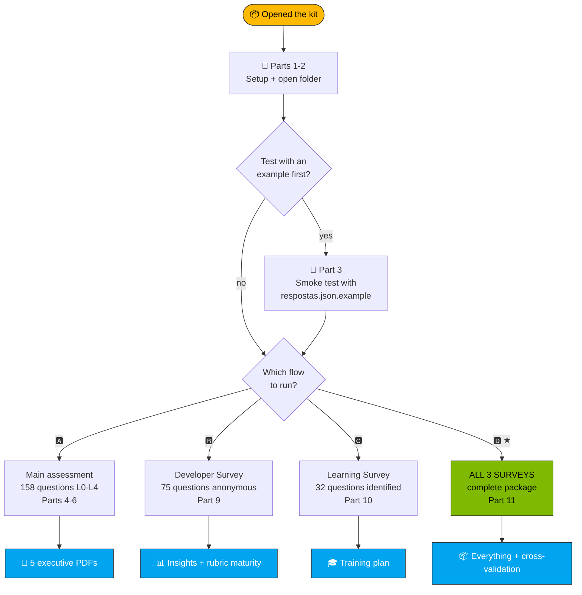

<!-- paulasilva-ms identity: Paula Silva, Software Global Black Belt · LinkedIn https://linkedin.com/in/paulanunes -->

# Step-by-Step Guide · AI Maturity Assessment Kit

**`📘 GUIDE`** · 📖 [🏠 Index](README.md) · You are here · [» Collection via Forms](coleta/INSTRUCOES-FORMS.md)

> [!NOTE]
> This guide is for you if you have **never used the kit before**. We go from zero (installing prerequisites) all the way to the executive report in your hands. **Total estimated time: 30-60 minutes** for the main assessment (15 min setup + 15-45 min filling in). For the complete flow with the 3 surveys: **~6 weeks** (including collection).

---

## 🗺️ Map of what you are going to do



> [!TIP]
> **How to invoke any flow:** open Copilot Chat and type `@ai-maturity-assistant` (guided mode, recommended for the first time) or `/run-full-pipeline` (straight to the point).

### Textual breakdown

```
[ Parts 1-2: Setup + open folder ]
            ↓
[ Part 3 (optional): Test with example data ]   ← recommended the 1st time
            ↓
        ┌─────────────────────────────────────────────────────────┐
        │  CHOOSE WHICH FLOW TO RUN:                              │
        │                                                          │
        │  🅰️ Main assessment only (Parts 4-6)                    │
        │     → 158 questions L0-L4, generates 5 executive PDFs   │
        │     → Time: 60-90 min to collect + 5 min to generate    │
        │                                                          │
        │  🅱️ Developer Survey only (Part 9)                      │
        │     → 75 anonymous questions, behavior + maturity       │
        │     → Time: 22-28 min/dev                               │
        │                                                          │
        │  🅲 Learning & Growth Survey only (Part 10)             │
        │     → 32 identified questions, training plan            │
        │     → Time: 5-8 min/dev                                 │
        │                                                          │
        │  🅳 ALL THREE: complete package (Part 11) ★             │
        │     → 360° view + cross-validation + plan with names    │
        │     → Time: ~6 weeks (including collection)             │
        │                                                          │
        │  HOW TO INVOKE (any of the 4):                          │
        │  • 🤖 Guided mode: @ai-maturity-assistant               │
        │       (the concierge offers the 4 paths)                │
        │  • 🚀 Direct mode: /run-full-pipeline (A only)          │
        │       or individual skills (any flow)                   │
        └─────────────────────────────────────────────────────────┘
            ↓
[ Part 7B: Wizard with Mode D auto-fill (if you ran the Learning Survey) ]
            ↓
[ Open the 5 PDFs + JSONs generated in saida/ ]
```

> 💡 **New here? Use the concierge.** Type `@ai-maturity-assistant` in Copilot Chat (Agent mode) and it will ask where you are in the process, offer clickable buttons for the next step, and warn you when something needs attention. No need to remember any command.

---

## 📦 Part 1: Setup (one time)

### 1.1 Install VS Code

| System | How to install |
|---|---|
| **macOS** | https://code.visualstudio.com/Download → download `.zip` → drag to Applications |
| **Windows** | https://code.visualstudio.com/Download → download `.exe` → Next, Next, Finish |
| **Linux (Ubuntu/Debian)** | `sudo snap install code --classic` or the `.deb` from the site |

**Confirm it worked:**
```bash
code --version
```
If something like `1.95.0` appears, you are OK.

### 1.2 Install Python 3.10 or higher

| System | How to install |
|---|---|
| **macOS** | Usually already included. If not: `brew install python@3.12` |
| **Windows** | https://www.python.org/downloads/ → check "Add Python to PATH" during installation |
| **Linux** | `sudo apt install python3 python3-pip` |

**Confirm:**
```bash
python3 --version
# Should show Python 3.10.x or higher
```

### 1.3 Install 3 Python libraries (required to generate the spreadsheet + 5 PDFs)

```bash
python3 -m pip install --user --break-system-packages openpyxl jinja2 weasyprint
```

| Library | What it is for |
|---|---|
| `openpyxl` | Filling in the auditable `.xlsx` spreadsheet (skill `/fill-spreadsheet`) |
| `jinja2` | Template engine for the 5 PDFs (skill `/generate-reports`) |
| `weasyprint` | HTML+CSS → high-quality PDF (skill `/generate-reports`) |

**Confirm:**
```bash
python3 -c "import openpyxl, jinja2, weasyprint; print('✓ All 3 libs OK')"
```

**Mac only: WeasyPrint system dependencies:**
```bash
brew install cairo pango gdk-pixbuf libffi
```
(If you see the error "library 'libgobject-2.0-0' not found" when running `/generate-reports`, you skipped this step.)

### 1.4 Install the GitHub Copilot Chat extension in VS Code

1. Open VS Code
2. **Extensions** icon in the sidebar (or `Cmd+Shift+X` / `Ctrl+Shift+X`)
3. Search: **GitHub Copilot Chat**
4. Click **Install** (it installs Copilot + Copilot Chat together)
5. When asked to log in, use your GitHub account that has **Copilot Pro / Business / Enterprise**

**How do you know you are logged in and active?** Look at the Copilot icon in the bottom-right corner of VS Code: it should be **lit up blue**, not gray.

### 1.5 ⚠️ CRITICAL: Switch to "Agent" mode

Without this, the concierge agent (`@ai-maturity-assistant`) and the 7 custom skills **do NOT appear** in the chat.

1. Open Copilot Chat (`Cmd+Shift+I` / `Ctrl+Shift+I`)
2. In the chat panel, find the **mode dropdown** (usually at the top of the chat, showing "Ask")
3. Switch it to **Agent**

> 🔍 **How to verify:** with the cursor in the chat, type `@`: `@ai-maturity-assistant` should appear in the dropdown. If only `@workspace` appears, you are still in Ask mode. Type `/`: it should list `/run-full-pipeline`, `/calculate-scores`, etc.

### ✅ Checkpoint 1
If you got here without errors, you are ready to use the kit. If you got stuck on a step:
- VS Code will not install? Try downloading the `.zip`/`.exe` directly from the site
- `pip install` gives a permission error? Use `pip install --user openpyxl`
- Copilot asks for payment? Your corporate account may not have the plan; talk to IT

---

## 📂 Part 2: Open the right folder

> ⚠️ **Important:** Copilot only detects the custom skills (`.github/skills/`) if the kit folder is the **workspace root**. Do not open the whole repository.

### 2.1 Open only `kit-cliente/`

**From the terminal:**
```bash
cd path/to/kit-cliente
code .
```

**Or from VS Code:**
1. Menu **File → Open Folder**
2. Select **only** the `kit-cliente/` folder
3. Click **Open**

### 2.2 Force Copilot to reload (important!)

After opening, do a Reload Window:
1. Press **Cmd+Shift+P** (Mac) / **Ctrl+Shift+P** (Win/Linux)
2. Type: **Developer: Reload Window**
3. Enter

This ensures Copilot reads `.github/copilot-instructions.md` and detects the skills.

### ✅ Checkpoint 2
Verify 3 things:
- [ ] In the sidebar (Explorer), you see: `README.md`, `respostas.json`, `framework.json`, and the folders `formularios/`, `referencia/`, `saida/`, `.github/`
- [ ] Clicking the `.github/skills/` folder, you see 12 skill subfolders (assessment, wizard, survey-devs, and survey-learning)
- [ ] The Copilot icon in the bottom-right corner is blue/active

If something is wrong, you probably opened the wrong folder. Go back to 2.1.

---

## 🧪 Part 3: First run with example data (RECOMMENDED)

> Before typing your own answers (there are many, 158!), do a **quick test** with pre-filled data. It shows you what to expect and validates that everything is working.

### 3.1 Use `respostas.json.example`

The folder ships with **`respostas.json.example`**: a file with **46 mocked answers** simulating a "Cliente Exemplo S.A." with a realistic profile (strong in Copilot, weak in DevSecOps and Agentic apps).

**Copy the example over `respostas.json`:**

In the terminal (inside the `kit-cliente/` folder):
```bash
cp respostas.json respostas.json.template     # backup of the empty template
cp respostas.json.example respostas.json      # use the mocked one
```

**Or from VS Code:**
1. Right-click `respostas.json` in the sidebar → **Rename** → rename it to `respostas.json.template`
2. Right-click `respostas.json.example` → **Rename** → rename it to `respostas.json`

### 3.2 Open Copilot Chat in Agent mode

1. Press **Cmd+Shift+I** (Mac) / **Ctrl+Shift+I** (Win/Linux): it opens the Copilot chat panel on the side
2. In the **dropdown at the top of the chat** (or bottom, depending on the VS Code version), select **Agent** (not Ask, not Edit)

> **How do you know you are in Agent mode?** The word "Agent" appears at the top of the chat. If it says "Ask", switch it.

### 3.3 Run the complete pipeline

In the chat field, type:

```
/run-full-pipeline
```

Press Enter.

**What is going to happen:**
1. Copilot will validate `respostas.json` (~10 seconds)
2. It will invoke 5 skills in sequence (~2-4 minutes in total)
3. It will show progress for each step in the chat
4. At the end, it will list the 6 files generated in the `saida/` folder

> 💡 **Permissions:** the Copilot Agent will ask permission to **run terminal commands** (Python) and **write files**. Approve each one (or click "Always allow" for this session).

### ✅ Checkpoint 3
If everything went well, you will see something like this in the chat:

```
🎯 Pipeline complete: AI Maturity Assessment

📂 Files generated in saida/:
   ✓ pontuacao-preenchida-2026-05-08.xlsx
   ✓ scores.json
   ✓ gaps.json
   ✓ recomendacoes.json
   ✓ payload.json                          (merged data, debug/customization)
   ✓ score_justification.pdf                (~330 KB)
   ✓ roadmap_part_pillar_p1.pdf             (~410 KB)
   ✓ roadmap_part_pillar_p2.pdf             (~410 KB)
   ✓ roadmap_part_pillar_p3.pdf             (~410 KB)
   ✓ roadmap_part4.pdf                      (~510 KB)

📊 Summary:
   Overall:     1.99 (L2 — Defined)
   Threshold:   OK (46/158)
   Pillars:     P1=2.69 L3 · P2=1.52 L2 · P3=1.92 L2
   Top gaps:    3 P0, 0 P1, 1 P2, 6 P3
   Strategies:  S7, S6, S5 (top 3)
```

> If the numbers are **close to this** (overall ~1.99, top strategy S7), the algorithm worked perfectly. Small variations are normal.

### 3.4 Open the generated files

| File | How to open | What to look at |
|---|---|---|
| `saida/pontuacao-preenchida-*.xlsx` | Excel / Numbers / Sheets | "Respostas" tab with the filled levels and "Cálculo" tab with live SUMPRODUCT formulas |
| `saida/scores.json` | VS Code | Complete structure: overall, pillars, capabilities |
| `saida/gaps.json` | VS Code | Gaps sorted by priority (top 3 are P0) |
| `saida/recomendacoes.json` | VS Code | 6 strategies with technologies and actions |
| `saida/score_justification.pdf` | PDF preview | Executive justification + PE Readiness |
| `saida/roadmap_part_pillar_p{1,2,3}.pdf` | PDF preview | Detailed roadmap per pillar (P1/P2/P3) |
| `saida/roadmap_part4.pdf` | PDF preview | Consolidated Implementation Guide (Steering Committee, RACI, ADKAR, Quick Wins) |
| `saida/payload.json` | VS Code | Consolidated data that fed the PDFs (edit + re-render to customize the narrative) |

### 3.5 Restore the template for real use

When you finish exploring the example:
```bash
mv respostas.json respostas.json.exemplo-usado    # keeps the used example
mv respostas.json.template respostas.json         # brings back the empty template
rm -rf saida/*                                     # cleans the test output
```

---

## ✏️ Part 4: Filling in your real answers

### 4.1 Understanding the structure

Open `respostas.json`. You will see:

```jsonc
{
  "metadata": { ... },              // 1. Who is answering
  "target_overrides": { ... },      // 2. Custom targets (optional)
  "responses": {                    // 3. The 158 answers
    "P1-C1-Q1": {
      "level": null,                //   ← 0=L0, 1=L1, ..., 4=L4, null=not answered
      "evidence": "",               //   ← free text with proof
      "text_pt_br": "..."           //   ← question (do not edit, read-only)
    },
    ...
  }
}
```

### 4.2 Fill in the metadata (5 minutes)

```jsonc
"metadata": {
  "respondent_name": "Your name",
  "respondent_email": "you@company.com",
  "respondent_role": "Engineering Manager",  // or: Tech Lead, Director, etc.
  "audience": ["all"],                       // or specific: ["developer", "sre"]
  "organization": "Your Company",
  "assessment_date": "2026-05-08",
  "language": "pt-BR"
}
```

### 4.3 (Optional) Define custom targets

By default, the system uses **target = 3.0 (L3)** for all capabilities. If you want to **aim for L4 in a specific area** (or L2 in a low-priority area):

```jsonc
"target_overrides": {
  "P3-C5": 4.0,   // Agentic Applications: aim for L4
  "P2-C4": 3.5,   // DevSecOps: aim for L3+
  "P1-C8": 2.0    // DevEx Metrics: L2 is fine for us
}
```

> 💡 The capability IDs are in `framework.json` or in the `referencia/P*.md` files. Use whatever makes sense for your strategy.

### 4.4 Fill in each answer: recommended flow

**Do not try to fill in everything at once.** Work in 30-minute sessions, capability by capability.

**For each question:**

1. **Read the question** (the `text_pt_br` field).
2. **Consult the reference document** if you are unsure about what each level means:
   - [`referencia/P1-produtividade-do-desenvolvedor.md`](referencia/P1-produtividade-do-desenvolvedor.md)
   - [`referencia/P2-ciclo-de-vida-devops.md`](referencia/P2-ciclo-de-vida-devops.md)
   - [`referencia/P3-plataforma-de-aplicações.md`](referencia/P3-plataforma-de-aplicações.md)
   
   For each question, every document has: KPI, context (what it measures / why it matters), and a complete description of each level L0-L4 with expected evidence.

3. **Select the level** that best describes **the reality today** (not the aspirational one!):
   - **L0 (0)**: No established practice
   - **L1 (1)**: Isolated pilots (<25% coverage)
   - **L2 (2)**: Defined (25-50%)
   - **L3 (3)**: Managed (>75%, with metrics)
   - **L4 (4)**: Optimizing (>95%, continuous automation)
   - **null**: You do not know / not applicable → the system **ignores it without penalty**

4. **Write evidence** (the `evidence` field):
   - **Minimal** (<80 chars): "We use Copilot." → weak
   - **Adequate** (80-250): "Copilot Enterprise for 80% of devs with governance via GHAS."
   - **Detailed** (250-500): "Copilot Enterprise rollout completed for 80% of devs in Q1/2026; DORA metrics show +18% in lead time; shared prompt library on corporate SharePoint."
   - **Exemplary** (>500): add before/after comparisons, links, time periods.

### 4.5 How much to fill in before running?

| Answered | Status | What changes |
|---|---|---|
| 0-24 | 🔴 BLOCKED | The system refuses scoring (insufficient coverage) |
| 25-39 | 🟡 WARNING | Scoring is calculated but marked "preliminary" |
| ≥ 40 | 🟢 OK | Reliable scoring |
| 158 | 💯 Complete | All capabilities get a score |

**Recommended:** **at least 60 answers distributed across the 3 pillars** for a useful report. You can run `/run-full-pipeline` multiple times while filling in (each run overwrites `saida/`).

### 4.6 Validate the JSON before running

JSON errors (an extra comma, missing quotes) break everything. Validate:

```bash
python3 -m json.tool respostas.json > /dev/null && echo "Valid JSON" || echo "Invalid JSON, fix it"
```

Or in VS Code: if there is an error, a red underline appears on the problematic line.

### ✅ Checkpoint 4
Before running the real pipeline:
- [ ] Metadata filled in with your data
- [ ] At least 40 answers with `level != null`
- [ ] JSON validates without errors
- [ ] The `saida/` folder is empty (or you do not mind overwriting)

---

## 🎬 Part 5: Running the real pipeline

You have **3 paths** to run it; choose the one that best matches your familiarity level.

### 5.1 Path A: Guided concierge (recommended for the 1st time) 🤖

In Copilot Chat (Agent mode):
```
@ai-maturity-assistant
```

The agent:
1. Greets you in PT-BR
2. **Reads your workspace state** (which files exist) and figures out where you are in the funnel
3. Asks only the minimum necessary (language, whether you already filled in answers, etc.)
4. Invokes the right skill **with clickable buttons** ("Yes, run /calculate-scores")
5. After each step, shows the result and offers the next one
6. Warns you when something needs attention (e.g., "Threshold below 25, do you want to proceed anyway?")

> 💡 **Advantage:** you do not need to remember any command. If you make a mistake, it corrects you.

### 5.2 Path B: Single command (you know what you are doing) 🚀

```
/run-full-pipeline
```

Runs the 6 skills in sequence (auto-detects `respostas-forms.xlsx` if it exists and offers the implementation wizard before `/generate-reports`).

### 5.3 Path C: Individual commands (granular control) 🔧

If you prefer to run step by step (or redo just one part):

```
/import-assessment-responses ← (optional) Forms Excel → respostas.json
/fill-spreadsheet            ← copies the template and fills levels in the .xlsx
/calculate-scores            ← generates saida/scores.json
/gap-analysis                ← generates saida/gaps.json
/recommend-strategies        ← generates saida/recomendacoes.json
/implementation-wizard       ← (optional) customizes Part 4
/generate-reports            ← generates 5 production-quality PDFs
```

The order matters (each one depends on the previous).

### 5.4 Iterating

Changed an answer? Changed a target? Just:
- **Path A (concierge):** `@ai-maturity-assistant`: it detects the new state and redoes what changed
- **Path B (direct):** `/run-full-pipeline`: runs everything again, files in `saida/` are overwritten
- **Path C (surgical):** run only the affected skill (e.g., edited `target_overrides`? just run `/gap-analysis` onwards)

---

## 📊 Part 6: Reading the results

After `/generate-reports` (or the completion of `@ai-maturity-assistant`), you will have **6 main outputs** in `saida/`:

### 6.1 The 5 production-quality PDFs (deliverables for leadership)

These are **identical** to the PDFs the web platform will generate when it is ready: clean branding, charts, professional tables:

| PDF | Size | What it contains |
|---|---|---|
| **`score_justification.pdf`** | ~330 KB | Score justification: overall, breakdown per pillar, PE Readiness with path recommendation (Three Horizons / Open Horizons) |
| **`roadmap_part_pillar_p1.pdf`** | ~410 KB | Pillar P1 (Productivity) deep-dive: 9 capabilities with rubric, gaps, evidence, actions per horizon |
| **`roadmap_part_pillar_p2.pdf`** | ~410 KB | Pillar P2 (DevOps) deep-dive: 10 capabilities |
| **`roadmap_part_pillar_p3.pdf`** | ~410 KB | Pillar P3 (Platform) deep-dive: 9 capabilities |
| **`roadmap_part4.pdf`** | ~510 KB | Consolidated Implementation Guide: Three Horizons (H1/H2/H3), technologies, success metrics, risks, **Steering Committee + RACI + ADKAR + Quick Wins** (this part uses data from `/implementation-wizard` if you ran it) |

**How to open:** double-click in Finder/Explorer → opens in Preview/Acrobat. Or in VS Code: click the `.pdf` in the sidebar.

**How to share:**
- **Email/Teams/SharePoint:** attach directly (PDFs of ~330 KB-510 KB each)
- **Present:** open in fullscreen (`Cmd+Ctrl+F` in the Mac Preview)
- **Print:** clean branding, correct pagination, ready for printing

> 💡 **Before sharing:** check whether Part 4 (`roadmap_part4.pdf`) has the names/data of YOUR organization. If it still shows "Maria Santos / James Carter / Acme", you forgot to run `/implementation-wizard` to customize.

### 6.2 The auditable spreadsheet (`saida/pontuacao-preenchida-*.xlsx`)

For when someone asks **"how was this score calculated?"**: open it in Excel/Numbers/Sheets:

- **"Respostas" tab**: all 158 questions with level, weight (from framework.json), and evidence
- **"Cálculo" tab**: SUMPRODUCT formulas visible cell by cell, with scores per capability, per pillar, overall, and threshold
- **"Leia-me" tab**: complete legend (labels, thresholds, how to use)

### 6.3 The JSONs (intermediates + final payload)

For integration with other tools (Power BI, Tableau, custom scripts):

| File | What it contains |
|---|---|
| `scores.json` | Overall, 3 pillars, 28 capabilities: raw scores |
| `gaps.json` | List of gaps sorted by priority (P0/P1/P2/P3) |
| `recomendacoes.json` | 7 ranked strategies with technologies and actions |
| `payload.json` | **Complete payload** sent to Jinja2 to render the PDFs, useful for deep customization |

**When the web app is ready:** these JSONs migrate to the backend via `POST /api/responses/bulk` (same schema).

### 6.4 Customize the deep narrative of the PDFs

Some PDF sections (e.g., `scoring_rationale` per capability, `risks_per_pillar`, details of `technology_resources_per_pillar`) use **professional placeholders** from `sample_payload.json` (Acme Insurance Group). To customize:

```bash
# Edit saida/payload.json replacing the placeholders with your data
code saida/payload.json

# Re-render only the PDFs (skips the merge step):
python3 relatorios/scripts/render_reports.py --payload saida/payload.json --out saida
```

### 6.5 Compare with the example

Want to see the PDFs of a fictional client before running with your data? See **[`referencia/exemplo-saida/`](referencia/exemplo-saida/)**: 5 PDFs of "Cliente Exemplo S.A." (PT-BR) + 5 in EN, generated from `respostas.json.example`.

---

## 🔁 Part 7: Multiple respondents via Microsoft Forms (RECOMMENDED)

To collect answers from **multiple people** (recommended to reduce bias), use **Microsoft Forms** or a **shared Excel on SharePoint**. The kit has a dedicated skill that **automatically aggregates via average** per question.

### Recommended flow (3 paths)

| Path | Setup time | When to use |
|---|---|---|
| **A. Manual Forms** (158 questions) | 4-6h | Organization roll-out (10+ respondents), professional branding |
| **B. Lean Forms** (1 pilot capability) | 30 min | PoC or flow validation |
| **C. Direct Excel/SharePoint** ⭐ | 5 min | **Default**: uses the ready-made template shipped with the kit |

> 📋 **Complete guide:** [`coleta/INSTRUCOES-FORMS.md`](coleta/INSTRUCOES-FORMS.md) has a detailed step-by-step for the 3 paths with verbal screenshots, permission configuration, the exact response option format (`L0 — Inicial`, etc.), and troubleshooting.

### Summary of the fastest path (Path C: direct Excel)

**Step 7.1**: Get the Excel template:
```bash
cp coleta/template-export-forms.xlsx respostas-forms.xlsx
```

**Step 7.2**: Clear the mocked data and upload to SharePoint/OneDrive:
- Open `respostas-forms.xlsx` in Excel
- Delete rows 2, 3, 4 (3 mocked respondents)
- Keep row 1 (headers)
- Save and upload to SharePoint with an "Anyone can edit" link

**Step 7.3**: Each person fills in one row:
- Share the spreadsheet link with the team
- Each respondent fills in **one row** in the Excel
- For each question column, pick an option (`L0 — Inicial`, `L1 — Em Desenvolvimento`, ..., `L4 — Otimizando`, `NA — Não sei`)
- The column next to it = evidence (optional free text)

**Step 7.4**: When everyone has filled it in:
- Download the updated Excel
- Rename it to `respostas-forms.xlsx`
- Put it at the root of `kit-cliente/`

**Step 7.5**: Import into the kit:
```
/import-assessment-responses
```

The skill:
- Automatically detects `respostas-forms.xlsx`
- Backs up the current `respostas.json` (`.backup-<timestamp>`)
- Reads all rows (each one = a respondent)
- **Aggregates via average** per question (aligned with the platform algorithm `repos/scoring.rs:354-368`)
- Overwrites `respostas.json`
- Generates `saida/import-log-<DATE>.md` with coverage per respondent and alerts

**Step 7.6**: Continue as usual:
```
/run-full-pipeline
```

> 💡 **Tip:** `/run-full-pipeline` **automatically detects** whether there is a `respostas-forms.xlsx` newer than `respostas.json` and runs `/import-assessment-responses` first; you can skip Step 7.5 and go straight ahead.

### Quick smoke test with the mocked template

Want to test the complete collection flow without creating Forms?

```bash
cp coleta/template-export-forms.xlsx respostas-forms.xlsx
# (the template already ships with 3 mocked respondents: Maria, Joao, Ana)
```

In Copilot Chat:
```
/run-full-pipeline
```

You will see the pipeline running with **3 respondents** being aggregated → it will generate a report with the weighted average of Maria + Joao + Ana.

---

---

## 🧙 Part 7B: Customize Part 4 of the PDF (Implementation Guide)

> Part 4 of the roadmap (`roadmap_part4.pdf`) is the **consolidated Implementation Guide**: committees, RACI, communication plan, training, ADKAR, quick wins. By default it uses professional placeholders. To customize it with your real data, there are **3 paths**.

### ⭐ Shortcut: Mode D (auto-fill from the Learning Survey)

If you already ran `/training-plan` (Part 10), the Copilot Agent **automatically detects** `saida/plano-capacitacao-*.md` and offers:

```
🎓 I detected a training plan. I can automatically EXTRACT:
   Champions, training_plan, communication_plan (calendar), quick wins.
   You only need to fill in: TPO + RACI Matrix.

   [a] Auto-fill (Mode D: recommended, fills 6 of the 9 inputs)
   [b] HTML / JSON / Chat mode (fill everything manually)
```

**Mode D saves 30-45 min** because the learning survey data already maps to:
- `executive_steering_committee` ← "active" Champions Network
- `communication_plan` ← Workshop calendar
- `training_plan` ← Cohorts per dimension
- `adkar_notes` ← Top 5 workshops
- `quick_wins_w1_4/5_8/9_12` ← 90-day calendar

If you have not run `/training-plan` yet, use modes A/B/C below.

### 7B.1 · The 9 inputs that go into Part 4

| # | Input | What it is |
|---|---|---|
| 1 | **Steering Committee** | 5-8 names: Sponsor, Program Lead, CFO, CISO, Change Champion |
| 2 | **TPO** (Technology Product Owner) | Program Manager + office (3-5 people) + authority |
| 3 | **RACI Matrix** | 5-8 activities × R/A/C/I |
| 4 | **Communication Plan** | Audience × channel × frequency × owner |
| 5 | **Training Plan** | Cohort × format × cadence × criteria |
| 6 | **ADKAR** | Awareness · Desire · Knowledge · Ability · Reinforcement |
| 7 | **Quick Wins W1-4** | 4-6 initiatives for the first month |
| 8 | **Quick Wins W5-8** | Second wave |
| 9 | **Quick Wins W9-12** | Third wave |

Output: `implementation-guide-inputs.json` at the kit root.

### 7B.2 · Mode A: Standalone HTML wizard (RECOMMENDED)

**The most visual path**: it mirrors the web app wizard.

```bash
open wizard/implementation-guide-wizard.html
# or right-click the file in VS Code → "Reveal in Finder" → double-click
```

**How it works:**
1. The browser opens a page with 9 steps (each with a helper + a large textarea)
2. It saves automatically to `localStorage`: you can pause and come back later
3. The stepper at the top shows progress (green ✓ when filled)
4. At the end, click **💾 Download JSON**
5. Move `implementation-guide-inputs.json` to the root of `kit-cliente/`

**Estimated time:** 30-60 min to fill in all 9 (or 15 min for a quick draft).

### 7B.3 · Mode B: Edit the JSON directly in VS Code

**The path for devs** who prefer code.

```bash
cp wizard/implementation-guide-inputs.template.json implementation-guide-inputs.json
code implementation-guide-inputs.json
# Edit each of the 9 fields (they come with inline instructions + examples)
```

The template has rich placeholders with instructions (`_help`, `_dicas`, examples per field). Delete the examples as you replace them with your content.

### 7B.4 · Mode C: Conversation via Copilot Chat

**The quick path for a collaborative draft.**

In Copilot Chat (Agent mode):
```
/implementation-wizard
```

Copilot will offer 3 modes. Choose **C** (chat). It will:
1. Ask you 9 questions, one at a time
2. You answer freely in PT-BR
3. At the end, it builds the JSON and asks your confirmation to save
4. It saves automatically to `implementation-guide-inputs.json`

> 💡 **Tip:** mode C is great for the initial iteration. Then you open the JSON and refine it manually.

### 7B.5 · Re-render the PDFs with the customized Part 4

After any of the 3 modes:

```
/generate-reports
```

The skill automatically detects `implementation-guide-inputs.json` at the root and merges it into the payload; Part 4 of `roadmap_part4.pdf` now reflects your real data.

### ✅ Checkpoint 7B

Before moving on:
- [ ] `implementation-guide-inputs.json` exists at the kit root
- [ ] At least 5 of the 9 fields filled in (ideally 9/9)
- [ ] You re-ran `/generate-reports` and `roadmap_part4.pdf` shows your names/data (no longer "Maria Santos / James Carter" from the sample)

---

---

## 👥 Part 9: Developer Survey (anonymous, behavioral)

> **Complementary survey #1**, different from the main assessment. It measures **how devs actually use AI** day to day (anonymous, individual). Output: **aggregated insights + maturity calculated by a deterministic L0-L4 rubric across 7 dimensions D2-D8**.

### 9.1 · Why run this survey?

The main assessment (Parts 4-6) captures the **leadership's perception** (declared L0-L4). The Developer Survey validates it against the **anonymous behavioral reality**:

- Leadership rates P1-C1 (Copilot) as L3? The survey reveals 60% of devs rarely use it → **dissonance detected**
- Identifies **real gaps** (not perceived by leadership)
- Anonymity → more honest answers

**When to run:** BEFORE the main assessment, to inform the capability evaluation.

### 9.2 · How to create the Microsoft Forms

1. Read **[`survey-devs/INSTRUCOES-FORMS-DEVS.md`](survey-devs/INSTRUCOES-FORMS-DEVS.md)** (complete step-by-step)
2. Critical point: **CHECK "Anonymous Responses"** in Settings (without it, it captures email!)
3. 75 questions in 9 sections (Profile, Copilot, MS/GH tools, practices, agents, instructions, usability, **security and governance**)
4. Time per dev: **22-28 min**
5. Share the link with ALL devs

### 9.3 · Shortcut: test with mocks (without collecting)

```bash
cp survey-devs/respostas-mock-devs.json survey-devs/respostas-devs.json
```

5 mocked respondents (Senior Backend, Mid Frontend, Junior, SRE, Tech Lead) ready for the pipeline.

### 9.4 · Import and generate insights

In Copilot Chat (Agent mode):

```
/import-developer-survey            ← if you have respostas-survey-devs.xlsx
/insights-developer-survey       ← generates the report + calculates maturity
```

**Output in `saida/`:**
- `insights-developer-survey-DATE.md`: a PT-BR report of ~14 page equivalents
- `maturidade-developer-survey-DATE.json`: **L0-L4 scores per dimension** (deterministic rubric)
  - D2 Copilot Adoption · D3 MS/GH Tooling · D4 AI Dev Practices · D5 Agent Concepts · D6 Instructions · D7 Best Practices · D8 Security & Governance

### 9.5 · Deterministic rubric: how it works

The scoring model is in **[`survey-devs/RUBRICA-MATURIDADE.md`](survey-devs/RUBRICA-MATURIDADE.md)**: 7 dimensions mapped to L0-L4 (the same scale as the main assessment). Deterministic (no LLM, auditable). Score per team (not individual; the report preserves anonymity).

Example output:

```
🎯 TEAM MATURITY: 2.22 (L2 — Defined), 12 anonymous devs

D2 Copilot Adoption       0.80  L1   ⚠️
D3 MS/GH Tooling          2.40  L2
D7 Best Practices         2.91  L3   ✨
D8 Security & Governance  1.92  L2
```

### ✅ Checkpoint 9

Before moving on:
- [ ] Forms created with **Anonymous ON** (validate by opening it in an incognito window)
- [ ] At least 5 respondents (ideally ≥15 for representativeness)
- [ ] `respostas-survey-devs.xlsx` at the kit root
- [ ] `/insights-developer-survey` ran and generated the 2 outputs in `saida/`

---

## 🎓 Part 10: Learning & Growth Survey (identified, training)

> **Complementary survey #2**, IDENTIFIED (requires name+email). It focuses on **what devs want to learn** + preferred format + barriers + Champions Network. Output: a **personalized training plan** with pre-validated attendee lists.

### 10.1 · Why run this survey?

The 2 previous surveys **diagnose**. This one **prescribes the training roadmap**:

- Top 10 requested topics with an **attendee list by name** (not "70% want workshop X"; this is the list of the 10 people going to the workshop)
- **Champions Network** identified (3 tiers: active, with support, maybe)
- Mentor↔mentee pairs mapped
- Workshop calendar for the next 90 days
- The plan automatically feeds the **wizard** Mode D (Part 7B)

**When to run:** after the survey-devs (anonymous) or in parallel. Before `/implementation-wizard`.

### 10.2 · ⚠️ Critical difference: IDENTIFIED

Unlike the survey-devs, this one needs name+email:

| Setting | Survey-devs | Learning Survey |
|---|---|---|
| Anonymous Responses | **ON** | **OFF** ⚠️ |
| Email captured | No | Yes |
| Why? | Behavioral honesty | Inviting people to workshops |

**Ethical communication with the team:** "This survey is IDENTIFIED. We will use name+email to INVITE you to specific workshops. It will **NOT** be used in performance reviews."

### 10.3 · How to create the Microsoft Forms

1. Read **[`survey-learning/INSTRUCOES-FORMS-LEARNING.md`](survey-learning/INSTRUCOES-FORMS-LEARNING.md)**
2. Settings → **Anonymous Responses UNCHECKED**
3. 32 questions in 7 sections (Profile, Self-perception L2, Where you want to grow L3, Topics L4, Format L5, Champions L6, Barriers L7)
4. Time: **5-8 min**
5. Share with ALL devs

### 10.4 · Shortcut: test with mocks

```bash
cp survey-learning/respostas-mock-learning.json survey-learning/respostas-learning.json
```

5 mocked IDENTIFIED respondents (Maria Tech Leader, João SRE, Ana Security, Pedro Junior, Sofia Frontend).

### 10.5 · Import and generate the training plan

```
/import-learning-survey ← if you have respostas-survey-learning.xlsx
/training-plan          ← generates the personalized training plan
```

**Output:** `saida/plano-capacitacao-DATA.md`: 12 sections including:
- Top 10 topics with a **pre-validated attendee list** (name+email)
- Suggested cohorts per dimension (D2-D8)
- Champions Network (3 tiers)
- 90-day workshop calendar
- 5 prioritized actions (impact × ease)
- Appendix with the respondent table (visible to leadership only)

### 10.6 · ⭐ Wizard auto-fill (Mode D)

After generating the plan, when you run `/implementation-wizard` the agent will detect `saida/plano-capacitacao-*.md` and offer **Mode D: Auto-fill**, which automatically fills 6 of the 9 wizard inputs:

| Wizard input | Comes from |
|---|---|
| `executive_steering_committee` | "Active" Champions Network |
| `communication_plan` | Suggested calendar |
| `training_plan` | Cohorts per dimension |
| `adkar_notes` | Top 5 workshops (Knowledge stage) |
| `quick_wins_w1_4/5_8/9_12` | 90-day calendar |

You only need to fill in manually: TPO + RACI Matrix.

### ✅ Checkpoint 10

- [ ] Forms created with **Anonymous OFF** + L1-Q1 (name) + L1-Q2 (email) **required**
- [ ] Clearly communicated that it is IDENTIFIED + ethical use
- [ ] At least 5 respondents (ideally >50% of the team)
- [ ] `/training-plan` ran and generated `saida/plano-capacitacao-DATA.md`
- [ ] You confirmed the identified Champions + suggested workshops before inviting

---

## 🔄 Part 11: Combined flow of the 3 surveys (recommended for serious consulting)

> The 3 surveys are **complementary, not substitutes**. When you run all 3, the order matters.

### 11.1 · Why all 3?

| Survey | Question it answers | Who answers |
|---|---|---|
| **Survey-devs** | "How do you USE AI today?" (behavioral, anonymous) | Individual devs (anonymous) |
| **Learning** | "What do you WANT to learn?" (aspirational, identified) | Individual devs (with name+email) |
| **Assessment** | "Where are we as an organization?" (declared Likert L0-L4) | Leadership (1-3 people) |

**Without the 3:** leadership rates maturity in the dark, generic training, invisible dissonance.
**With the 3:** an assessment **informed** by real behavior + a training plan **with names** + cross-validation.

### 11.2 · Recommended order

```
WEEK 1
   ↓
1. Launch the Survey-devs (anonymous, 22-28 min)  + Learning Survey (identified, 5-8 min)
   • Can run in parallel
   • Communicate the differences (anonymity vs identification)
   • Deadline: 2 weeks
   ↓
WEEK 3-4
   ↓
2. /import-developer-survey  → /insights-developer-survey
   /import-learning-survey   → /training-plan
   • Leadership receives insights BEFORE rating capabilities
   • Identifies real behavioral gaps
   ↓
WEEK 4-5
   ↓
3. Leadership fills in respostas.json (assessment) INFORMED by the surveys
   • Use the insights as evidence per capability
   • Avoids a declared L3 when the survey shows a real L1
   ↓
WEEK 5
   ↓
4. /run-full-pipeline (assessment): calculates scores, gaps, recommendations
   ↓
WEEK 5
   ↓
5. /implementation-wizard in Mode D (auto-fill from the training plan)
   • 6 of the 9 inputs filled automatically
   • You only complete: TPO + RACI Matrix
   ↓
WEEK 5
   ↓
6. /generate-reports
   • 5 final assessment PDFs
   • `saida/payload.json` includes references to the cross-survey artifacts when they exist
   • `roadmap_part4.pdf` consumes Learning Survey data when the wizard Mode D generated `implementation-guide-inputs.json`
   ↓
WEEK 6
   ↓
7. Present the PDFs to leadership + the plan to the devs
   • Cross-validation (survey vs assessment)
   • Workshops already scheduled with pre-validated attendees
```

### 11.3 · Shortcut with the concierge agent

```
@ai-maturity-assistant
> choose [D] ALL THREE: Complete package
```

The agent guides you through the 3 surveys + assessment + wizard + report, **with clickable handoffs** between each step. You never need to remember a command.

### 11.4 · Cross-survey validations

After running the 3 + `/generate-reports`, **`score_justification.pdf`** includes the **Complementary Signals from the Surveys** section, and the file **`saida/payload.json`** keeps the structured pointers for auditing. Use this data to compare the maturity declared by leadership with the behavioral maturity of the devs:

```
| Capability | Leadership rates | Survey rubric | Dissonance |
|---|---|---|---|
| P1-C1 Copilot     | L3 (3.2)        | D2 = L1 (0.80)  | 🚨 ALERT |
| P3-C5 Agent Apps  | L1 (1.0)        | D5 = L3 (2.56)  | ⚠ Underconf |
```

**Insight:** dissonances reveal where to investigate (a gap between strategy and practice).

> [!NOTE]
> When `cross_survey_data` exists in the payload, `score_justification.pdf` renders the **Complementary Signals from the Surveys** section. The Learning Survey also feeds `roadmap_part4.pdf` when you run `/implementation-wizard` in Mode D before `/generate-reports`.

### ✅ Checkpoint 11 (after the flow of the 3)

- [ ] The 2 surveys (devs + learning) collected before the assessment
- [ ] `saida/insights-developer-survey-*.md` + `saida/maturidade-developer-survey-*.json` exist
- [ ] `saida/plano-capacitacao-*.md` exists
- [ ] `respostas.json` filled in informed by the surveys
- [ ] `/implementation-wizard` ran in Mode D (auto-fill detected the plan)
- [ ] `/generate-reports` generated 5 PDFs, `saida/payload.json` contains `cross_survey_data`, and `score_justification.pdf` includes the complementary signals section
- [ ] Presented to leadership + devs

---

## 🅿️ Part 12: When to use each input format (main assessment)

> This part only covers the input formats for the **main assessment** (Part 5). For the complementary surveys, see Parts 9 and 10.

| Scenario | Recommended input | Why |
|---|---|---|
| 1 person filling in (you or a consultant) | `respostas.json` directly | Simple, no overhead |
| 3-5 people from the same team | `respostas-forms.xlsx` (Path C) | Ready-made Excel template, 5 min setup |
| 10+ people, multi-team, multi-location | Microsoft Forms (Path A) | Mobile UX, native validation, audit trail |
| Demanding client / corporate branding | Microsoft Forms (Path A) | The professional look of Forms |
| Fast iteration during a workshop | `respostas.json` edited live | Immediate results, no collection round |

---

## 🆘 Extended troubleshooting

> 💡 **General tip:** when something goes wrong, your first attempt should be **`@ai-maturity-assistant`** in Copilot Chat. The concierge **reads the workspace state** (which files exist, at what stage you stopped) and usually identifies the problem without you having to diagnose it. The items below are for when the concierge is not available or you want to understand the problem in detail.

### "The `/run-full-pipeline` command does not appear in the menu"

**Probable cause:** wrong workspace, wrong mode, or Copilot cache.

**Try in order:**
1. Confirm the workspace root is `kit-cliente/` (in the Explorer sidebar, the name at the top should be "KIT-CLIENTE")
2. **Cmd+Shift+P** → **Developer: Reload Window**
3. Confirm the Copilot Chat dropdown is set to **Agent**
4. Confirm `.github/skills/` exists in the folder (it should have 12 subfolders)

### "Skills appear but fail with 'cannot find file framework.json'"

**Cause:** relative paths. It usually happens if you opened a parent folder by mistake.

**Solution:** close it, reopen **only** the `kit-cliente/` folder (not the parent).

### "Copilot asks approval for every command, it is annoying"

When the "Allow command" popup appears, click **Always allow for this session**. Or adjust it in **Settings → Search "copilot agent allow"**.

### "Invalid JSON" when running

```bash
python3 -m json.tool respostas.json
```
It will show the exact line of the error. Common causes:
- Extra comma before `}` or `]`
- Wrong quotes (`"` vs `"`)
- `level: 3,` (missing quotes on the key) vs `"level": 3,` (correct)

### "Threshold always BLOCKED"

You have fewer than 25 answers with `level != null`. Count them:
```bash
python3 -c "
import json
r = json.load(open('respostas.json'))
n = sum(1 for v in r['responses'].values() if v['level'] is not None)
print(f'Answered: {n} / 158')
"
```

### "Excel does not recalculate formulas"

Excel is in manual mode. Press **F9** (Win) or **Cmd+=** (Mac) to force recalculation. Or: Excel → Formulas → Calculation Options → Automatic.

### "openpyxl not found"

```bash
python3 -m pip install --user openpyxl
# If it still fails:
which python3
# Confirm Copilot is using the same Python (configure it in Settings)
```

### "Custom skills do not work on my Copilot Free"

Custom skills require **Copilot Pro/Business/Enterprise** with Agent mode. Alternative for Free:
- Use Claude.ai web or ChatGPT
- Upload the kit zip
- Manually paste the content of `.github/copilot-instructions.md` as context
- Ask: "run the pipeline according to `.github/prompts/run-full-pipeline.prompt.md`"

---

## 🎓 To learn more

- **Complete algorithm** (formulas, edge cases, examples): [`referencia/pontuacao-e-calculo.md`](referencia/pontuacao-e-calculo.md)
- **Interactive calculator** (play with levels and see scores live): open [`referencia/calculadora-pontuacao.html`](referencia/calculadora-pontuacao.html) in the browser
- **Documentation of the 158 questions** (KPI, context, expected evidence): `referencia/P1-…md`, `P2-…md`, `P3-…md`
- **Platform visuals** (how it will look when the app is ready): open `formularios/P1-…html` in the browser
- **Main README**: [`README.md`](README.md)

---

## 📞 Support

| Type of question | Where to look |
|---|---|
| How a question should be interpreted | `referencia/P1-…md`, `P2-…md`, `P3-…md` |
| Why a score is X (understanding the calculation) | `referencia/pontuacao-e-calculo.md` or open the `.xlsx` in saida/ |
| The kit is not working | The Troubleshooting section above |
| Bug or feature request | Microsoft GBB contact |

---

**Guide version:** 1.0 · **Date:** 2026-05-08 · **Language:** EN

---

## Stuck on one of these steps?

<details>
<summary><strong>FAQ: common situations in the first 15 minutes</strong></summary>

| Symptom | Probable cause | How to fix |
|---|---|---|
| The `/calculate-scores` command does not appear when I type `/` | Copilot Chat is not in **Agent mode** | Open the Chat → click the dropdown next to the Copilot icon → choose **Agent** |
| Error `framework_version mismatch` | You opened the kit on an old framework version | Update `respostas.json::metadata.framework_version` to `1.0.0` |
| `make smoke` fails with `ModuleNotFoundError` | Python dependencies missing | Run `make install-deps` (installs jinja2 + weasyprint + openpyxl) |
| PDFs show `GERADO EM` with the wrong date | Expected behavior | The date reflects the generation date; it is not a bug |
| `respostas-forms.xlsx` is not detected | The file is in the wrong folder | Move it to the kit **root** (not inside `coleta/`) |
| Agent mode says "I do not have that skill" | VS Code did not reload the skills | Cmd/Ctrl+Shift+P → "Developer: Reload Window" |

</details>

---

## Continue reading

| ← PREVIOUS | NEXT → |
|:---|---:|
| **[🏠 Index (README)](README.md)** | **[Collection via Microsoft Forms](coleta/INSTRUCOES-FORMS.md)** |
| Main hub: overview, 3 surveys, prerequisites. | 3 paths to collect answers as a team (Forms / Excel / SharePoint). |

↑ [Back to the kit index](README.md)

---

<sub>**Paula Silva** | Software Global Black Belt · [LinkedIn](https://linkedin.com/in/paulanunes)</sub>
<sub>paulasilva-ms visual identity applied to the interactive HTMLs (calculator, forms, wizard) and the 5 production PDFs. See [referencia/branding/](referencia/branding/).</sub>
