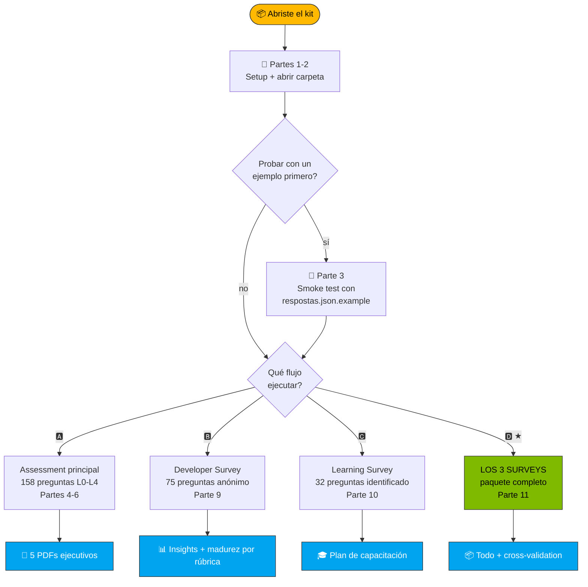

<!-- paulasilva-ms identity: Paula Silva, Software Global Black Belt · LinkedIn https://linkedin.com/in/paulanunes -->

# Guía Paso a Paso · Kit AI Maturity Assessment

**`📘 GUÍA`** · 📖 [🏠 Índice](README.md) · Estás aquí · [» Recolección vía Forms](coleta/INSTRUCOES-FORMS.md)

> [!NOTE]
> Esta guía es para ti si **nunca usaste el kit antes**. Vamos desde cero (instalar prerrequisitos) hasta tener el informe ejecutivo en tus manos. **Tiempo total estimado: 30-60 minutos** para el assessment principal (15 min de setup + 15-45 min llenando). Para el flujo completo de los 3 surveys: **~6 semanas** (incluyendo la recolección).

---

## 🗺️ Mapa de lo que vas a hacer



> [!TIP]
> **Cómo invocar cualquier flujo:** abre Copilot Chat y escribe `@ai-maturity-assistant` (modo guiado, recomendado la primera vez) o `/run-full-pipeline` (directo al punto).

### Desglose textual

```
[ Partes 1-2: Setup + abrir carpeta ]
            ↓
[ Parte 3 (opcional): Probar con datos de ejemplo ]   ← recomendado la 1ª vez
            ↓
        ┌─────────────────────────────────────────────────────────┐
        │  ELIGE QUÉ FLUJO EJECUTAR:                              │
        │                                                          │
        │  🅰️ Solo assessment principal (Partes 4-6)              │
        │     → 158 preguntas L0-L4, genera 5 PDFs ejecutivos     │
        │     → Tiempo: 60-90 min recolectar + 5 min generar      │
        │                                                          │
        │  🅱️ Solo Developer Survey (Parte 9)                     │
        │     → 75 preguntas anónimas, comportamiento + madurez   │
        │     → Tiempo: 22-28 min/dev                             │
        │                                                          │
        │  🅲 Solo Learning & Growth Survey (Parte 10)            │
        │     → 32 preguntas identificadas, plan de capacitación  │
        │     → Tiempo: 5-8 min/dev                               │
        │                                                          │
        │  🅳 LOS TRES: paquete completo (Parte 11) ★             │
        │     → Visión 360° + cross-validation + plan con nombres │
        │     → Tiempo: ~6 semanas (incluyendo recolección)       │
        │                                                          │
        │  CÓMO INVOCAR (cualquiera de los 4):                    │
        │  • 🤖 Modo guiado: @ai-maturity-assistant               │
        │       (el concierge ofrece los 4 caminos)               │
        │  • 🚀 Modo directo: /run-full-pipeline (solo A)         │
        │       o skills individuales (cualquier flujo)           │
        └─────────────────────────────────────────────────────────┘
            ↓
[ Parte 7B: Wizard con Mode D auto-fill (si ejecutaste el Learning Survey) ]
            ↓
[ Abrir los 5 PDFs + JSONs generados en saida/ ]
```

> 💡 **¿Nuevo por aquí? Usa el concierge.** Escribe `@ai-maturity-assistant` en Copilot Chat (modo Agent) y te va a preguntar en qué punto del proceso estás, ofrecer botones clicables para el siguiente paso y avisarte cuando algo necesita atención. No hace falta recordar ningún comando.

---

## 📦 Parte 1: Setup (una sola vez)

### 1.1 Instalar VS Code

| Sistema | Cómo instalar |
|---|---|
| **macOS** | https://code.visualstudio.com/Download → descargar `.zip` → arrastrar a Applications |
| **Windows** | https://code.visualstudio.com/Download → descargar `.exe` → Next, Next, Finish |
| **Linux (Ubuntu/Debian)** | `sudo snap install code --classic` o el `.deb` del sitio |

**Confirma que funcionó:**
```bash
code --version
```
Si aparece algo como `1.95.0`, está OK.

### 1.2 Instalar Python 3.10 o superior

| Sistema | Cómo instalar |
|---|---|
| **macOS** | Generalmente ya viene. Si no: `brew install python@3.12` |
| **Windows** | https://www.python.org/downloads/ → marcar "Add Python to PATH" durante la instalación |
| **Linux** | `sudo apt install python3 python3-pip` |

**Confirma:**
```bash
python3 --version
# Debe mostrar Python 3.10.x o superior
```

### 1.3 Instalar 3 bibliotecas Python (necesarias para generar la hoja de cálculo + 5 PDFs)

```bash
python3 -m pip install --user --break-system-packages openpyxl jinja2 weasyprint
```

| Biblioteca | Para qué sirve |
|---|---|
| `openpyxl` | Llenar la hoja de cálculo auditable `.xlsx` (skill `/fill-spreadsheet`) |
| `jinja2` | Motor de plantillas de los 5 PDFs (skill `/generate-reports`) |
| `weasyprint` | HTML+CSS → PDF de calidad (skill `/generate-reports`) |

**Confirma:**
```bash
python3 -c "import openpyxl, jinja2, weasyprint; print('✓ Las 3 libs OK')"
```

**Solo Mac: dependencias de sistema de WeasyPrint:**
```bash
brew install cairo pango gdk-pixbuf libffi
```
(Si ves el error "library 'libgobject-2.0-0' not found" al ejecutar `/generate-reports`, te saltaste este paso.)

### 1.4 Instalar la extensión GitHub Copilot Chat en VS Code

1. Abre VS Code
2. Icono de **Extensions** en la barra lateral (o `Cmd+Shift+X` / `Ctrl+Shift+X`)
3. Buscar: **GitHub Copilot Chat**
4. Clic en **Install** (instala Copilot + Copilot Chat juntos)
5. Cuando pida login, hazlo con tu cuenta de GitHub que tenga **Copilot Pro / Business / Enterprise**

**¿Cómo saber si estás logueado y activo?** Mira el icono de Copilot en la esquina inferior derecha de VS Code: debe estar **azul encendido**, no gris.

### 1.5 ⚠️ CRÍTICO: Cambiar al modo "Agent"

Sin esto, el agente concierge (`@ai-maturity-assistant`) y las 7 skills custom **NO aparecen** en el chat.

1. Abre Copilot Chat (`Cmd+Shift+I` / `Ctrl+Shift+I`)
2. En el panel del chat, busca el **dropdown de modo** (generalmente en la parte superior del chat, mostrando "Ask")
3. Cámbialo a **Agent**

> 🔍 **Cómo verificar:** con el cursor en el chat, escribe `@`: debe aparecer `@ai-maturity-assistant` en el dropdown. Si solo aparece `@workspace`, sigues en modo Ask. Escribe `/`: debe listar `/run-full-pipeline`, `/calculate-scores`, etc.

### ✅ Checkpoint 1
Si llegaste hasta aquí sin errores, estás listo para usar el kit. Si te trabaste en algún paso:
- ¿VS Code no se instala? Prueba descargar el `.zip`/`.exe` directo del sitio
- ¿`pip install` da error de permisos? Usa `pip install --user openpyxl`
- ¿Copilot pide pago? Tu cuenta corporativa puede no tener el plan; habla con TI

---

## 📂 Parte 2: Abrir la carpeta correcta

> ⚠️ **Importante:** Copilot solo detecta las skills custom (`.github/skills/`) si la carpeta del kit es el **workspace root**. No abras el repositorio completo.

### 2.1 Abrir solo `kit-cliente/`

**Desde la terminal:**
```bash
cd ruta/hacia/kit-cliente
code .
```

**O desde VS Code:**
1. Menú **File → Open Folder**
2. Selecciona **solo** la carpeta `kit-cliente/`
3. Clic en **Open**

### 2.2 Forzar a Copilot a recargar (¡importante!)

Después de abrir, haz Reload Window:
1. Presiona **Cmd+Shift+P** (Mac) / **Ctrl+Shift+P** (Win/Linux)
2. Escribe: **Developer: Reload Window**
3. Enter

Esto garantiza que Copilot lea el `.github/copilot-instructions.md` y detecte las skills.

### ✅ Checkpoint 2
Verifica 3 cosas:
- [ ] En la sidebar (Explorer) ves: `README.md`, `respostas.json`, `framework.json`, y las carpetas `formularios/`, `referencia/`, `saida/`, `.github/`
- [ ] Al hacer clic en la carpeta `.github/skills/`, ves 12 subcarpetas de skills (assessment, wizard, survey-devs y survey-learning)
- [ ] El icono de Copilot en la esquina inferior derecha está azul/activo

Si algo está mal, probablemente abriste la carpeta equivocada. Vuelve a 2.1.

---

## 🧪 Parte 3: Primera ejecución con datos de ejemplo (RECOMENDADO)

> Antes de escribir tus propias respuestas (que son muchas, ¡158!), haz una **prueba rápida** con datos pre-llenados. Te muestra qué esperar y valida que todo esté funcionando.

### 3.1 Usar el `respostas.json.example`

La carpeta viene con **`respostas.json.example`**: un archivo con **46 respuestas simuladas** de una "Cliente Exemplo S.A." con perfil realista (fuerte en Copilot, débil en DevSecOps y aplicaciones Agénticas).

**Copia el ejemplo sobre `respostas.json`:**

En la terminal (dentro de la carpeta `kit-cliente/`):
```bash
cp respostas.json respostas.json.template     # respaldo del template vacío
cp respostas.json.example respostas.json      # usar el simulado
```

**O desde VS Code:**
1. Clic derecho en `respostas.json` en la sidebar → **Rename** → renómbralo a `respostas.json.template`
2. Clic derecho en `respostas.json.example` → **Rename** → renómbralo a `respostas.json`

### 3.2 Abrir Copilot Chat en modo Agent

1. Presiona **Cmd+Shift+I** (Mac) / **Ctrl+Shift+I** (Win/Linux): abre el panel de chat de Copilot en el lateral
2. En el **dropdown en la parte superior del chat** (o inferior, depende de la versión de VS Code), selecciona **Agent** (no Ask, no Edit)

> **¿Cómo saber si estás en modo Agent?** Aparece la palabra "Agent" en la parte superior del chat. Si aparece "Ask", cámbialo.

### 3.3 Ejecutar el pipeline completo

En el campo de chat, escribe:

```
/run-full-pipeline
```

Presiona Enter.

**Lo que va a pasar:**
1. Copilot va a validar `respostas.json` (~10 segundos)
2. Va a invocar 5 skills en secuencia (~2-4 minutos en total)
3. Te va a mostrar el progreso de cada paso en el chat
4. Al final, va a listar los 6 archivos generados en la carpeta `saida/`

> 💡 **Permisos:** el Copilot Agent va a pedir permiso para **ejecutar comandos de terminal** (Python) y **escribir archivos**. Aprueba cada uno (o haz clic en "Always allow" para esta sesión).

### ✅ Checkpoint 3
Si todo salió bien, verás en el chat algo como:

```
🎯 Pipeline completo: AI Maturity Assessment

📂 Archivos generados en saida/:
   ✓ pontuacao-preenchida-2026-05-08.xlsx
   ✓ scores.json
   ✓ gaps.json
   ✓ recomendacoes.json
   ✓ payload.json                          (merged data, debug/customización)
   ✓ score_justification.pdf                (~330 KB)
   ✓ roadmap_part_pillar_p1.pdf             (~410 KB)
   ✓ roadmap_part_pillar_p2.pdf             (~410 KB)
   ✓ roadmap_part_pillar_p3.pdf             (~410 KB)
   ✓ roadmap_part4.pdf                      (~510 KB)

📊 Resumen:
   Overall:      1.99 (L2 — Definido)
   Threshold:    OK (46/158)
   Pillars:      P1=2.69 L3 · P2=1.52 L2 · P3=1.92 L2
   Gaps top:     3 P0, 0 P1, 1 P2, 6 P3
   Estrategias:  S7, S6, S5 (top 3)
```

> Si los números están **cerca de esto** (overall ~1.99, estrategia top S7), el algoritmo funcionó perfectamente. Pequeñas variaciones son normales.

### 3.4 Abrir los archivos generados

| Archivo | Cómo abrir | Qué mirar |
|---|---|---|
| `saida/pontuacao-preenchida-*.xlsx` | Excel / Numbers / Sheets | Pestaña "Respostas" con los niveles llenados y pestaña "Cálculo" con fórmulas SUMPRODUCT calculando en vivo |
| `saida/scores.json` | VS Code | Estructura completa: overall, pillars, capabilities |
| `saida/gaps.json` | VS Code | Gaps ordenados por prioridad (los top 3 son P0) |
| `saida/recomendacoes.json` | VS Code | 6 estrategias con tecnologías y acciones |
| `saida/score_justification.pdf` | Vista previa de PDF | Justificación ejecutiva + PE Readiness |
| `saida/roadmap_part_pillar_p{1,2,3}.pdf` | Vista previa de PDF | Roadmap detallado por pilar (P1/P2/P3) |
| `saida/roadmap_part4.pdf` | Vista previa de PDF | Implementation Guide consolidado (Steering Committee, RACI, ADKAR, Quick Wins) |
| `saida/payload.json` | VS Code | Datos consolidados que alimentaron los PDFs (edita + re-renderiza para personalizar la narrativa) |

### 3.5 Restaurar el template para el uso real

Cuando termines de explorar el ejemplo:
```bash
mv respostas.json respostas.json.exemplo-usado    # guarda el ejemplo usado
mv respostas.json.template respostas.json         # vuelve el template vacío
rm -rf saida/*                                     # limpia el output de la prueba
```

---

## ✏️ Parte 4: Llenando tus respuestas reales

### 4.1 Entendiendo la estructura

Abre `respostas.json`. Vas a ver:

```jsonc
{
  "metadata": { ... },              // 1. Quién está respondiendo
  "target_overrides": { ... },      // 2. Targets personalizados (opcional)
  "responses": {                    // 3. Las 158 respuestas
    "P1-C1-Q1": {
      "level": null,                //   ← 0=L0, 1=L1, ..., 4=L4, null=sin responder
      "evidence": "",               //   ← texto libre con prueba
      "text_pt_br": "..."           //   ← pregunta (no editar, solo lectura)
    },
    ...
  }
}
```

### 4.2 Llenar la metadata (5 minutos)

```jsonc
"metadata": {
  "respondent_name": "Tu nombre",
  "respondent_email": "tu@empresa.com",
  "respondent_role": "Engineering Manager",  // o: Tech Lead, Director, etc.
  "audience": ["all"],                       // o específico: ["developer", "sre"]
  "organization": "Tu Empresa",
  "assessment_date": "2026-05-08",
  "language": "pt-BR"
}
```

### 4.3 (Opcional) Definir targets personalizados

Por defecto, el sistema usa **target = 3.0 (L3)** para todas las capabilities. Si quieres **apuntar a L4 en algún área específica** (o L2 si es un área de baja prioridad):

```jsonc
"target_overrides": {
  "P3-C5": 4.0,   // Aplicaciones Agénticas: apuntar a L4
  "P2-C4": 3.5,   // DevSecOps: apuntar a L3+
  "P1-C8": 2.0    // Métricas DevEx: L2 nos basta
}
```

> 💡 Los IDs de las capabilities están en `framework.json` o en los `referencia/P*.md`. Usa lo que tenga sentido para tu estrategia.

### 4.4 Llenar cada respuesta: flujo recomendado

**No intentes llenar todo de una vez.** Trabaja en sesiones de 30 minutos, capability por capability.

**Para cada pregunta:**

1. **Lee la pregunta** (campo `text_pt_br`).
2. **Consulta el documento de referencia** si tienes dudas sobre lo que significa cada nivel:
   - [`referencia/P1-produtividade-do-desenvolvedor.md`](referencia/P1-produtividade-do-desenvolvedor.md)
   - [`referencia/P2-ciclo-de-vida-devops.md`](referencia/P2-ciclo-de-vida-devops.md)
   - [`referencia/P3-plataforma-de-aplicações.md`](referencia/P3-plataforma-de-aplicações.md)
   
   Cada documento tiene para cada pregunta: KPI, contexto (qué mide / por qué importa), y la descripción completa de cada nivel L0-L4 con las evidencias esperadas.

3. **Selecciona el nivel** que mejor describa **la realidad de hoy** (¡no la aspiracional!):
   - **L0 (0)**: Sin práctica establecida
   - **L1 (1)**: Pilotos aislados (<25% de cobertura)
   - **L2 (2)**: Definido (25-50%)
   - **L3 (3)**: Gestionado (>75%, con métricas)
   - **L4 (4)**: Optimizando (>95%, automatización continua)
   - **null**: No sabes / no aplica → el sistema **lo ignora sin penalizar**

4. **Escribe una evidencia** (campo `evidence`):
   - **Mínima** (<80 chars): "Usamos Copilot." → débil
   - **Adecuada** (80-250): "Copilot Enterprise para el 80% de los devs con gobernanza vía GHAS."
   - **Detallada** (250-500): "Rollout de Copilot Enterprise completado en el 80% de los devs en Q1/2026; las métricas DORA muestran +18% en lead time; biblioteca de prompts compartida en el SharePoint corporativo."
   - **Ejemplar** (>500): agrega comparativos antes/después, enlaces, periodos.

### 4.5 ¿Cuánto llenar antes de ejecutar?

| Respondidas | Estado | Qué cambia |
|---|---|---|
| 0-24 | 🔴 BLOCKED | El sistema rechaza el scoring (cobertura insuficiente) |
| 25-39 | 🟡 WARNING | El scoring se calcula, pero marcado como "preliminar" |
| ≥ 40 | 🟢 OK | Scoring confiable |
| 158 | 💯 Completo | Todas las capabilities tienen score |

**Recomendado:** **mínimo 60 respuestas distribuidas entre los 3 pillars** para un informe útil. Puedes ejecutar `/run-full-pipeline` varias veces a lo largo del llenado (cada ejecución sobrescribe `saida/`).

### 4.6 Validar el JSON antes de ejecutar

Los errores de JSON (una coma de más, comillas faltantes) rompen todo. Valida:

```bash
python3 -m json.tool respostas.json > /dev/null && echo "JSON válido" || echo "JSON inválido, corrígelo"
```

O en VS Code: si hay un error, aparece un subrayado rojo en la línea problemática.

### ✅ Checkpoint 4
Antes de ejecutar el pipeline real:
- [ ] Metadata llenada con tus datos
- [ ] Al menos 40 respuestas con `level != null`
- [ ] El JSON valida sin errores
- [ ] La carpeta `saida/` está vacía (o no te importa sobrescribir)

---

## 🎬 Parte 5: Ejecutando el pipeline real

Tienes **3 caminos** para ejecutar; elige el que mejor se ajuste a tu nivel de familiaridad.

### 5.1 Camino A: Concierge guiado (recomendado la 1ª vez) 🤖

En Copilot Chat (modo Agent):
```
@ai-maturity-assistant
```

El agente:
1. Te saluda en PT-BR
2. **Lee el estado de tu workspace** (qué archivos existen) y descubre en qué punto del embudo estás
3. Pregunta lo mínimo necesario (idioma, si ya llenaste respuestas, etc.)
4. Invoca la skill correcta **con botones clicables** ("Sí, ejecutar /calculate-scores")
5. Después de cada paso, muestra el resultado y ofrece el siguiente
6. Te avisa cuando algo necesita atención (ej.: "Threshold por debajo de 25, ¿quieres continuar de todos modos?")

> 💡 **Ventaja:** no necesitas recordar ningún comando. Si te equivocas, te corrige.

### 5.2 Camino B: Comando único (sabes lo que haces) 🚀

```
/run-full-pipeline
```

Ejecuta las 6 skills en secuencia (auto-detecta `respostas-forms.xlsx` si existe y ofrece el wizard de implementación antes del `/generate-reports`).

### 5.3 Camino C: Comandos individuales (control granular) 🔧

Si prefieres ejecutar paso a paso (o rehacer solo una parte):

```
/import-assessment-responses ← (opcional) Excel del Forms → respostas.json
/fill-spreadsheet            ← copia el template y llena niveles en el .xlsx
/calculate-scores            ← genera saida/scores.json
/gap-analysis                ← genera saida/gaps.json
/recommend-strategies        ← genera saida/recomendacoes.json
/implementation-wizard       ← (opcional) personaliza la Parte 4
/generate-reports            ← genera 5 PDFs production-quality
```

El orden importa (cada uno depende del anterior).

### 5.4 Iterando

¿Cambiaste alguna respuesta? ¿Cambiaste un target? Basta con:
- **Camino A (concierge):** `@ai-maturity-assistant`: detecta el estado nuevo y rehace lo que cambió
- **Camino B (directo):** `/run-full-pipeline`: ejecuta todo de nuevo, los archivos en `saida/` se sobrescriben
- **Camino C (quirúrgico):** ejecuta solo la skill afectada (ej.: ¿editaste `target_overrides`? ejecuta solo `/gap-analysis` en adelante)

---

## 📊 Parte 6: Leyendo los resultados

Después de `/generate-reports` (o de la conclusión del `@ai-maturity-assistant`), tendrás **6 outputs principales** en `saida/`:

### 6.1 Los 5 PDFs production-quality (entregables para el liderazgo)

Estos son **idénticos** a los PDFs que la plataforma web va a generar cuando esté lista: branding limpio, gráficos, tablas profesionales:

| PDF | Tamaño | Qué contiene |
|---|---|---|
| **`score_justification.pdf`** | ~330 KB | Justificación del score: overall, desglose por pillar, PE Readiness con recomendación de path (Three Horizons / Open Horizons) |
| **`roadmap_part_pillar_p1.pdf`** | ~410 KB | Deep-dive del Pillar P1 (Productividad): 9 capabilities con rúbrica, gaps, evidencias, acciones por horizonte |
| **`roadmap_part_pillar_p2.pdf`** | ~410 KB | Deep-dive del Pillar P2 (DevOps): 10 capabilities |
| **`roadmap_part_pillar_p3.pdf`** | ~410 KB | Deep-dive del Pillar P3 (Plataforma): 9 capabilities |
| **`roadmap_part4.pdf`** | ~510 KB | Implementation Guide consolidado: Three Horizons (H1/H2/H3), tecnologías, success metrics, riesgos, **Steering Committee + RACI + ADKAR + Quick Wins** (esta parte usa datos del `/implementation-wizard` si lo ejecutaste) |

**Cómo abrir:** doble clic en Finder/Explorer → se abre en Preview/Acrobat. O en VS Code: clic en el `.pdf` en la sidebar.

**Cómo compartir:**
- **Email/Teams/SharePoint:** adjuntar directamente (PDFs de ~330 KB-510 KB cada uno)
- **Presentar:** abrir en pantalla completa (`Cmd+Ctrl+F` en el Preview de Mac)
- **Imprimir:** branding limpio, paginación correcta, listo para impresión

> 💡 **Antes de compartir:** verifica que la Parte 4 (`roadmap_part4.pdf`) tenga los nombres/datos de TU organización. Si todavía muestra "Maria Santos / James Carter / Acme", olvidaste ejecutar `/implementation-wizard` para personalizar.

### 6.2 La hoja de cálculo auditable (`saida/pontuacao-preenchida-*.xlsx`)

Para cuando alguien pregunte **"¿cómo se calculó este score?"**: ábrela en Excel/Numbers/Sheets:

- **Pestaña "Respostas"**: las 158 preguntas con nivel, peso (del framework.json) y evidencia
- **Pestaña "Cálculo"**: fórmulas SUMPRODUCT visibles celda por celda, con scores por capability, por pilar, overall y threshold
- **Pestaña "Leia-me"**: leyenda completa (etiquetas, thresholds, cómo usar)

### 6.3 Los JSONs (intermedios + payload final)

Para integración con otras herramientas (Power BI, Tableau, scripts custom):

| Archivo | Qué contiene |
|---|---|
| `scores.json` | Overall, 3 pillars, 28 capabilities: scores brutos |
| `gaps.json` | Lista de gaps ordenados por prioridad (P0/P1/P2/P3) |
| `recomendacoes.json` | 7 estrategias rankeadas con tecnologías y acciones |
| `payload.json` | **Payload completo** enviado a Jinja2 para renderizar los PDFs, útil para personalización profunda |

**Cuando la app web esté lista:** estos JSONs migran al backend vía `POST /api/responses/bulk` (mismo schema).

### 6.4 Personalizar la narrativa profunda de los PDFs

Algunas secciones de los PDFs (ej.: `scoring_rationale` por capability, `risks_per_pillar`, detalles de `technology_resources_per_pillar`) usan **placeholders profesionales** del `sample_payload.json` (Acme Insurance Group). Para personalizar:

```bash
# Edita saida/payload.json sustituyendo los placeholders por tus datos
code saida/payload.json

# Re-renderiza solo los PDFs (salta la etapa de merge):
python3 relatorios/scripts/render_reports.py --payload saida/payload.json --out saida
```

### 6.5 Comparar con el ejemplo

¿Quieres ver cómo quedaron los PDFs de un cliente ficticio antes de ejecutar con tus datos? Mira **[`referencia/exemplo-saida/`](referencia/exemplo-saida/)**: 5 PDFs de "Cliente Exemplo S.A." (PT-BR) + 5 en EN, generados a partir del `respostas.json.example`.

---

## 🔁 Parte 7: Múltiples respondentes vía Microsoft Forms (RECOMENDADO)

Para recolectar respuestas de **múltiples personas** (recomendado para reducir sesgo), usa **Microsoft Forms** o un **Excel compartido en SharePoint**. El kit tiene una skill dedicada que **agrega automáticamente vía promedio** por pregunta.

### Flujo recomendado (3 caminos)

| Camino | Tiempo de setup | Cuándo usar |
|---|---|---|
| **A. Forms manual** (158 preguntas) | 4-6h | Roll-out organizacional (10+ respondentes), branding profesional |
| **B. Forms compacto** (1 capability piloto) | 30 min | PoC o validación del flujo |
| **C. Excel/SharePoint directo** ⭐ | 5 min | **Default**: usa el template listo que viene en el kit |

> 📋 **Guía completa:** [`coleta/INSTRUCOES-FORMS.md`](coleta/INSTRUCOES-FORMS.md) tiene el paso a paso detallado de los 3 caminos con capturas verbales, configuración de permisos, el formato exacto de las opciones de respuesta (`L0 — Inicial`, etc.) y troubleshooting.

### Resumen del camino más rápido (Camino C: Excel directo)

**Paso 7.1**: Tomar el template de Excel:
```bash
cp coleta/template-export-forms.xlsx respostas-forms.xlsx
```

**Paso 7.2**: Limpiar los datos simulados y subirlo a SharePoint/OneDrive:
- Abrir `respostas-forms.xlsx` en Excel
- Borrar las filas 2, 3, 4 (3 respondentes simulados)
- Mantener la fila 1 (headers)
- Guardar y subir a SharePoint con un enlace "Anyone can edit"

**Paso 7.3**: Cada persona llena una fila:
- Comparte el enlace de la hoja con el equipo
- Cada respondente llena **una fila** en el Excel
- Para cada columna de pregunta, elegir una opción (`L0 — Inicial`, `L1 — Em Desenvolvimento`, ..., `L4 — Otimizando`, `NA — Não sei`)
- La columna de al lado = evidencia (texto libre opcional)

**Paso 7.4**: Cuando todos hayan llenado:
- Descargar el Excel actualizado
- Renombrarlo a `respostas-forms.xlsx`
- Colocarlo en la raíz del `kit-cliente/`

**Paso 7.5**: Importar en el kit:
```
/import-assessment-responses
```

La skill:
- Detecta automáticamente `respostas-forms.xlsx`
- Hace respaldo del `respostas.json` actual (`.backup-<timestamp>`)
- Lee todas las filas (cada una = un respondente)
- **Agrega vía promedio** por pregunta (alineado con el algoritmo `repos/scoring.rs:354-368` de la plataforma)
- Sobrescribe `respostas.json`
- Genera `saida/import-log-<DATA>.md` con la cobertura por respondente y alertas

**Paso 7.6**: Continuar normal:
```
/run-full-pipeline
```

> 💡 **Tip:** el `/run-full-pipeline` **detecta automáticamente** si hay un `respostas-forms.xlsx` más reciente que `respostas.json` y ejecuta `/import-assessment-responses` antes; puedes saltarte el Paso 7.5 e ir directo.

### Smoke test rápido con el template simulado

¿Quieres probar el flujo completo de recolección sin crear Forms?

```bash
cp coleta/template-export-forms.xlsx respostas-forms.xlsx
# (el template ya viene con 3 respondentes simulados: Maria, Joao, Ana)
```

En Copilot Chat:
```
/run-full-pipeline
```

Verás el pipeline ejecutándose con **3 respondentes** siendo agregados → va a generar un informe con el promedio ponderado de Maria + Joao + Ana.

---

---

## 🧙 Parte 7B: Personalizar la Parte 4 del PDF (Implementation Guide)

> La Parte 4 del roadmap (`roadmap_part4.pdf`) es la **Guía de Implementación consolidada**: comités, RACI, plan de comunicación, capacitación, ADKAR, quick wins. Por defecto usa placeholders profesionales. Para personalizarla con tus datos reales, hay **3 caminos**.

### ⭐ Atajo: Mode D (auto-fill desde el Learning Survey)

Si ya ejecutaste `/training-plan` (Parte 10), el Copilot Agent **detecta automáticamente** el `saida/plano-capacitacao-*.md` y ofrece:

```
🎓 Detecté un plan de capacitación. Puedo EXTRAER automáticamente:
   Champions, training_plan, communication_plan (calendario), quick wins.
   Solo necesitas llenar: TPO + RACI Matrix.

   [a] Auto-fill (Mode D: recomendado, llena 6 de los 9 inputs)
   [b] Modo HTML / JSON / Chat (llenar todo manualmente)
```

**Mode D ahorra 30-45 min** porque los datos del learning survey ya mapean a:
- `executive_steering_committee` ← Champions Network "activos"
- `communication_plan` ← Calendario de workshops
- `training_plan` ← Cohorts por dimensión
- `adkar_notes` ← Top 5 de workshops
- `quick_wins_w1_4/5_8/9_12` ← Calendario de 90 días

Si todavía no ejecutaste `/training-plan`, usa los modos A/B/C de abajo.

### 7B.1 · Los 9 inputs que van a la Parte 4

| # | Input | Qué es |
|---|---|---|
| 1 | **Steering Committee** | 5-8 nombres: Sponsor, Program Lead, CFO, CISO, Change Champion |
| 2 | **TPO** (Technology Product Owner) | Program Manager + oficina (3-5 personas) + autoridad |
| 3 | **RACI Matrix** | 5-8 actividades × R/A/C/I |
| 4 | **Plan de Comunicación** | Audiencia × canal × frecuencia × owner |
| 5 | **Plan de Capacitación** | Cohort × formato × cadencia × criterio |
| 6 | **ADKAR** | Awareness · Desire · Knowledge · Ability · Reinforcement |
| 7 | **Quick Wins W1-4** | 4-6 iniciativas del primer mes |
| 8 | **Quick Wins W5-8** | Segunda ola |
| 9 | **Quick Wins W9-12** | Tercera ola |

Output: `implementation-guide-inputs.json` en la raíz del kit.

### 7B.2 · Modo A: Wizard HTML standalone (RECOMENDADO)

**El camino más visual**: espeja el wizard de la app web.

```bash
open wizard/implementation-guide-wizard.html
# o clic derecho en el archivo en VS Code → "Reveal in Finder" → doble clic
```

**Cómo funciona:**
1. El navegador abre una página con 9 steps (cada uno con un helper + un textarea grande)
2. Guarda automáticamente en `localStorage`: puedes pausar y volver después
3. El stepper de arriba muestra el progreso (✓ verde cuando está lleno)
4. Al final, haz clic en **💾 Descargar JSON**
5. Mueve `implementation-guide-inputs.json` a la raíz del `kit-cliente/`

**Tiempo estimado:** 30-60 min para llenar los 9 (o 15 min si es un borrador rápido).

### 7B.3 · Modo B: Editar el JSON directo en VS Code

**El camino para devs** que prefieren código.

```bash
cp wizard/implementation-guide-inputs.template.json implementation-guide-inputs.json
code implementation-guide-inputs.json
# Editar cada uno de los 9 campos (vienen con instrucciones inline + ejemplos)
```

El template tiene placeholders ricos con instrucciones (`_help`, `_dicas`, ejemplos por campo). Borra los ejemplos cuando los sustituyas por tu contenido.

### 7B.4 · Modo C: Conversación vía Copilot Chat

**El camino rápido para un borrador colaborativo.**

En Copilot Chat (modo Agent):
```
/implementation-wizard
```

Copilot va a ofrecer 3 modos. Elige **C** (chat). Va a:
1. Hacerte 9 preguntas, una por vez
2. Respondes libremente en PT-BR
3. Al final, arma el JSON y te pide confirmación para guardar
4. Guarda automáticamente en `implementation-guide-inputs.json`

> 💡 **Tip:** el modo C es excelente para la iteración inicial. Después abres el JSON y lo refinas manualmente.

### 7B.5 · Re-renderizar los PDFs con la Parte 4 personalizada

Después de cualquiera de los 3 modos:

```
/generate-reports
```

La skill detecta automáticamente el `implementation-guide-inputs.json` en la raíz y lo mezcla en el payload; la Parte 4 del `roadmap_part4.pdf` ahora refleja tus datos reales.

### ✅ Checkpoint 7B

Antes de seguir:
- [ ] `implementation-guide-inputs.json` existe en la raíz del kit
- [ ] Al menos 5 de los 9 campos llenados (idealmente 9/9)
- [ ] Re-ejecutaste `/generate-reports` y el `roadmap_part4.pdf` muestra tus nombres/datos (ya no "Maria Santos / James Carter" del sample)

---

---

## 👥 Parte 9: Developer Survey (anónimo, comportamental)

> **Survey complementario #1**, diferente del assessment principal. Mide **cómo los devs realmente usan la IA** en el día a día (anónimo, individual). Output: **insights agregados + madurez calculada por rúbrica determinística L0-L4 en 7 dimensiones D2-D8**.

### 9.1 · ¿Por qué ejecutar este survey?

El assessment principal (Partes 4-6) captura la **percepción del liderazgo** (L0-L4 declarado). El Developer Survey la valida contra la **realidad comportamental anónima**:

- ¿El liderazgo evalúa P1-C1 (Copilot) como L3? El survey revela que el 60% de los devs lo usa raramente → **disonancia detectada**
- Identifica **gaps reales** (no percibidos por el liderazgo)
- Anonimato → respuestas más honestas

**Cuándo ejecutar:** ANTES del assessment principal, para informar la evaluación de capabilities.

### 9.2 · Cómo crear el Microsoft Forms

1. Lee **[`survey-devs/INSTRUCOES-FORMS-DEVS.md`](survey-devs/INSTRUCOES-FORMS-DEVS.md)** (paso a paso completo)
2. Punto crítico: **MARCAR "Anonymous Responses"** en Settings (¡sin eso captura el email!)
3. 75 preguntas en 9 secciones (Perfil, Copilot, herramientas MS/GH, prácticas, agentes, instructions, usabilidad, **seguridad y gobernanza**)
4. Tiempo por dev: **22-28 min**
5. Comparte el enlace con TODOS los devs

### 9.3 · Atajo: probar con mocks (sin recolectar)

```bash
cp survey-devs/respostas-mock-devs.json survey-devs/respostas-devs.json
```

5 respondentes simulados (Senior Backend, Mid Frontend, Junior, SRE, Tech Lead) listos para el pipeline.

### 9.4 · Importar y generar insights

En Copilot Chat (modo Agent):

```
/import-developer-survey            ← si tienes respostas-survey-devs.xlsx
/insights-developer-survey       ← genera el informe + calcula la madurez
```

**Output en `saida/`:**
- `insights-developer-survey-DATE.md`: informe en PT-BR de ~14 páginas equivalentes
- `maturidade-developer-survey-DATE.json`: **scores L0-L4 por dimensión** (rúbrica determinística)
  - D2 Copilot Adoption · D3 MS/GH Tooling · D4 AI Dev Practices · D5 Agent Concepts · D6 Instructions · D7 Best Practices · D8 Security & Governance

### 9.5 · Rúbrica determinística: cómo funciona

El modelo de scoring está en **[`survey-devs/RUBRICA-MATURIDADE.md`](survey-devs/RUBRICA-MATURIDADE.md)**: 7 dimensiones mapeadas a L0-L4 (la misma escala del assessment principal). Determinística (sin LLM, auditable). Score por equipo (no individual; el informe preserva el anonimato).

Ejemplo de output:

```
🎯 MADUREZ DEL EQUIPO: 2.22 (L2 — Definido), 12 devs anónimos

D2 Copilot Adoption       0.80  L1   ⚠️
D3 MS/GH Tooling          2.40  L2
D7 Best Practices         2.91  L3   ✨
D8 Security & Governance  1.92  L2
```

### ✅ Checkpoint 9

Antes de seguir:
- [ ] Forms creado con **Anonymous ON** (validar abriéndolo en una ventana de incógnito)
- [ ] Mínimo 5 respondentes (ideal ≥15 para representatividad)
- [ ] `respostas-survey-devs.xlsx` en la raíz del kit
- [ ] `/insights-developer-survey` se ejecutó y generó los 2 outputs en `saida/`

---

## 🎓 Parte 10: Learning & Growth Survey (identificado, capacitación)

> **Survey complementario #2**, IDENTIFICADO (necesita nombre+email). Se enfoca en **qué quieren aprender los devs** + formato preferido + barreras + Champions Network. Output: **plan de capacitación personalizado** con listas de inscritos pre-validados.

### 10.1 · ¿Por qué ejecutar este survey?

Los 2 surveys anteriores **diagnostican**. Este **prescribe el roadmap de capacitación**:

- Top 10 de temas demandados con **lista de inscritos por nombre** (no "el 70% quiere el workshop X"; esta es la lista de las 10 personas que van al workshop)
- **Champions Network** identificado (3 tiers: activos, con soporte, maybe)
- Pares mentor↔mentee mapeados
- Calendario de workshops de los próximos 90 días
- El plan alimenta automáticamente el **wizard** Mode D (Parte 7B)

**Cuándo ejecutar:** después del survey-devs (anónimo) o en paralelo. Antes del `/implementation-wizard`.

### 10.2 · ⚠️ Diferencia crítica: IDENTIFICADO

A diferencia del survey-devs, este necesita nombre+email:

| Setting | Survey-devs | Learning Survey |
|---|---|---|
| Anonymous Responses | **ON** | **OFF** ⚠️ |
| Email capturado | No | Sí |
| ¿Por qué? | Honestidad comportamental | Invitar personas a los workshops |

**Comunicación ética con el equipo:** "Este survey es IDENTIFICADO. Vamos a usar nombre+email para INVITARLOS a workshops específicos. **NO** se usará en performance review."

### 10.3 · Cómo crear el Microsoft Forms

1. Lee **[`survey-learning/INSTRUCOES-FORMS-LEARNING.md`](survey-learning/INSTRUCOES-FORMS-LEARNING.md)**
2. Settings → **Anonymous Responses DESMARCADO**
3. 32 preguntas en 7 secciones (Perfil, Autopercepción L2, Dónde quieres crecer L3, Temas L4, Formato L5, Champions L6, Barreras L7)
4. Tiempo: **5-8 min**
5. Compartir con TODOS los devs

### 10.4 · Atajo: probar con mocks

```bash
cp survey-learning/respostas-mock-learning.json survey-learning/respostas-learning.json
```

5 respondentes IDENTIFICADOS simulados (Maria Tech Leader, João SRE, Ana Security, Pedro Junior, Sofia Frontend).

### 10.5 · Importar y generar el plan de capacitación

```
/import-learning-survey ← si tienes respostas-survey-learning.xlsx
/training-plan          ← genera el plan de capacitación personalizado
```

**Output:** `saida/plano-capacitacao-DATA.md`: 12 secciones incluyendo:
- Top 10 de temas con **lista de inscritos pre-validados** (nombre+email)
- Cohorts sugeridos por dimensión (D2-D8)
- Champions Network (3 tiers)
- Calendario de workshops de 90 días
- 5 acciones priorizadas (impacto × facilidad)
- Apéndice con la tabla de respondentes (visible solo para el liderazgo)

### 10.6 · ⭐ Auto-fill del wizard (Mode D)

Después de generar el plan, al ejecutar `/implementation-wizard` el agente va a detectar `saida/plano-capacitacao-*.md` y ofrecer **Mode D: Auto-fill**, que llena automáticamente 6 de los 9 inputs del wizard:

| Input del wizard | Viene de |
|---|---|
| `executive_steering_committee` | Champions Network "activos" |
| `communication_plan` | Calendario sugerido |
| `training_plan` | Cohorts por dimensión |
| `adkar_notes` | Top 5 de workshops (etapa Knowledge) |
| `quick_wins_w1_4/5_8/9_12` | Calendario de 90 días |

Solo necesitas llenar manualmente: TPO + RACI Matrix.

### ✅ Checkpoint 10

- [ ] Forms creado con **Anonymous OFF** + L1-Q1 (nombre) + L1-Q2 (email) **required**
- [ ] Comunicado claramente que es IDENTIFICADO + uso ético
- [ ] Mínimo 5 respondentes (ideal >50% del equipo)
- [ ] `/training-plan` se ejecutó y generó `saida/plano-capacitacao-DATA.md`
- [ ] Confirmaste los Champions identificados + workshops sugeridos antes de invitar

---

## 🔄 Parte 11: Flujo combinado de los 3 surveys (recomendado para consultoría seria)

> Los 3 surveys son **complementarios, no sustitutos**. Cuando ejecutes los 3, el orden importa.

### 11.1 · ¿Por qué los 3?

| Survey | Pregunta que responde | Quién responde |
|---|---|---|
| **Survey-devs** | "¿Cómo USAN la IA hoy?" (comportamental, anónimo) | Devs individuales (anónimo) |
| **Learning** | "¿Qué QUIEREN aprender?" (aspiracional, identificado) | Devs individuales (con nombre+email) |
| **Assessment** | "¿Dónde estamos como organización?" (Likert L0-L4 declarado) | Liderazgo (1-3 personas) |

**Sin los 3:** el liderazgo evalúa la madurez a ciegas, capacitación genérica, disonancia invisible.
**Con los 3:** un assessment **informado** por el comportamiento real + un plan de capacitación **con nombres** + cross-validation.

### 11.2 · Orden recomendado

```
SEMANA 1
   ↓
1. Lanza el Survey-devs (anónimo, 22-28 min)  + Learning Survey (identificado, 5-8 min)
   • Pueden correr en paralelo
   • Comunicar las diferencias (anonimato vs identificación)
   • Deadline: 2 semanas
   ↓
SEMANA 3-4
   ↓
2. /import-developer-survey  → /insights-developer-survey
   /import-learning-survey   → /training-plan
   • El liderazgo recibe insights ANTES de evaluar capabilities
   • Identifica gaps comportamentales reales
   ↓
SEMANA 4-5
   ↓
3. El liderazgo llena respostas.json (assessment) INFORMADO por los surveys
   • Usa los insights como evidencia por capability
   • Evita un L3 declarado cuando el survey muestra un L1 real
   ↓
SEMANA 5
   ↓
4. /run-full-pipeline (assessment): calcula scores, gaps, recomendaciones
   ↓
SEMANA 5
   ↓
5. /implementation-wizard en Mode D (auto-fill del plan de capacitación)
   • 6 de los 9 inputs llenados automáticamente
   • Solo completas: TPO + RACI Matrix
   ↓
SEMANA 5
   ↓
6. /generate-reports
   • 5 PDFs finales del assessment
   • `saida/payload.json` incluye referencias a los artefactos cross-survey cuando existen
   • `roadmap_part4.pdf` consume datos del Learning Survey cuando el wizard Mode D generó `implementation-guide-inputs.json`
   ↓
SEMANA 6
   ↓
7. Presentar los PDFs al liderazgo + el plan a los devs
   • Validación cruzada (survey vs assessment)
   • Workshops ya agendados con inscritos pre-validados
```

### 11.3 · Atajo con el agente concierge

```
@ai-maturity-assistant
> elegir [D] LOS TRES: Paquete completo
```

El agente te conduce por los 3 surveys + assessment + wizard + informe, **con handoffs clicables** entre cada paso. Nunca necesitas recordar un comando.

### 11.4 · Cross-survey validations

Después de ejecutar los 3 + `/generate-reports`, el **`score_justification.pdf`** incluye la sección **Señales Complementarias de los Surveys**, y el archivo **`saida/payload.json`** mantiene los punteros estructurados para auditoría. Usa esos datos para comparar la madurez declarada por el liderazgo con la madurez comportamental de los devs:

```
| Capability | Liderazgo evalúa | Survey rubric | Disonancia |
|---|---|---|---|
| P1-C1 Copilot     | L3 (3.2)        | D2 = L1 (0.80)  | 🚨 ALERTA |
| P3-C5 Apps Agent  | L1 (1.0)        | D5 = L3 (2.56)  | ⚠ Underconf |
```

**Insight:** las disonancias revelan dónde investigar (el gap entre estrategia y práctica).

> [!NOTE]
> Cuando `cross_survey_data` existe en el payload, el `score_justification.pdf` renderiza la sección **Señales Complementarias de los Surveys**. El Learning Survey también entra en el `roadmap_part4.pdf` cuando ejecutas `/implementation-wizard` en Mode D antes de `/generate-reports`.

### ✅ Checkpoint 11 (después del flujo de los 3)

- [ ] Los 2 surveys (devs + learning) recolectados antes del assessment
- [ ] `saida/insights-developer-survey-*.md` + `saida/maturidade-developer-survey-*.json` existen
- [ ] `saida/plano-capacitacao-*.md` existe
- [ ] `respostas.json` llenado informado por los surveys
- [ ] `/implementation-wizard` se ejecutó en Mode D (el auto-fill detectó el plan)
- [ ] `/generate-reports` generó 5 PDFs, `saida/payload.json` contiene `cross_survey_data` y el `score_justification.pdf` incluye la sección de señales complementarias
- [ ] Presentaste al liderazgo + devs

---

## 🅿️ Parte 12: Cuándo usar cada formato de input (assessment principal)

> Esta parte trata solo de los formatos de input para el **assessment principal** (Parte 5). Para los surveys complementarios, ver las Partes 9 y 10.

| Escenario | Input recomendado | Por qué |
|---|---|---|
| 1 persona llenando (tú o un consultor) | `respostas.json` directo | Simple, sin overhead |
| 3-5 personas del mismo equipo | `respostas-forms.xlsx` (Camino C) | Template de Excel listo, 5 min de setup |
| 10+ personas, multi-equipo, multi-ubicación | Microsoft Forms (Camino A) | UX móvil, validación nativa, audit trail |
| Cliente exigente / branding corporativo | Microsoft Forms (Camino A) | Apariencia profesional de Forms |
| Iteración rápida durante un workshop | `respostas.json` editado en vivo | Resultado inmediato, sin ronda de recolección |

---

## 🆘 Troubleshooting ampliado

> 💡 **Tip general:** cuando algo salga mal, tu primer intento debe ser **`@ai-maturity-assistant`** en Copilot Chat. El concierge **lee el estado del workspace** (qué archivos existen, en qué etapa te detuviste) y generalmente identifica el problema sin que tengas que diagnosticar. Los puntos de abajo son para cuando el concierge no está disponible o quieres entender el problema en detalle.

### "El comando `/run-full-pipeline` no aparece en el menú"

**Causa probable:** workspace equivocado, modo equivocado o caché de Copilot.

**Intenta en orden:**
1. Confirma que el root del workspace es `kit-cliente/` (en la sidebar Explorer, el nombre de arriba debe ser "KIT-CLIENTE")
2. **Cmd+Shift+P** → **Developer: Reload Window**
3. Confirma que el dropdown de Copilot Chat está en **Agent**
4. Confirma que existe `.github/skills/` en la carpeta (debe tener 12 subcarpetas)

### "Las skills aparecen pero dan el error 'cannot find file framework.json'"

**Causa:** rutas relativas. Generalmente pasa si abriste una carpeta padre por error.

**Solución:** cierra y reabre **solo** la carpeta `kit-cliente/` (no la padre).

### "Copilot pide aprobación en cada comando, es molesto"

Cuando aparezca el popup de "Allow command", haz clic en **Always allow for this session**. O ajústalo en **Settings → Search "copilot agent allow"**.

### "JSON inválido" al ejecutar

```bash
python3 -m json.tool respostas.json
```
Va a mostrar la línea exacta del error. Causas comunes:
- Coma extra antes de `}` o `]`
- Comillas cambiadas (`"` vs `"`)
- `level: 3,` (faltan comillas en la clave) vs `"level": 3,` (correcto)

### "Threshold siempre BLOCKED"

Tienes menos de 25 respuestas con `level != null`. Cuéntalas:
```bash
python3 -c "
import json
r = json.load(open('respostas.json'))
n = sum(1 for v in r['responses'].values() if v['level'] is not None)
print(f'Respondidas: {n} / 158')
"
```

### "Excel no recalcula las fórmulas"

Excel está en modo manual. Presiona **F9** (Win) o **Cmd+=** (Mac) para forzar el recálculo. O: Excel → Fórmulas → Opciones de cálculo → Automático.

### "openpyxl no encontrado"

```bash
python3 -m pip install --user openpyxl
# Si sigue fallando:
which python3
# Confirma que Copilot está usando el mismo Python (configúralo en Settings)
```

### "Las skills custom no funcionan en mi Copilot Free"

Las skills custom requieren **Copilot Pro/Business/Enterprise** con modo Agent. Alternativa para Free:
- Usa Claude.ai web o ChatGPT
- Sube el zip del kit
- Pega manualmente el contenido de `.github/copilot-instructions.md` como contexto
- Pide: "ejecuta el pipeline según `.github/prompts/run-full-pipeline.prompt.md`"

---

## 🎓 Para aprender más

- **Algoritmo completo** (fórmulas, edge cases, ejemplos): [`referencia/pontuacao-e-calculo.md`](referencia/pontuacao-e-calculo.md)
- **Calculadora interactiva** (jugar con los niveles y ver los scores en vivo): abre [`referencia/calculadora-pontuacao.html`](referencia/calculadora-pontuacao.html) en el navegador
- **Documentación de las 158 preguntas** (KPI, contexto, evidencias esperadas): `referencia/P1-…md`, `P2-…md`, `P3-…md`
- **Visual de la plataforma** (cómo se verá cuando la app esté lista): abre `formularios/P1-…html` en el navegador
- **README principal**: [`README.md`](README.md)

---

## 📞 Soporte

| Tipo de duda | Dónde buscar |
|---|---|
| Cómo debe interpretarse una pregunta | `referencia/P1-…md`, `P2-…md`, `P3-…md` |
| Por qué un score es X (entender el cálculo) | `referencia/pontuacao-e-calculo.md` o abrir el `.xlsx` en saida/ |
| El kit no está funcionando | Sección de Troubleshooting de arriba |
| Bug o feature request | Contacto Microsoft GBB |

---

**Versión de la guía:** 1.0 · **Fecha:** 2026-05-08 · **Idioma:** ES

---

## ¿Te trabaste en alguno de estos pasos?

<details>
<summary><strong>FAQ: situaciones comunes en los primeros 15 minutos</strong></summary>

| Síntoma | Causa probable | Cómo resolver |
|---|---|---|
| El comando `/calculate-scores` no aparece cuando escribo `/` | Copilot Chat no está en **modo Agent** | Abre el Chat → clic en el dropdown al lado del icono de Copilot → elige **Agent** |
| Error `framework_version mismatch` | Abriste el kit en una versión antigua del framework | Actualiza `respostas.json::metadata.framework_version` a `1.0.0` |
| `make smoke` falla con `ModuleNotFoundError` | Faltan dependencias de Python | Ejecuta `make install-deps` (instala jinja2 + weasyprint + openpyxl) |
| Los PDFs salen con `GERADO EM` en la fecha equivocada | Comportamiento esperado | La fecha refleja la fecha de generación; no es un bug |
| `respostas-forms.xlsx` no es detectado | El archivo está en la carpeta equivocada | Muévelo a la **raíz** del kit (no dentro de `coleta/`) |
| El modo Agent dice "no tengo esa skill" | VS Code no recargó las skills | Cmd/Ctrl+Shift+P → "Developer: Reload Window" |

</details>

---

## Continuar la lectura

| ← ANTERIOR | SIGUIENTE → |
|:---|---:|
| **[🏠 Índice (README)](README.md)** | **[Recolección vía Microsoft Forms](coleta/INSTRUCOES-FORMS.md)** |
| Hub principal: visión general, 3 surveys, prerrequisitos. | 3 caminos para recolectar respuestas en equipo (Forms / Excel / SharePoint). |

↑ [Volver al Índice del kit](README.md)

---

<sub>**Paula Silva** | Software Global Black Belt · [LinkedIn](https://linkedin.com/in/paulanunes)</sub>
<sub>Identidad visual paulasilva-ms aplicada en los HTMLs interactivos (calculadora, formularios, wizard) y en los 5 PDFs production. Ver [referencia/branding/](referencia/branding/).</sub>
