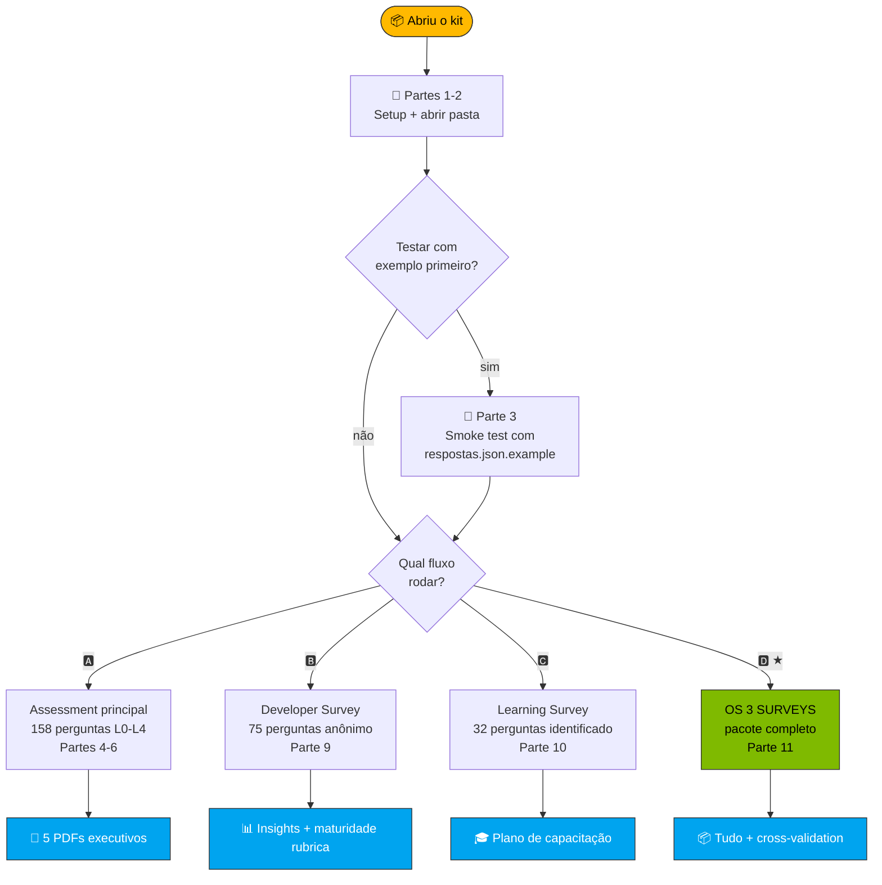

<!-- paulasilva-ms identity: Paula Silva, Software Global Black Belt · LinkedIn https://linkedin.com/in/paulanunes -->

# Guia Passo-a-Passo · Kit AI Maturity Assessment

**`📘 GUIA`** · 📖 [🏠 Índice](README.md) · Você está aqui · [» Coleta via Forms](coleta/INSTRUCOES-FORMS.md)

> [!NOTE]
> Este guia é para você que **nunca usou o kit antes**. Vamos do zero (instalar pré-requisitos) até o relatório executivo na sua mão. **Tempo total estimado: 30–60 minutos** para o assessment principal (15 min setup + 15–45 min preenchendo). Para o fluxo completo dos 3 surveys: **~6 semanas** (incluindo coleta).

---

## 🗺️ Mapa do que você vai fazer



> [!TIP]
> **Como invocar qualquer fluxo:** abra Copilot Chat e digite `@ai-maturity-assistant` (modo guiado, recomendado para a primeira vez) ou `/run-full-pipeline` (direto ao ponto).

### Detalhamento textual

```
[ Partes 1-2: Setup + abrir pasta ]
            ↓
[ Parte 3 (opcional): Testar com dados de exemplo ]   ← recomendado na 1ª vez
            ↓
        ┌─────────────────────────────────────────────────────────┐
        │  ESCOLHA QUAL FLUXO RODAR:                              │
        │                                                          │
        │  🅰️ Assessment principal apenas (Partes 4-6)            │
        │     → 158 perguntas L0-L4, gera 5 PDFs executivos       │
        │     → Tempo: 60-90 min coletar + 5 min gerar            │
        │                                                          │
        │  🅱️ Developer Survey apenas (Parte 9)                   │
        │     → 75 perguntas anônimas, comportamento + maturidade │
        │     → Tempo: 22-28 min/dev                              │
        │                                                          │
        │  🅲 Learning & Growth Survey apenas (Parte 10)          │
        │     → 32 perguntas identificadas, plano de capacitação  │
        │     → Tempo: 5-8 min/dev                                │
        │                                                          │
        │  🅳 OS TRÊS — pacote completo (Parte 11) ★              │
        │     → Visão 360° + cross-validation + plano com nomes   │
        │     → Tempo: ~6 semanas (incluindo coleta)              │
        │                                                          │
        │  COMO INVOCAR (qualquer um dos 4):                      │
        │  • 🤖 Modo guiado: @ai-maturity-assistant               │
        │       (concierge oferece os 4 caminhos)                 │
        │  • 🚀 Modo direto: /run-full-pipeline (só A)            │
        │       ou skills individuais (qualquer fluxo)            │
        └─────────────────────────────────────────────────────────┘
            ↓
[ Parte 7B: Wizard com Mode D auto-fill (se rodou Learning Survey) ]
            ↓
[ Abrir os 5 PDFs + JSONs gerados em saida/ ]
```

> 💡 **Nova aqui? Use o concierge.** Digite `@ai-maturity-assistant` no Copilot Chat (modo Agent) e ele vai te perguntar onde você está no processo, oferecer botões clicáveis para o próximo passo, e te avisar quando algo precisa atenção. Não precisa lembrar nenhum comando.

---

## 📦 Parte 1 — Setup (uma vez)

### 1.1 Instalar VS Code

| Sistema | Como instalar |
|---|---|
| **macOS** | https://code.visualstudio.com/Download → baixar `.zip` → arrastar para Applications |
| **Windows** | https://code.visualstudio.com/Download → baixar `.exe` → Next, Next, Finish |
| **Linux (Ubuntu/Debian)** | `sudo snap install code --classic` ou `.deb` do site |

**Confirme que funcionou:**
```bash
code --version
```
Se aparecer algo como `1.95.0`, está OK.

### 1.2 Instalar Python 3.10 ou superior

| Sistema | Como instalar |
|---|---|
| **macOS** | Geralmente já vem. Se não: `brew install python@3.12` |
| **Windows** | https://www.python.org/downloads/ → marcar "Add Python to PATH" durante instalação |
| **Linux** | `sudo apt install python3 python3-pip` |

**Confirme:**
```bash
python3 --version
# Deve mostrar Python 3.10.x ou superior
```

### 1.3 Instalar 3 bibliotecas Python (necessárias para gerar planilha + 5 PDFs)

```bash
python3 -m pip install --user --break-system-packages openpyxl jinja2 weasyprint
```

| Biblioteca | Para que serve |
|---|---|
| `openpyxl` | Preencher a planilha auditável `.xlsx` (skill `/fill-spreadsheet`) |
| `jinja2` | Engine de templates dos 5 PDFs (skill `/generate-reports`) |
| `weasyprint` | HTML+CSS → PDF de qualidade (skill `/generate-reports`) |

**Confirme:**
```bash
python3 -c "import openpyxl, jinja2, weasyprint; print('✓ Todas as 3 libs OK')"
```

**Mac apenas — dependências de sistema do WeasyPrint:**
```bash
brew install cairo pango gdk-pixbuf libffi
```
(Se você ver erro "library 'libgobject-2.0-0' not found" ao rodar `/generate-reports`, você esqueceu este passo.)

### 1.4 Instalar a extensão GitHub Copilot Chat no VS Code

1. Abra o VS Code
2. Ícone de **Extensions** na barra lateral (ou `Cmd+Shift+X` / `Ctrl+Shift+X`)
3. Buscar: **GitHub Copilot Chat**
4. Clicar **Install** (vai instalar Copilot + Copilot Chat juntos)
5. Quando pedir login, fazer com sua conta GitHub que tem **Copilot Pro / Business / Enterprise**

**Como saber se está logado e ativo?** Olhe o ícone do Copilot no canto inferior direito do VS Code — deve estar **azul aceso**, não cinza.

### 1.5 ⚠️ CRÍTICO — Trocar para modo "Agent"

Sem isso, o agente concierge (`@ai-maturity-assistant`) e as 7 skills custom **NÃO aparecem** no chat.

1. Abra o Copilot Chat (`Cmd+Shift+I` / `Ctrl+Shift+I`)
2. No painel do chat, procure o **dropdown de modo** (geralmente no topo do chat, mostrando "Ask")
3. Mude para **Agent**

> 🔍 **Como verificar:** com o cursor no chat, digite `@` — deve aparecer `@ai-maturity-assistant` no dropdown. Se aparecer só `@workspace`, ainda está em modo Ask. Digite `/` — deve listar `/run-full-pipeline`, `/calculate-scores`, etc.

### ✅ Checkpoint 1
Se chegou aqui sem erro, está pronto para usar o kit. Se travou em algum passo:
- VS Code não instala? Tente baixar o `.zip`/`.exe` direto do site
- `pip install` dá erro de permissão? Use `pip install --user openpyxl`
- Copilot pede pagamento? Sua conta corporativa pode não ter o plano — fale com TI

---

## 📂 Parte 2 — Abrir a pasta certa

> ⚠️ **Importante:** o Copilot só detecta as skills custom (`.github/skills/`) se a pasta do kit for o **workspace root**. Não abra o repositório inteiro.

### 2.1 Abrir só o `kit-cliente/`

**Pelo terminal:**
```bash
cd caminho/para/kit-cliente
code .
```

**Ou pelo VS Code:**
1. Menu **File → Open Folder**
2. Selecione **só** a pasta `kit-cliente/`
3. Clique **Open**

### 2.2 Forçar o Copilot a recarregar (importante!)

Depois de abrir, faça Reload Window:
1. Pressione **Cmd+Shift+P** (Mac) / **Ctrl+Shift+P** (Win/Linux)
2. Digite: **Developer: Reload Window**
3. Enter

Isso garante que o Copilot leia o `.github/copilot-instructions.md` e detecte as skills.

### ✅ Checkpoint 2
Verifique 3 coisas:
- [ ] Na sidebar (Explorer), você vê: `README.md`, `respostas.json`, `framework.json`, pastas `formularios/`, `referencia/`, `saida/`, `.github/`
- [ ] Clicando na pasta `.github/skills/`, você vê 12 subpastas de skills (assessment, wizard, survey-devs e survey-learning)
- [ ] O ícone do Copilot no canto inferior direito está azul/ativo

Se algo está errado, provavelmente você abriu a pasta errada. Volte para 2.1.

---

## 🧪 Parte 3 — Primeira execução com dados de exemplo (RECOMENDADO)

> Antes de digitar suas próprias respostas (que são muitas — 158!), faça um **teste rápido** com dados pré-preenchidos. Isso te mostra o que esperar e valida que tudo está funcionando.

### 3.1 Usar o `respostas.json.example`

A pasta vem com **`respostas.json.example`** — um arquivo com **46 respostas mockadas** simulando uma "Cliente Exemplo S.A." com perfil realista (forte em Copilot, fraco em DevSecOps e Agênticos).

**Copie o exemplo para `respostas.json`:**

No terminal (dentro da pasta `kit-cliente/`):
```bash
cp respostas.json respostas.json.template     # backup do template vazio
cp respostas.json.example respostas.json      # usar o mockado
```

**Ou pelo VS Code:**
1. Clique direito em `respostas.json` na sidebar → **Rename** → renomeie para `respostas.json.template`
2. Clique direito em `respostas.json.example` → **Rename** → renomeie para `respostas.json`

### 3.2 Abrir o Copilot Chat em modo Agent

1. Pressione **Cmd+Shift+I** (Mac) / **Ctrl+Shift+I** (Win/Linux) — abre o painel de chat do Copilot na lateral
2. No **dropdown no topo do chat** (ou bottom — depende da versão do VS Code), selecione **Agent** (não Ask, não Edit)

> **Como saber se está em modo Agent?** Aparece a palavra "Agent" no topo do chat. Se aparecer "Ask", troque.

### 3.3 Rodar o pipeline completo

No campo de chat, digite:

```
/run-full-pipeline
```

Pressione Enter.

**O que vai acontecer:**
1. O Copilot vai validar `respostas.json` (~10 segundos)
2. Vai invocar 5 skills em sequência (~2–4 minutos no total)
3. Vai te mostrar progresso a cada passo no chat
4. Ao final, vai listar os 6 arquivos gerados na pasta `saida/`

> 💡 **Permissões:** o Copilot Agent vai pedir permissão para **rodar comandos de terminal** (Python) e **escrever arquivos**. Aprove cada um (ou clique "Always allow" para esta sessão).

### ✅ Checkpoint 3
Se tudo deu certo, você verá no chat algo como:

```
🎯 Pipeline completo — AI Maturity Assessment

📂 Arquivos gerados em saida/:
   ✓ pontuacao-preenchida-2026-05-08.xlsx
   ✓ scores.json
   ✓ gaps.json
   ✓ recomendacoes.json
   ✓ payload.json                          (merged data — debug/customization)
   ✓ score_justification.pdf                (~330 KB)
   ✓ roadmap_part_pillar_p1.pdf             (~410 KB)
   ✓ roadmap_part_pillar_p2.pdf             (~410 KB)
   ✓ roadmap_part_pillar_p3.pdf             (~410 KB)
   ✓ roadmap_part4.pdf                      (~510 KB)

📊 Resumo:
   Overall:     1.99 (L2 — Definido)
   Threshold:   OK (46/158)
   Pillars:     P1=2.69 L3 · P2=1.52 L2 · P3=1.92 L2
   Gaps top:    3 P0, 0 P1, 1 P2, 6 P3
   Estratégias: S7, S6, S5 (top 3)
```

> Se os números estiverem **próximos disso** (overall ~1.99, top estratégia S7), o algoritmo funcionou perfeitamente. Pequenas variações são normais.

### 3.4 Abrir os arquivos gerados

| Arquivo | Como abrir | O que olhar |
|---|---|---|
| `saida/pontuacao-preenchida-*.xlsx` | Excel / Numbers / Sheets | Aba "Respostas" com os níveis preenchidos e aba "Cálculo" com fórmulas SUMPRODUCT calculando ao vivo |
| `saida/scores.json` | VS Code | Estrutura completa: overall, pillars, capabilities |
| `saida/gaps.json` | VS Code | Gaps ordenados por prioridade (top 3 são P0) |
| `saida/recomendacoes.json` | VS Code | 6 estratégias com tecnologias e ações |
| `saida/score_justification.pdf` | Preview de PDF | Justificativa executiva + PE Readiness |
| `saida/roadmap_part_pillar_p{1,2,3}.pdf` | Preview de PDF | Roadmap detalhado por pilar (P1/P2/P3) |
| `saida/roadmap_part4.pdf` | Preview de PDF | Implementation Guide consolidado (Steering Committee, RACI, ADKAR, Quick Wins) |
| `saida/payload.json` | VS Code | Dados consolidados que alimentaram os PDFs (edite + re-renderize para customizar narrativa) |

### 3.5 Restaurar o template para o uso real

Quando terminar de explorar o exemplo:
```bash
mv respostas.json respostas.json.exemplo-usado    # guarda o exemplo usado
mv respostas.json.template respostas.json         # volta o template vazio
rm -rf saida/*                                     # limpa o output do teste
```

---

## ✏️ Parte 4 — Preenchendo suas respostas reais

### 4.1 Entendendo a estrutura

Abra `respostas.json`. Você vai ver:

```jsonc
{
  "metadata": { ... },              // 1. Quem está respondendo
  "target_overrides": { ... },      // 2. Targets customizados (opcional)
  "responses": {                    // 3. As 158 respostas
    "P1-C1-Q1": {
      "level": null,                //   ← 0=L0, 1=L1, ..., 4=L4, null=não respondida
      "evidence": "",               //   ← texto livre com prova
      "text_pt_br": "..."           //   ← pergunta (não editar — só leitura)
    },
    ...
  }
}
```

### 4.2 Preencher metadata (5 minutos)

```jsonc
"metadata": {
  "respondent_name": "Seu nome",
  "respondent_email": "voce@empresa.com",
  "respondent_role": "Engineering Manager",  // ou: Tech Lead, Diretor, etc.
  "audience": ["all"],                       // ou específico: ["developer", "sre"]
  "organization": "Sua Empresa",
  "assessment_date": "2026-05-08",
  "language": "pt-BR"
}
```

### 4.3 (Opcional) Definir targets customizados

Por default, o sistema usa **target = 3.0 (L3)** para todas as capabilities. Se você quer **mirar L4 em alguma área específica** (ou L2 se for área de baixa prioridade):

```jsonc
"target_overrides": {
  "P3-C5": 4.0,   // Aplicações Agênticas — ambicionar L4
  "P2-C4": 3.5,   // DevSecOps — ambicionar L3+
  "P1-C8": 2.0    // Métricas DevEx — L2 está bom para nós
}
```

> 💡 Os IDs das capabilities estão em `framework.json` ou nos `referencia/P*.md`. Use o que faz sentido para sua estratégia.

### 4.4 Preencher cada resposta — fluxo recomendado

**Não tente preencher tudo de uma vez.** Vá em sessões de 30 minutos, capability por capability.

**Para cada questão:**

1. **Leia a pergunta** (campo `text_pt_br`).
2. **Consulte o documento de referência** se tiver dúvida sobre o que cada nível significa:
   - [`referencia/P1-produtividade-do-desenvolvedor.md`](referencia/P1-produtividade-do-desenvolvedor.md)
   - [`referencia/P2-ciclo-de-vida-devops.md`](referencia/P2-ciclo-de-vida-devops.md)
   - [`referencia/P3-plataforma-de-aplicações.md`](referencia/P3-plataforma-de-aplicações.md)
   
   Cada documento tem para cada questão: KPI, contexto (o que mede / por que importa), e descrição completa de cada nível L0-L4 com evidências esperadas.

3. **Selecione o nível** que melhor descreve **a realidade hoje** (não a aspiracional!):
   - **L0 (0)** — Sem prática estabelecida
   - **L1 (1)** — Pilotos isolados (<25% cobertura)
   - **L2 (2)** — Definido (25–50%)
   - **L3 (3)** — Gerenciado (>75%, com métricas)
   - **L4 (4)** — Otimizando (>95%, automação contínua)
   - **null** — Você não sabe / não se aplica → o sistema **ignora sem penalizar**

4. **Escreva uma evidência** (campo `evidence`):
   - **Mínima** (<80 chars): "Usamos Copilot." → fraco
   - **Adequada** (80–250): "Copilot Enterprise para 80% dos devs com governança via GHAS."
   - **Detalhada** (250–500): "Copilot Enterprise rollout completo em 80% dos devs Q1/2026; métricas DORA mostram +18% na lead time; biblioteca de prompts compartilhada no SharePoint corporativo."
   - **Exemplar** (>500): adicione comparativos antes/depois, links, períodos.

### 4.5 Quanto preencher antes de rodar?

| Respondidas | Status | O que muda |
|---|---|---|
| 0–24 | 🔴 BLOCKED | Sistema recusa scoring (cobertura insuficiente) |
| 25–39 | 🟡 WARNING | Scoring calculado, mas marcado "preliminar" |
| ≥ 40 | 🟢 OK | Scoring confiável |
| 158 | 💯 Completo | Todas as capabilities têm score |

**Recomendado:** **mínimo 60 respostas distribuídas pelos 3 pillars** para um relatório útil. Você pode rodar `/run-full-pipeline` várias vezes ao longo do preenchimento (cada execução sobrescreve `saida/`).

### 4.6 Validar o JSON antes de rodar

Erros de JSON (vírgula a mais, aspas faltando) quebram tudo. Valide:

```bash
python3 -m json.tool respostas.json > /dev/null && echo "JSON válido" || echo "JSON inválido — corrija"
```

Ou no VS Code: se houver erro, aparece um sublinhado vermelho na linha problemática.

### ✅ Checkpoint 4
Antes de rodar o pipeline real:
- [ ] Metadata preenchida com seus dados
- [ ] Pelo menos 40 respostas com `level != null`
- [ ] JSON valida sem erros
- [ ] Pasta `saida/` está vazia (ou você não se importa de sobrescrever)

---

## 🎬 Parte 5 — Rodando o pipeline real

Você tem **3 caminhos** para rodar — escolha o que combina mais com seu nível de familiaridade.

### 5.1 Caminho A — Concierge guiado (recomendado para 1ª vez) 🤖

No Copilot Chat (modo Agent):
```
@ai-maturity-assistant
```

O agente:
1. Faz uma saudação em PT-BR
2. **Lê o estado do seu workspace** (que arquivos existem) e descobre onde você está no funil
3. Pergunta o mínimo necessário (idioma, se já preencheu respostas, etc.)
4. Invoca a skill certa **com botões clicáveis** ("Sim, rodar /calculate-scores")
5. Após cada passo, mostra o resultado e oferece o próximo
6. Te avisa quando algo precisa atenção (ex.: "Threshold abaixo de 25, quer prosseguir mesmo assim?")

> 💡 **Vantagem:** você não precisa lembrar nenhum comando. Se errar, ele te corrige.

### 5.2 Caminho B — Comando único (você sabe o que faz) 🚀

```
/run-full-pipeline
```

Roda as 6 skills em sequência (auto-detecta `respostas-forms.xlsx` se existir e oferece o wizard de implementação antes do `/generate-reports`).

### 5.3 Caminho C — Comandos individuais (controle granular) 🔧

Se preferir rodar passo a passo (ou refazer só uma parte):

```
/import-assessment-responses ← (opcional) Excel do Forms → respostas.json
/fill-spreadsheet            ← copia template e preenche níveis no .xlsx
/calculate-scores            ← gera saida/scores.json
/gap-analysis                ← gera saida/gaps.json
/recommend-strategies        ← gera saida/recomendacoes.json
/implementation-wizard       ← (opcional) personaliza Parte 4
/generate-reports            ← gera 5 PDFs production-quality
```

A ordem importa (cada um depende do anterior).

### 5.4 Iterando

Mudou alguma resposta? Mudou um target? Basta:
- **Caminho A (concierge):** `@ai-maturity-assistant` — ele detecta o estado novo e refaz o que mudou
- **Caminho B (direto):** `/run-full-pipeline` — roda tudo de novo, arquivos em `saida/` são sobrescritos
- **Caminho C (cirúrgico):** rode só a skill afetada (ex.: editou `target_overrides`? só rode `/gap-analysis` em diante)

---

## 📊 Parte 6 — Lendo os resultados

Após `/generate-reports` (ou conclusão do `@ai-maturity-assistant`), você terá **6 outputs principais** em `saida/`:

### 6.1 Os 5 PDFs production-quality (entregáveis para liderança)

Estes são **idênticos** aos PDFs que a plataforma web vai gerar quando ficar pronta — branding limpo, gráficos, tabelas profissionais:

| PDF | Tamanho | O que contém |
|---|---|---|
| **`score_justification.pdf`** | ~330 KB | Justificativa do score: overall, breakdown por pillar, PE Readiness com recomendação de path (Three Horizons / Open Horizons) |
| **`roadmap_part_pillar_p1.pdf`** | ~410 KB | Pillar P1 (Produtividade) deep-dive: 9 capabilities com rubric, gaps, evidências, ações por horizonte |
| **`roadmap_part_pillar_p2.pdf`** | ~410 KB | Pillar P2 (DevOps) deep-dive: 10 capabilities |
| **`roadmap_part_pillar_p3.pdf`** | ~410 KB | Pillar P3 (Plataforma) deep-dive: 9 capabilities |
| **`roadmap_part4.pdf`** | ~510 KB | Implementation Guide consolidado: Three Horizons (H1/H2/H3), tecnologias, success metrics, riscos, **Steering Committee + RACI + ADKAR + Quick Wins** (esta parte usa dados do `/implementation-wizard` se rodou) |

**Como abrir:** duplo clique no Finder/Explorer → abre no Preview/Acrobat. Ou no VS Code: clique no `.pdf` na sidebar.

**Como compartilhar:**
- **Email/Teams/SharePoint:** anexar diretamente (PDFs ~330 KB-510 KB cada)
- **Apresentar:** abrir em fullscreen (`Cmd+Ctrl+F` no Preview do Mac)
- **Imprimir:** branding limpo, paginação correta — pronto para impressão

> 💡 **Antes de compartilhar:** confira se a Parte 4 (`roadmap_part4.pdf`) tem os nomes/dados da SUA organização. Se ainda mostrar "Maria Santos / James Carter / Acme", você esqueceu de rodar `/implementation-wizard` para personalizar.

### 6.2 A planilha auditável (`saida/pontuacao-preenchida-*.xlsx`)

Para quando alguém perguntar **"como esse score foi calculado?"** — abra no Excel/Numbers/Sheets:

- **Aba "Respostas"**: todas as 158 questões com nível, peso (do framework.json) e evidência
- **Aba "Cálculo"**: fórmulas SUMPRODUCT visíveis célula por célula, com scores por capability, por pilar, overall e threshold
- **Aba "Leia-me"**: legenda completa (rótulos, thresholds, como usar)

### 6.3 Os JSONs (intermediários + payload final)

Para integração com outras ferramentas (Power BI, Tableau, scripts custom):

| Arquivo | O que contém |
|---|---|
| `scores.json` | Overall, 3 pillars, 28 capabilities — scores brutos |
| `gaps.json` | Lista de gaps ordenados por prioridade (P0/P1/P2/P3) |
| `recomendacoes.json` | 7 estratégias rankeadas com tecnologias e ações |
| `payload.json` | **Payload completo** enviado ao Jinja2 para renderizar os PDFs — útil para customização profunda |

**Quando o app web ficar pronto:** esses JSONs migram para o backend via `POST /api/responses/bulk` (mesmo schema).

### 6.4 Personalizar narrativa profunda dos PDFs

Algumas seções dos PDFs (ex.: `scoring_rationale` por capability, `risks_per_pillar`, detalhes de `technology_resources_per_pillar`) usam **placeholders profissionais** do `sample_payload.json` (Acme Insurance Group). Para personalizar:

```bash
# Edite saida/payload.json substituindo os placeholders pelos seus dados
code saida/payload.json

# Re-renderize só os PDFs (pula a etapa de merge):
python3 relatorios/scripts/render_reports.py --payload saida/payload.json --out saida
```

### 6.5 Comparar com exemplo

Quer ver como ficaram os PDFs de um cliente fictício antes de rodar com seus dados? Veja **[`referencia/exemplo-saida/`](referencia/exemplo-saida/)** — 5 PDFs do "Cliente Exemplo S.A." (PT-BR) + 5 em EN, gerados a partir do `respostas.json.example`.

---

## 🔁 Parte 7 — Múltiplos respondentes via Microsoft Forms (RECOMENDADO)

Para coletar respostas de **múltiplas pessoas** (recomendado para reduzir viés), use o **Microsoft Forms** ou um **Excel compartilhado no SharePoint**. O kit tem uma skill dedicada que **agrega automaticamente via média** por questão.

### Fluxo recomendado (3 caminhos)

| Caminho | Tempo setup | Quando usar |
|---|---|---|
| **A. Forms manual** (158 perguntas) | 4-6h | Roll-out organização (10+ respondentes), branding profissional |
| **B. Forms enxuto** (1 capability piloto) | 30 min | PoC ou validação do fluxo |
| **C. Excel/SharePoint direto** ⭐ | 5 min | **Default** — usa template pronto que vem no kit |

> 📋 **Guia completo:** [`coleta/INSTRUCOES-FORMS.md`](coleta/INSTRUCOES-FORMS.md) tem passo-a-passo detalhado dos 3 caminhos com screenshots verbais, configuração de permissões, formato exato das opções de resposta (`L0 — Inicial`, etc.) e troubleshooting.

### Resumo do caminho mais rápido (Caminho C — Excel direto)

**Passo 7.1** — Pegar o template Excel:
```bash
cp coleta/template-export-forms.xlsx respostas-forms.xlsx
```

**Passo 7.2** — Limpar dados mockados e subir no SharePoint/OneDrive:
- Abrir `respostas-forms.xlsx` no Excel
- Apagar linhas 2, 3, 4 (3 respondentes mockados)
- Manter linha 1 (headers)
- Salvar e subir no SharePoint com link "Anyone can edit"

**Passo 7.3** — Cada pessoa preenche uma linha:
- Compartilhe o link da planilha com a equipe
- Cada respondente preenche **uma linha** no Excel
- Para cada coluna de pergunta, escolher uma opção (`L0 — Inicial`, `L1 — Em Desenvolvimento`, ..., `L4 — Otimizando`, `NA — Não sei`)
- Coluna ao lado = evidência (texto livre opcional)

**Passo 7.4** — Quando todos preencherem:
- Baixar o Excel atualizado
- Renomear para `respostas-forms.xlsx`
- Colocar na raiz do `kit-cliente/`

**Passo 7.5** — Importar no kit:
```
/import-assessment-responses
```

A skill:
- Detecta automaticamente `respostas-forms.xlsx`
- Faz backup do `respostas.json` atual (`.backup-<timestamp>`)
- Lê todas as linhas (cada uma = um respondente)
- **Agrega via média** por questão (alinhado com algoritmo `repos/scoring.rs:354-368` da plataforma)
- Sobrescreve `respostas.json`
- Gera `saida/import-log-<DATA>.md` com cobertura por respondente e alertas

**Passo 7.6** — Continuar normal:
```
/run-full-pipeline
```

> 💡 **Dica:** o `/run-full-pipeline` **detecta automaticamente** se há `respostas-forms.xlsx` mais recente que `respostas.json` e roda `/import-assessment-responses` antes — você pode pular o Passo 7.5 e ir direto.

### Smoke test rápido com o template mockado

Quer testar o fluxo completo de coleta sem criar Forms?

```bash
cp coleta/template-export-forms.xlsx respostas-forms.xlsx
# (template já vem com 3 respondentes mockados: Maria, Joao, Ana)
```

No Copilot Chat:
```
/run-full-pipeline
```

Você verá o pipeline rodando com **3 respondentes** sendo agregados → vai gerar relatório com média ponderada de Maria + Joao + Ana.

---

---

## 🧙 Parte 7B — Personalizar a Parte 4 do PDF (Implementation Guide)

> A Parte 4 do roadmap (`roadmap_part4.pdf`) é o **Guia de Implementação consolidado**: comitês, RACI, plano de comunicação, treinamento, ADKAR, quick wins. Por padrão usa placeholders profissionais. Para personalizar com seus dados reais, há **3 caminhos**.

### ⭐ Atalho: Mode D (auto-fill do Learning Survey)

Se você já rodou `/training-plan` (Parte 10), o Copilot Agent **detecta automaticamente** o `saida/plano-capacitacao-*.md` e oferece:

```
🎓 Detectei plano de capacitação. Posso EXTRAIR automaticamente:
   Champions, training_plan, communication_plan (calendário), quick wins.
   Você só precisa preencher: TPO + RACI Matrix.

   [a] Auto-fill (Mode D — recomendado, preenche 6 dos 9 inputs)
   [b] Modo HTML / JSON / Chat (preencher tudo manualmente)
```

**Mode D economiza 30-45 min** porque os dados do learning survey já mapeiam para:
- `executive_steering_committee` ← Champions Network "ativos"
- `communication_plan` ← Calendário de workshops
- `training_plan` ← Cohorts por dimensão
- `adkar_notes` ← Workshops top 5
- `quick_wins_w1_4/5_8/9_12` ← Calendário 90 dias

Se você ainda não rodou `/training-plan`, use modos A/B/C abaixo.

### 7B.1 · Os 9 inputs que vão para a Parte 4

| # | Input | O que é |
|---|---|---|
| 1 | **Steering Committee** | 5-8 nomes — Sponsor, Programa Lead, CFO, CISO, Change Champion |
| 2 | **TPO** (Technology Product Owner) | Programa Manager + escritório (3-5 pessoas) + autoridade |
| 3 | **RACI Matrix** | 5-8 atividades × R/A/C/I |
| 4 | **Plano de Comunicação** | Audiência × canal × frequência × owner |
| 5 | **Plano de Treinamento** | Cohort × formato × cadência × critério |
| 6 | **ADKAR** | Awareness · Desire · Knowledge · Ability · Reinforcement |
| 7 | **Quick Wins W1-4** | 4-6 iniciativas do primeiro mês |
| 8 | **Quick Wins W5-8** | Segunda onda |
| 9 | **Quick Wins W9-12** | Terceira onda |

Output: `implementation-guide-inputs.json` na raiz do kit.

### 7B.2 · Modo A — Wizard HTML standalone (RECOMENDADO)

**Caminho mais visual** — espelha o wizard do app web.

```bash
open wizard/implementation-guide-wizard.html
# ou clique direito no arquivo no VS Code → "Reveal in Finder" → duplo-clique
```

**Como funciona:**
1. Browser abre uma página com 9 steps (cada um com helper + textarea grande)
2. Salva automaticamente no `localStorage` — pode pausar e voltar depois
3. Stepper no topo mostra progresso (✓ verde quando preenchido)
4. Ao final, clique **💾 Baixar JSON**
5. Mova `implementation-guide-inputs.json` para a raiz do `kit-cliente/`

**Tempo estimado:** 30-60 min para preencher todos os 9 (ou 15 min se for rascunho rápido).

### 7B.3 · Modo B — Editar JSON direto no VS Code

**Caminho para devs** que preferem código.

```bash
cp wizard/implementation-guide-inputs.template.json implementation-guide-inputs.json
code implementation-guide-inputs.json
# Editar cada um dos 9 campos (vêm com instruções inline + exemplos)
```

O template tem placeholders ricos com instruções (`_help`, `_dicas`, exemplos por campo). Apague os exemplos quando substituir pelo seu conteúdo.

### 7B.4 · Modo C — Conversa via Copilot Chat

**Caminho rápido para rascunho colaborativo.**

No Copilot Chat (modo Agent):
```
/implementation-wizard
```

O Copilot vai oferecer 3 modos. Escolha **C** (chat). Ele vai:
1. Te fazer 9 perguntas, uma por vez
2. Você responde livremente em PT-BR
3. No fim, ele monta o JSON e te pede confirmação para salvar
4. Salva automaticamente em `implementation-guide-inputs.json`

> 💡 **Dica:** o modo C é ótimo para iteração inicial. Depois você abre o JSON e refina manualmente.

### 7B.5 · Re-renderizar PDFs com a Parte 4 personalizada

Depois de qualquer um dos 3 modos:

```
/generate-reports
```

A skill detecta automaticamente o `implementation-guide-inputs.json` na raiz e mescla no payload — a Parte 4 do `roadmap_part4.pdf` agora reflete seus dados reais.

### ✅ Checkpoint 7B

Antes de seguir:
- [ ] `implementation-guide-inputs.json` existe na raiz do kit
- [ ] Pelo menos 5 dos 9 campos preenchidos (idealmente 9/9)
- [ ] Re-rodou `/generate-reports` e o `roadmap_part4.pdf` mostra seus nomes/dados (não mais "Maria Santos / James Carter" do sample)

---

---

## 👥 Parte 9 — Developer Survey (anônimo, comportamental)

> **Survey complementar #1** — diferente do assessment principal. Mede **como devs realmente usam IA** no dia-a-dia (anônimo, individual). Output: **insights agregados + maturidade calculada por rubrica determinística L0-L4 em 7 dimensões D2-D8**.

### 9.1 · Por que rodar este survey?

O assessment principal (Partes 4-6) captura a **percepção da liderança** (L0-L4 declarado). O Developer Survey valida com a **realidade comportamental anônima**:

- Liderança avalia P1-C1 (Copilot) como L3? Survey revela 60% dos devs usa raramente → **dissonância detectada**
- Identifica **gaps reais** (não percebidos pela liderança)
- Anonimato → respostas mais honestas

**Quando rodar:** ANTES do assessment principal, para informar a avaliação de capabilities.

### 9.2 · Como criar o Microsoft Forms

1. Leia **[`survey-devs/INSTRUCOES-FORMS-DEVS.md`](survey-devs/INSTRUCOES-FORMS-DEVS.md)** (passo-a-passo completo)
2. Ponto crítico: **MARCAR "Anonymous Responses"** nas Settings (sem isso captura email!)
3. 75 perguntas em 9 seções (Perfil, Copilot, MS/GH tools, práticas, agentes, instructions, usabilidade, **segurança e governança**)
4. Tempo por dev: **22-28 min**
5. Compartilhe link com TODOS os devs

### 9.3 · Atalho: testar com mocks (sem coletar)

```bash
cp survey-devs/respostas-mock-devs.json survey-devs/respostas-devs.json
```

5 respondentes mockados (Senior Backend, Mid Frontend, Junior, SRE, Tech Lead) prontos para o pipeline.

### 9.4 · Importar e gerar insights

No Copilot Chat (modo Agent):

```
/import-developer-survey            ← se tem respostas-survey-devs.xlsx
/insights-developer-survey       ← gera relatório + calcula maturidade
```

**Output em `saida/`:**
- `insights-developer-survey-DATE.md` — relatório PT-BR de ~14 páginas equivalentes
- `maturidade-developer-survey-DATE.json` — **scores L0-L4 por dimensão** (rubrica determinística)
  - D2 Copilot Adoption · D3 MS/GH Tooling · D4 AI Dev Practices · D5 Agent Concepts · D6 Instructions · D7 Best Practices · D8 Security & Governance

### 9.5 · Rubrica determinística — como funciona

Modelo de scoring em **[`survey-devs/RUBRICA-MATURIDADE.md`](survey-devs/RUBRICA-MATURIDADE.md)** — 7 dimensões mapeadas para L0-L4 (mesma escala do assessment principal). Determinística (sem LLM, auditável). Score por time (não individual — preserva anonimato no relatório).

Exemplo de output:

```
🎯 MATURIDADE DO TIME: 2.22 (L2 — Definido) — 12 devs anônimos

D2 Copilot Adoption       0.80  L1   ⚠️
D3 MS/GH Tooling          2.40  L2
D7 Best Practices         2.91  L3   ✨
D8 Security & Governance  1.92  L2
```

### ✅ Checkpoint 9

Antes de seguir:
- [ ] Forms criado com **Anonymous ON** (validar abrindo em janela anônima)
- [ ] Mínimo 5 respondentes (ideal ≥15 para representatividade)
- [ ] `respostas-survey-devs.xlsx` na raiz do kit
- [ ] `/insights-developer-survey` rodou e gerou os 2 outputs em `saida/`

---

## 🎓 Parte 10 — Learning & Growth Survey (identificado, capacitação)

> **Survey complementar #2** — IDENTIFICADO (precisa nome+email). Foca em **o que devs querem aprender** + formato preferido + barreiras + Champions Network. Output: **plano de capacitação personalizado** com listas de inscritos pré-validados.

### 10.1 · Por que rodar este survey?

Os 2 surveys anteriores **diagnosticam**. Este **prescreve o roadmap de capacitação**:

- Top 10 tópicos demandados com **lista de inscritos por nome** (não "70% querem workshop X" — isso é a lista das 10 pessoas que vão pro workshop)
- **Champions Network** identificado (3 tiers: ativos, com suporte, maybe)
- Mentor↔mentee pairs mapeados
- Calendário de workshops próximos 90 dias
- Plano alimenta automaticamente o **wizard** Mode D (Parte 7B)

**Quando rodar:** depois do survey-devs (anônimo) ou em paralelo. Antes do `/implementation-wizard`.

### 10.2 · ⚠️ Diferença crítica: IDENTIFICADO

Diferente do survey-devs, este precisa nome+email:

| Setting | Survey-devs | Learning Survey |
|---|---|---|
| Anonymous Responses | **ON** | **OFF** ⚠️ |
| Email captured | Não | Sim |
| Por quê? | Honestidade comportamental | Convidar pessoas para workshops |

**Comunicação ética com o time:** "Este survey é IDENTIFICADO. Vamos usar nome+email para CONVIDAR vocês para workshops específicos. **NÃO** será usado em performance review."

### 10.3 · Como criar o Microsoft Forms

1. Leia **[`survey-learning/INSTRUCOES-FORMS-LEARNING.md`](survey-learning/INSTRUCOES-FORMS-LEARNING.md)**
2. Settings → **Anonymous Responses DESMARCADO**
3. 32 perguntas em 7 seções (Perfil, Auto-percepção L2, Onde quer crescer L3, Tópicos L4, Formato L5, Champions L6, Barreiras L7)
4. Tempo: **5-8 min**
5. Compartilhar com TODOS os devs

### 10.4 · Atalho: testar com mocks

```bash
cp survey-learning/respostas-mock-learning.json survey-learning/respostas-learning.json
```

5 respondentes IDENTIFICADOS mockados (Maria Tech Leader, João SRE, Ana Security, Pedro Junior, Sofia Frontend).

### 10.5 · Importar e gerar plano de capacitação

```
/import-learning-survey ← se tem respostas-survey-learning.xlsx
/training-plan          ← gera plano de capacitação personalizado
```

**Output:** `saida/plano-capacitacao-DATA.md` — 12 seções incluindo:
- Top 10 tópicos com **lista de inscritos pré-validados** (nome+email)
- Cohorts sugeridos por dimensão (D2-D8)
- Champions Network (3 tiers)
- Calendário 90 dias de workshops
- 5 ações priorizadas (impacto × facilidade)
- Apêndice com tabela de respondentes (visível só para liderança)

### 10.6 · ⭐ Auto-fill do wizard (Mode D)

Depois de gerar o plano, ao rodar `/implementation-wizard` o agente vai detectar `saida/plano-capacitacao-*.md` e oferecer **Mode D — Auto-fill** que preenche automaticamente 6 dos 9 inputs do wizard:

| Input do wizard | Vem de |
|---|---|
| `executive_steering_committee` | Champions Network "ativos" |
| `communication_plan` | Calendário sugerido |
| `training_plan` | Cohorts por dimensão |
| `adkar_notes` | Workshops top 5 (Knowledge stage) |
| `quick_wins_w1_4/5_8/9_12` | Calendário 90 dias |

Você só precisa preencher manualmente: TPO + RACI Matrix.

### ✅ Checkpoint 10

- [ ] Forms criado com **Anonymous OFF** + L1-Q1 (nome) + L1-Q2 (email) **required**
- [ ] Comunicado claramente que é IDENTIFICADO + uso ético
- [ ] Mínimo 5 respondentes (ideal >50% do time)
- [ ] `/training-plan` rodou e gerou `saida/plano-capacitacao-DATA.md`
- [ ] Você confirmou Champions identificados + workshops sugeridos antes de convidar

---

## 🔄 Parte 11 — Fluxo combinado dos 3 surveys (recomendado para consultoria séria)

> Os 3 surveys são **complementares, não substitutos**. Quando rodar os 3, a ordem importa.

### 11.1 · Por que os 3?

| Survey | Pergunta que responde | Quem responde |
|---|---|---|
| **Survey-devs** | "Como vocês USAM IA hoje?" (comportamental anônimo) | Devs individuais (anônimo) |
| **Learning** | "O que vocês QUEREM aprender?" (aspiracional identificado) | Devs individuais (com nome+email) |
| **Assessment** | "Onde estamos como organização?" (Likert L0-L4 declarado) | Liderança (1-3 pessoas) |

**Sem os 3:** liderança avalia maturidade no escuro, capacitação genérica, dissonância invisível.
**Com os 3:** assessment **informado** pelo comportamento real + plano de capacitação **com nomes** + cross-validation.

### 11.2 · Ordem recomendada

```
SEMANA 1
   ↓
1. Lance Survey-devs (anônimo, 22-28 min)  + Learning Survey (identificado, 5-8 min)
   • Pode rodar em paralelo
   • Comunicar diferenças (anonimato vs identificação)
   • Deadline: 2 semanas
   ↓
SEMANA 3-4
   ↓
2. /import-developer-survey  → /insights-developer-survey
   /import-learning-survey   → /training-plan
   • Liderança recebe insights ANTES de avaliar capabilities
   • Identifica gaps comportamentais reais
   ↓
SEMANA 4-5
   ↓
3. Liderança preenche respostas.json (assessment) INFORMADA pelos surveys
   • Use insights como evidência por capability
   • Evita L3 declarado quando survey mostra L1 real
   ↓
SEMANA 5
   ↓
4. /run-full-pipeline (assessment) — calcula scores, gaps, recomendações
   ↓
SEMANA 5
   ↓
5. /implementation-wizard em Mode D (auto-fill do plano de capacitação)
   • 6 dos 9 inputs preenchidos automaticamente
   • Você só completa: TPO + RACI Matrix
   ↓
SEMANA 5
   ↓
6. /generate-reports
   • 5 PDFs finais do assessment
   • `saida/payload.json` inclui referências aos artefatos cross-survey quando eles existem
   • `roadmap_part4.pdf` consome dados do Learning Survey quando o wizard Mode D gerou `implementation-guide-inputs.json`
   ↓
SEMANA 6
   ↓
7. Apresentar PDFs para liderança + plano para devs
   • Validação cruzada (survey vs assessment)
   • Workshops já agendados com inscritos pré-validados
```

### 11.3 · Atalho com agente concierge

```
@ai-maturity-assistant
> escolher [D] OS TRÊS — Pacote completo
```

Agente conduz pelos 3 surveys + assessment + wizard + relatório, **com handoffs clicáveis** entre cada passo. Você nunca precisa lembrar comando.

### 11.4 · Cross-survey validations

Após rodar os 3 + `/generate-reports`, o **`score_justification.pdf`** inclui a seção **Sinais Complementares dos Surveys**, e o arquivo **`saida/payload.json`** mantém os ponteiros estruturados para auditoria. Use esses dados para comparar a maturidade declarada pela liderança com a maturidade comportamental dos devs:

```
| Capability | Liderança avalia | Survey rubric | Dissonância |
|---|---|---|---|
| P1-C1 Copilot     | L3 (3.2)        | D2 = L1 (0.80)  | 🚨 ALERTA |
| P3-C5 Apps Agent  | L1 (1.0)        | D5 = L3 (2.56)  | ⚠ Underconf |
```

**Insight:** dissonâncias revelam onde investigar (gap entre estratégia e prática).

> [!NOTE]
> Quando `cross_survey_data` existe no payload, o `score_justification.pdf` renderiza a seção **Sinais Complementares dos Surveys**. O Learning Survey também entra no `roadmap_part4.pdf` quando você roda `/implementation-wizard` em Mode D antes de `/generate-reports`.

### ✅ Checkpoint 11 (após fluxo dos 3)

- [ ] Os 2 surveys (devs + learning) coletados antes do assessment
- [ ] `saida/insights-developer-survey-*.md` + `saida/maturidade-developer-survey-*.json` existem
- [ ] `saida/plano-capacitacao-*.md` existe
- [ ] `respostas.json` preenchido informado pelos surveys
- [ ] `/implementation-wizard` rodou em Mode D (auto-fill detectou plano)
- [ ] `/generate-reports` gerou 5 PDFs, `saida/payload.json` contém `cross_survey_data` e o `score_justification.pdf` inclui a seção de sinais complementares
- [ ] Apresentou para liderança + devs

---

## 🅿️ Parte 12 — Quando usar cada formato de input (assessment principal)

> Esta parte trata só dos formatos de input para o **assessment principal** (Parte 5). Para os surveys complementares, ver Partes 9 e 10.

| Cenário | Input recomendado | Por quê |
|---|---|---|
| 1 pessoa preenchendo (você ou consultor) | `respostas.json` direto | Simples, sem overhead |
| 3-5 pessoas do mesmo time | `respostas-forms.xlsx` (Caminho C) | Template Excel pronto, 5 min setup |
| 10+ pessoas, multi-time, multi-localidade | Microsoft Forms (Caminho A) | UX mobile, validação nativa, audit trail |
| Cliente exigente / branding corporativo | Microsoft Forms (Caminho A) | Aparência profissional do Forms |
| Iteração rápida durante workshop | `respostas.json` editado ao vivo | Resultado imediato, sem rodada de coleta |

---

## 🆘 Troubleshooting expandido

> 💡 **Dica geral:** quando algo der errado, sua primeira tentativa deve ser **`@ai-maturity-assistant`** no Copilot Chat. O concierge **lê o estado do workspace** (que arquivos existem, em que estágio você parou) e geralmente identifica o problema sem você precisar diagnosticar. Os itens abaixo são para quando o concierge não está disponível ou você quer entender o problema em detalhe.

### "O comando `/run-full-pipeline` não aparece no menu"

**Causa provável:** workspace errado, modo errado ou cache do Copilot.

**Tente em ordem:**
1. Confirme que o root do workspace é `kit-cliente/` (na sidebar Explorer, o nome no topo deve ser "KIT-CLIENTE")
2. **Cmd+Shift+P** → **Developer: Reload Window**
3. Confirme que o dropdown do Copilot Chat está em **Agent**
4. Confirme que existe `.github/skills/` na pasta (deve ter 12 subpastas)

### "Skills aparecem mas dão erro 'cannot find file framework.json'"

**Causa:** caminhos relativos. Geralmente acontece se você abriu uma pasta pai por engano.

**Solução:** feche, reabra **só** a pasta `kit-cliente/` (não a pai).

### "Copilot pede aprovação a cada comando, é chato"

Quando aparecer o popup de "Allow command", clique **Always allow for this session**. Ou ajuste em **Settings → Search "copilot agent allow"**.

### "JSON inválido" ao rodar

```bash
python3 -m json.tool respostas.json
```
Vai mostrar a linha exata do erro. Causas comuns:
- Vírgula extra antes de `}` ou `]`
- Aspas trocadas (`"` vs `"`)
- `level: 3,` (faltou aspas em string) vs `"level": 3,` (correto)

### "Threshold sempre BLOCKED"

Você tem menos de 25 respostas com `level != null`. Conte:
```bash
python3 -c "
import json
r = json.load(open('respostas.json'))
n = sum(1 for v in r['responses'].values() if v['level'] is not None)
print(f'Respondidas: {n} / 158')
"
```

### "Excel não recalcula fórmulas"

Excel está em modo manual. Pressione **F9** (Win) ou **Cmd+=** (Mac) para forçar recálculo. Ou: Excel → Fórmulas → Opções de cálculo → Automático.

### "openpyxl não encontrado"

```bash
python3 -m pip install --user openpyxl
# Se ainda falhar:
which python3
# Confirme que o Copilot está usando o mesmo Python (configurar em Settings)
```

### "Custom skills não funcionam no meu Copilot Free"

Skills custom requerem **Copilot Pro/Business/Enterprise** com modo Agent. Alternativa para Free:
- Use Claude.ai web ou ChatGPT
- Faça upload do zip do kit
- Cole manualmente o conteúdo de `.github/copilot-instructions.md` como contexto
- Peça: "execute o pipeline conforme `.github/prompts/run-full-pipeline.prompt.md`"

---

## 🎓 Para aprender mais

- **Algoritmo completo** (fórmulas, edge cases, exemplos): [`referencia/pontuacao-e-calculo.md`](referencia/pontuacao-e-calculo.md)
- **Calculadora interativa** (brincar com níveis e ver scores ao vivo): abra [`referencia/calculadora-pontuacao.html`](referencia/calculadora-pontuacao.html) no navegador
- **Documentação das 158 questões** (KPI, contexto, evidências esperadas): `referencia/P1-…md`, `P2-…md`, `P3-…md`
- **Visual da plataforma** (como vai ficar quando o app estiver pronto): abra `formularios/P1-…html` no navegador
- **README principal**: [`README.md`](README.md)

---

## 📞 Suporte

| Tipo de dúvida | Onde buscar |
|---|---|
| Como uma questão deve ser interpretada | `referencia/P1-…md`, `P2-…md`, `P3-…md` |
| Por que um score é X (entender o cálculo) | `referencia/pontuacao-e-calculo.md` ou abrir o `.xlsx` em saida/ |
| O kit não está funcionando | Seção Troubleshooting acima |
| Bug ou feature request | Contato Microsoft GBB |

---

**Versão do guia:** 1.0 · **Data:** 2026-05-08 · **Idioma:** PT-BR

---

## Travou em algum desses passos?

<details>
<summary><strong>FAQ — situações comuns nos primeiros 15 minutos</strong></summary>

| Sintoma | Causa provável | Como resolver |
|---|---|---|
| O comando `/calculate-scores` não aparece quando digito `/` | Copilot Chat não está em **modo Agent** | Abra o Chat → clique no dropdown ao lado do ícone do Copilot → escolha **Agent** |
| Erro `framework_version mismatch` | Você abriu o kit em uma versão antiga do framework | Atualize `respostas.json::metadata.framework_version` para `1.0.0` |
| `make smoke` falha com `ModuleNotFoundError` | Faltam dependências Python | Rode `make install-deps` (instala jinja2 + weasyprint + openpyxl) |
| PDFs ficam com `GERADO EM` na data errada | Comportamento esperado | A data reflete a data de geração; não é bug |
| `respostas-forms.xlsx` não é detectado | Arquivo está em pasta errada | Mova para a **raiz** do kit (não dentro de `coleta/`) |
| Modo Agent diz "não tenho essa skill" | VS Code não recarregou as skills | Cmd/Ctrl+Shift+P → "Developer: Reload Window" |

</details>

---

## Continuar a leitura

| ← ANTERIOR | PRÓXIMO → |
|:---|---:|
| **[🏠 Índice (README)](README.md)** | **[Coleta via Microsoft Forms](coleta/INSTRUCOES-FORMS.md)** |
| Hub principal: visão geral, 3 surveys, pré-requisitos. | 3 caminhos para coletar respostas em equipe (Forms / Excel / SharePoint). |

↑ [Voltar ao Índice do kit](README.md)

---

<sub>**Paula Silva** | Software Global Black Belt · [LinkedIn](https://linkedin.com/in/paulanunes)</sub>
<sub>Identidade visual paulasilva-ms aplicada nos HTMLs interativos (calculadora, formulários, wizard) e nos 5 PDFs production. Veja [referencia/branding/](referencia/branding/).</sub>
