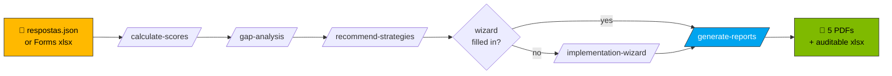

<!-- paulasilva-ms identity -->
<!--
  Paula Silva, Software Global Black Belt
  Building the future of software development with AI and Agentic DevOps
  Contact: LinkedIn https://linkedin.com/in/paulanunes
  Branding: paulasilva-ms Design System v1.7.0
  See referencia/branding/ for tokens, identity, and voice rules
-->

# AI Maturity Assessment Kit: Self-service with GitHub Copilot

**`🏠 INDEX`** · 📖 You are here · [» Step-by-step guide](GUIA-PASSO-A-PASSO.md) · [» Collection via Forms](coleta/INSTRUCOES-FORMS.md) · [» Wizard](wizard/README.md)

> [!TIP]
> **First time here?** Go straight to [GUIA-PASSO-A-PASSO.md](GUIA-PASSO-A-PASSO.md) or open Copilot Chat and type `@ai-maturity-assistant`: it guides you from installation to the final PDF.

🌐 **Public mini-site:** [paulasilvatech.github.io/ai-maturity-client-kit](https://paulasilvatech.github.io/ai-maturity-client-kit/), a visual presentation plus a download button (enable GitHub Pages under Settings → Pages → Source: GitHub Actions)

🌍 **Languages:** Português (BR): [README.md](README.md) · English, you are here · Español: [README.es.md](README.es.md). Each ZIP (PT/EN/ES) ships its documentation in the chosen language; the canonical PT-BR question banks accompany every package to preserve parsing IDs.

> **For the client:** this package contains everything you need to run the **AI Maturity Assessment** without depending on the web platform. You fill in a JSON, open GitHub Copilot Chat in VS Code, type a command, and receive a **spreadsheet, scores, gap analysis, strategy recommendations, and an executive report**.

## 🔄 Visual pipeline



---

## 🎯 When to use each survey (and the expected ROI)

The kit has **3 complementary surveys**: pick 1, 2, or all 3 based on your goal:

| Survey | Goal | Audience | Time | ROI |
|---|---|---|---|---|
| **🅰️ Main assessment** | Formal organizational baseline + 5 executive PDFs for leadership | Leadership / Tech Leads (1-3 people) | 60-90 min to collect + 5 min to generate | Canonical document for the board, comparable quarter over quarter |
| **🅱️ Developer Survey** | Validate real, anonymous maturity + surface dissonance vs the assessment | Individual devs, ANONYMOUS (≥5, ideally 15+) | 22-28 min/dev + 3 min for insights | Uncovers gaps invisible to leadership; deterministic L0-L4 rubric across 7 dimensions |
| **🅲 Learning & Growth Survey** | Personalized training roadmap with Champions + cohorts + workshops | Devs, IDENTIFIED (name+email) | 5-8 min/dev + 3 min for the plan | Concrete attendee list per workshop; feeds the wizard Mode D auto-fill |
| **🅳 All three (recommended for consulting)** | 360° view + cross-validation + action plan | Devs (anonymous + identified) + leadership | ~6 weeks (incl. collection) | Executive PDFs with **detected dissonances** + a training plan with attendees |

### When to run 1 vs. 2 vs. 3

- **Assessment only:** leadership already has good visibility (small org) or needs a fast formal deliverable
- **Survey-devs only:** you want an anonymous team pulse without committing to the formal framework
- **Learning only:** the team is already mature in AI and the focus is now advanced training
- **All 3:** serious consulting, investment decisions, a before/after transformation baseline

> 📘 **Complete breakdown of each flow (including combining all 3):** [GUIA-PASSO-A-PASSO.md](GUIA-PASSO-A-PASSO.md) Parts 1-11.

---

## ⚡ TL;DR: 3 steps

1. **Open this folder in VS Code** (`code .` or File → Open Folder).
2. **Fill in [`respostas.json`](respostas.json)**: for each question, set a `level` from 0 to 4 and an evidence text.
3. **In Copilot Chat (Agent mode), type `@ai-maturity-assistant`** (guided concierge) or `/run-full-pipeline` (run everything at once).

Done. The concierge agent or the orchestrator prompt drives the 7 skills in sequence and generates everything into [`saida/`](saida/), including the **5 production-quality PDFs**.

> 🤖 **First time? Use the concierge agent.** Type `@ai-maturity-assistant` in Copilot Chat and it guides you from "how do I fill this in?" to "open the PDFs", with no commands to memorize.

> 📘 **First time using the kit?** Follow the **[GUIA-PASSO-A-PASSO.md](GUIA-PASSO-A-PASSO.md)**: detailed instructions with per-OS setup, verbal screenshots, checkpoints, and expanded troubleshooting.
>
> 🧪 **Want to test before filling everything in?** The kit ships with **[respostas.json.example](respostas.json.example)**: 46 mocked responses from a "Cliente Exemplo S.A.". Rename it to `respostas.json` and run `/run-full-pipeline` to see the full output in ~3 minutes.
>
> 📋 **Have a team and want to collect via Microsoft Forms?** See **[coleta/INSTRUCOES-FORMS.md](coleta/INSTRUCOES-FORMS.md)**: 3 paths (manual Forms, lean Forms, direct Excel/SharePoint). The `/import-assessment-responses` skill aggregates multiple respondents automatically.
>
> 🧙 **Want to customize Part 4 of the PDF (Implementation Guide)?** Use the **[wizard/](wizard/)**: a standalone HTML (`implementation-guide-wizard.html`), an editable JSON template, or the `/implementation-wizard` skill that guides you through chat. 9 structured inputs (Steering Committee, RACI, ADKAR, Quick Wins…) populate `roadmap_part4.pdf`.
>
> 📄 **Want to see the final output before running?** The 5 real PDFs are in **[referencia/exemplo-saida/](referencia/exemplo-saida/)**, generated from `respostas.json.example` (Cliente Exemplo S.A.) with the real pipeline.
>
> 👥 **Want to hear from the devs (anonymous, behavioral)?** See **[survey-devs/](survey-devs/)**: a 75-question Developer Survey in 9 sections (GitHub Copilot + Ask/Edit/Agent modes + Coding Agent + Spaces + AI agents + Foundry + security). Skills: `/import-developer-survey` + `/insights-developer-survey`. Anonymous, individual, behavioral. Includes a deterministic L0-L4 rubric across 7 dimensions.
>
> 🎓 **Want to build the training roadmap (identified)?** See **[survey-learning/](survey-learning/)**: the Learning & Growth Survey with 32 short questions (5-8 min, IDENTIFIED with name+email) that becomes a plan of workshops + cohorts + Champions Network + mentoring. Skills: `/import-learning-survey` + `/training-plan`.

---

## 📋 Prerequisites

- [ ] **VS Code** with the **GitHub Copilot Chat** extension installed and active
- [ ] A **Copilot Pro / Business / Enterprise** plan (Free may work for skills; confirm with your org)
- [ ] **Python 3.10+** with `openpyxl` (`pip install openpyxl`), used to fill the spreadsheet
- [ ] **Agent** mode enabled in Copilot Chat (required to invoke custom skills)

> [!IMPORTANT]
> Without **Agent** mode enabled, the `/calculate-scores`, `/gap-analysis` etc. commands do not appear. See [GUIA-PASSO-A-PASSO.md](GUIA-PASSO-A-PASSO.md#parte-1) for the per-OS how-to.
### Quick smoke test (optional, for contributors)

Validate that the pipeline is intact without needing WeasyPrint:

```bash
make smoke          # rapid e2e: copies respostas.json.example and validates the payload
make smoke-cross    # same + cross-survey (developer + learning)
```

Both restore the workspace at the end. Useful after editing `relatorios/scripts/build_payload_and_render.py` or any SKILL.md in the pipeline.
---

## 🗂 Kit structure

```
kit-cliente/
├── README.md                          ← you are here
├── GUIA-PASSO-A-PASSO.md              ← detailed guide for first-time users
├── respostas.json                     ← main INPUT (filled in manually)
├── respostas.json.example             ← 46 mocked responses for testing
├── framework.json                     ← Immutable: weights, capabilities, S1-S7
│
├── formularios/                       ← Visual HTMLs (reference)
│   ├── P1-produtividade-do-desenvolvedor.html
│   ├── P2-ciclo-de-vida-devops.html
│   └── P3-plataforma-de-aplicações.html
│
├── coleta/                            ← Multi-respondent collection for the MAIN assessment (Forms/Excel)
│   ├── INSTRUCOES-FORMS.md            ← 3 collection paths + tradeoffs
│   ├── perguntas-para-forms.md        ← 158 questions to copy/paste into Forms
│   └── template-export-forms.xlsx     ← Excel template (Forms export format)
│
├── survey-devs/                       ← Developer Survey (anonymous, behavioral, 75 q)
│   ├── README.md
│   ├── INSTRUCOES-FORMS-DEVS.md       ← How to create an anonymous Forms
│   ├── perguntas-para-forms-devs.md   ← 75 questions formatted for Forms (9 sections)
│   ├── template-export-forms-devs.xlsx ← Excel template + 5 mocked respondents
│   ├── respostas-mock-devs.json       ← Structured JSON example
│   ├── RUBRICA-MATURIDADE.md          ← Deterministic L0-L4 scoring model (7 dimensions)
│   └── scripts/                       ← rubric.py + calcular_maturidade.py
│
├── survey-learning/                   ← ★ Learning & Growth Survey (identified, training, 32 q)
│   ├── README.md
│   ├── INSTRUCOES-FORMS-LEARNING.md   ← How to create an IDENTIFIED Forms
│   ├── perguntas-para-forms-learning.md  ← 32 formatted questions (7 sections)
│   ├── template-export-forms-learning.xlsx  ← Excel + 5 mocked respondents
│   └── respostas-mock-learning.json   ← Structured JSON example
│
├── wizard/                            ← ★ Implementation Guide wizard (9 steps)
│   ├── implementation-guide-wizard.html       ← Standalone visual wizard
│   └── implementation-guide-inputs.template.json ← Alternative for direct editing
│
├── relatorios/                        ← Jinja2 templates + renderer (final PDFs)
│   ├── templates/                     ← 4 official .html.j2 + _print.css
│   │   ├── _components.html.j2
│   │   ├── _print.css
│   │   ├── score_justification.html.j2
│   │   ├── roadmap_part_pillar.html.j2  (rendered 3x: P1, P2, P3)
│   │   └── roadmap_part4.html.j2
│   ├── i18n/                          ← EN / ES / PT-BR strings
│   ├── scripts/
│   │   ├── render_reports.py          ← Jinja2 → WeasyPrint → PDF renderer
│   │   └── build_payload_and_render.py ← Merge sample + client data + render
│   └── sample_payload.json            ← Schema reference + sample data
│
├── referencia/                        ← Technical documentation
│   ├── pontuacao-e-calculo.md         ← Official algorithm
│   ├── pontuacao-e-calculo.xlsx       ← Auditable template
│   ├── calculadora-pontuacao.html     ← Interactive demo (with paulasilva-ms branding)
│   ├── P1/P2/P3-...md                 ← Documentation for the 158 questions
│   ├── branding/                      ← ★ paulasilva-ms identity (Microsoft)
│   │   ├── tokens-paulasilva-ms.css   ← Design tokens (4 MS colors + neutrals + dark mode)
│   │   ├── IDENTITY.md                ← Canonical strings, SVG logo, chrome bar
│   │   └── VOICE.md                   ← Voice, banned vocabulary, punctuation rules
│   └── exemplo-saida/                 ← ★ 5 real PDFs + example JSONs
│       ├── README.md
│       ├── score_justification.pdf
│       ├── roadmap_part_pillar_p1.pdf  (P2, P3)
│       ├── roadmap_part4.pdf
│       ├── pt-br/                     ← Same 5 PDFs in PT-BR
│       ├── scores.json · gaps.json · recomendacoes.json  (intermediate JSONs)
│       └── pontuacao-preenchida-2026-05-08.xlsx
│
├── saida/                             ← OUTPUT: everything Copilot generates
│
└── .github/
    ├── copilot-instructions.md        ← Loaded automatically in every prompt (EN)
    ├── agents/
    │   └── ai-maturity-assistant.agent.md       ← @ai-maturity-assistant (guided concierge)
    ├── prompts/
    │   └── run-full-pipeline.prompt.md          ← /run-full-pipeline
    └── skills/  (12 custom skills: 1 orchestrator + 6 assessment + 1 wizard + 2 survey-devs + 2 survey-learning)
        ├── import-assessment-responses/SKILL.md  ← /import-assessment-responses  (assessment)
        ├── fill-spreadsheet/SKILL.md             ← /fill-spreadsheet             (assessment)
        ├── calculate-scores/SKILL.md             ← /calculate-scores             (assessment)
        ├── gap-analysis/SKILL.md                 ← /gap-analysis                 (assessment)
        ├── recommend-strategies/SKILL.md         ← /recommend-strategies         (assessment)
        ├── implementation-wizard/SKILL.md        ← /implementation-wizard        (assessment)
        ├── generate-reports/SKILL.md             ← /generate-reports  (5 PDFs)   (assessment)
        ├── import-developer-survey/SKILL.md      ← /import-developer-survey      (survey-devs)
        ├── insights-developer-survey/SKILL.md    ← /insights-developer-survey    (survey-devs)
        ├── import-learning-survey/SKILL.md       ← /import-learning-survey       (survey-learning)
        └── training-plan/SKILL.md                ← /training-plan                (survey-learning)
```

---

## 🎯 Commands available in Copilot Chat

Open Copilot Chat (`Ctrl+Shift+I` / `Cmd+Shift+I`) **in Agent mode** and type `/`:

### AI Maturity Assessment (main flow)

| Command | What it does | Prerequisite |
|---|---|---|
| `@ai-maturity-assistant` | **Guided concierge**: discovers the state, asks for what is missing, invokes skills, drives you to the 5 PDFs (recommended for first-timers) | none |
| `/run-full-pipeline` | **Everything at once**: 6 skills in order (auto-detects Excel + wizard) | `respostas.json` or `respostas-forms.xlsx` |
| `/import-assessment-responses` | Converts Microsoft Forms Excel → `respostas.json` (aggregates multi-respondent) | `respostas-forms.xlsx` |
| `/fill-spreadsheet` | Copies the xlsx template and fills in levels | `respostas.json` |
| `/calculate-scores` | Applies SUMPRODUCT, generates `saida/scores.json` | `respostas.json` |
| `/gap-analysis` | Computes gaps + P0–P3 priority | `saida/scores.json` |
| `/recommend-strategies` | Maps gaps → S1–S7 + technologies | `saida/gaps.json` |
| `/implementation-wizard` | **9-step wizard** to customize Part 4 of the PDF (steering committee, RACI, ADKAR, quick wins…) | none (independent) |
| `/generate-reports` | **5 production-quality PDFs** via Jinja2 + WeasyPrint (identical to the platform) | the 3 above + optional wizard |

### Developer Survey (anonymous, behavioral)

| Command | What it does | Prerequisite |
|---|---|---|
| `/import-developer-survey` | Converts `respostas-survey-devs.xlsx` (anonymous Forms) → `survey-devs/respostas-devs.json` (75 q × N respondents) | `respostas-survey-devs.xlsx` |
| `/insights-developer-survey` | **Aggregated report** + computed maturity (deterministic L0-L4 rubric across the 7 dimensions D2-D8) + gaps + recommendations linked to capabilities | `survey-devs/respostas-devs.json` |

### Learning & Growth Survey (identified, training)

| Command | What it does | Prerequisite |
|---|---|---|
| `/import-learning-survey` | Converts `respostas-survey-learning.xlsx` (identified Forms) → `survey-learning/respostas-learning.json` (32 q × N respondents with name+email) | `respostas-survey-learning.xlsx` |
| `/training-plan` | **Personalized training plan**: top 10 topics with pre-validated attendees, cohorts per dimension D2-D8, Champions Network (3 tiers), mentor↔mentee pairs, 90-day calendar, prioritized barriers | `survey-learning/respostas-learning.json` |

---

## 📝 How to fill in `respostas.json`

```jsonc
{
  "metadata": {
    "respondent_name": "João Silva",
    "respondent_email": "joao@empresa.com",
    "respondent_role": "Engineering Manager",
    "audience": ["developer", "manager"],
    "organization": "Empresa Acme",
    "assessment_date": "2026-05-08",
    "language": "pt-BR"
  },
  "target_overrides": {
    // Optional: if you want a target other than the default 3.0 for some capability:
    "P3-C5": 4.0,   // aim for L4 in Agentic Applications
    "P2-C4": 3.5    // aim for L3+ in DevSecOps
  },
  "responses": {
    "P1-C1-Q1": {
      "level": 3,                                        // 0=L0 ... 4=L4 ... null=not answered
      "evidence": "Copilot Enterprise para 80% dos devs, métricas DORA mostram +18% velocidade.",
      "text_pt_br": "Em que medida sua organização utiliza..."  // read-only
    },
    // ... (157 more questions, identical format)
  }
}
```

### Filling tips

- **Not sure?** Leave `level: null`: the system ignores it (no penalty).
- **The more evidence, the better.** Text with tool + metric + period = "exemplary".
- **Minimum threshold: 25 answered questions** to leave BLOCKED. Ideally ≥ 40 (OK).
- **Multi-respondent:** prefer `respostas-forms.xlsx` or the Excel template in `coleta/`; the `/import-assessment-responses` skill aggregates automatically with a simple mean per question.

### Visual alternative: use the HTMLs in `formularios/`
The HTMLs in [`formularios/`](formularios/) reproduce the platform's look. You can open them in the browser, read each question's rich context (KPI, what/why, examples per level), and then fill in the JSON. Today there is **no automatic export** from the HTMLs to JSON: fill in the JSON manually.

---

## 🔢 Scoring algorithm (5-line summary)

```
capability_score = Σ(level × question_weight) / Σ(question_weight)      # answered only
pillar_score     = Σ(cap_score × cap_weight) / Σ(cap_weight)            # caps in the pillar
overall_score    = Σ(cap_score × cap_weight) / Σ(cap_weight)            # ALL caps (not pillars)
gap_size         = max(0, target − current);  priority = weight × gap
threshold        = ≥40 OK · 25–39 WARNING · <25 BLOCKED
```

See `referencia/pontuacao-e-calculo.md` for complete formulas, edge cases, and 3 end-to-end examples.

---

## 🎨 The 7 strategies (S1–S7)

| ID | Name | When it appears in recommendations |
|---|---|---|
| S1 | GitHub Migration | Gaps in capabilities related to SCM/collaboration |
| S2 | Foundry + SRE | Gaps in observability, SLOs, platform |
| S3 | App Modernization | Gaps in IaC, containers, cloud-native |
| S4 | AI Applications | Gaps in AI features / Azure OpenAI |
| S5 | GitHub Copilot Acceleration | Gaps in developer productivity |
| S6 | Agentic Activation | Gaps in agentic workflows |
| S7 | Security & Governance | Gaps in DevSecOps, supply chain |

The `/recommend-strategies` skill computes a `cumulative_priority` per strategy (the sum of the `priority_score` of the gaps it addresses) and returns the strategies ranked with specific technologies and initial actions.

---

## ❓ Troubleshooting

| Symptom | Likely cause | Action |
|---|---|---|
| Copilot Chat does not show `/run-full-pipeline` in the menu | Agent mode disabled | Switch to "Agent" in the chat dropdown |
| Custom skills do not appear | `.github/skills/` folder not detected | Reopen the workspace or run **Developer: Reload Window** |
| `respostas.json: Unexpected token` | Invalid JSON (extra comma, missing quotes) | Validate at jsonlint.com or run `python -m json.tool respostas.json` |
| Spreadsheet does not recalculate in Excel | Excel in "manual calculation" mode | Excel → Formulas → Calculate Now (F9) |
| `openpyxl` not installed | Missing Python dependency | `pip install openpyxl` |
| Threshold always BLOCKED | < 25 answered questions | Answer 25+ more, spread across P1, P2, P3 |

---

## 🔁 Migration to the web platform (future)

When the web app is ready, migration is direct:

1. This kit's `respostas.json` follows **the same schema** the platform API accepts (`POST /api/responses/bulk`).
2. The 5 skills become native app operations (buttons instead of `/` commands).
3. The reports in `saida/` remain as a historical archive; the app becomes the source of truth.

You lose no data: just upload the JSON when the app becomes available.

---

## 📞 Support

- **Technical questions about the algorithm:** see `referencia/pontuacao-e-calculo.md`
- **Questions about a specific question:** see `referencia/P1-…md`, `P2-…md` or `P3-…md`
- **Bugs in the kit:** open an issue in the main repo or contact Microsoft GBB

---

**Framework version:** 1.0.0 · **Kit date:** 2026-05-08 · **Language:** EN

---

## Stuck on one of these steps?

<details>
<summary><strong>FAQ: common questions on first contact with the kit</strong></summary>

| Symptom | Likely cause | How to solve |
|---|---|---|
| I do not know which survey to run first | You have not decided the consulting scope yet | Use the agent: `@ai-maturity-assistant` presents the 4 paths (A/B/C/D) and helps you choose |
| `@ai-maturity-assistant` does not appear in chat | Copilot Chat is not in **Agent mode** | Click the dropdown next to the Copilot icon → choose **Agent** |
| Does `respostas.json.example` work as a real test? | Yes: it is Cliente Exemplo S.A. with 46 mocked responses | `cp respostas.json.example respostas.json` and run `/run-full-pipeline` |
| Does Copilot Free work? | It works for skills, but with message limits | **Pro/Business/Enterprise** recommended for the full flow |
| Can I run without WeasyPrint? | Yes, but it will not generate PDFs | `make smoke` validates everything up to `payload.json` without needing WeasyPrint |

</details>

---

## Continue reading

| ← PREVIOUS | NEXT → |
|:---|---:|
| _(you are at the hub)_ | **[Step-by-step guide](GUIA-PASSO-A-PASSO.md)** |
| You are already at the kit's main index. | Detailed installation, filling, and execution, from zero to the executive PDF in 60–90 min. |

---

<sub>**Paula Silva** | Software Global Black Belt · [LinkedIn](https://linkedin.com/in/paulanunes)</sub>
<sub>Building the future of software development with AI and Agentic DevOps</sub>
<sub>Visual identity: [paulasilva-ms Design System v1.7.0](referencia/branding/) · Microsoft 4-color palette applied to the interactive HTMLs and the 5 production-quality PDFs</sub>
