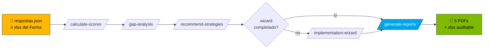

<!-- paulasilva-ms identity -->
<!--
  Paula Silva, Software Global Black Belt
  Building the future of software development with AI and Agentic DevOps
  Contact: LinkedIn https://linkedin.com/in/paulanunes
  Branding: paulasilva-ms Design System v1.7.0
  See referencia/branding/ for tokens, identity, and voice rules
-->

# Kit AI Maturity Assessment: Autoservicio con GitHub Copilot

**`🏠 ÍNDICE`** · 📖 Estás aquí · [» Guía paso a paso](GUIA-PASSO-A-PASSO.md) · [» Recolección vía Forms](coleta/INSTRUCOES-FORMS.md) · [» Wizard](wizard/README.md)

> [!TIP]
> **¿Primera vez aquí?** Ve directo a [GUIA-PASSO-A-PASSO.md](GUIA-PASSO-A-PASSO.md) o abre Copilot Chat y escribe `@ai-maturity-assistant`: te guía desde la instalación hasta el PDF final.

🌐 **Mini-sitio público:** [paulasilvatech.github.io/ai-maturity-client-kit](https://paulasilvatech.github.io/ai-maturity-client-kit/), presentación visual más botón de descarga (activa GitHub Pages en Settings → Pages → Source: GitHub Actions)

🌍 **Idiomas:** Português (BR): [README.md](README.md) · English: [README.en.md](README.en.md) · Español, estás aquí. Cada ZIP (PT/EN/ES) ya trae la documentación en el idioma elegido; los bancos canónicos de preguntas en PT-BR acompañan todos los paquetes para preservar los IDs de parsing.

> **Para el cliente:** este paquete contiene todo lo que necesitas para conducir el **AI Maturity Assessment** sin depender de la plataforma web. Llenas un JSON, abres GitHub Copilot Chat en VS Code, escribes un comando y recibes **hoja de cálculo, scores, análisis de gaps, recomendaciones de estrategia e informe ejecutivo**.

## 🔄 Pipeline visual



---

## 🎯 Cuándo usar cada encuesta (y el ROI esperado)

El kit tiene **3 encuestas complementarias**: elige 1, 2 o las 3 según tu objetivo:

| Encuesta | Objetivo | Audiencia | Tiempo | ROI |
|---|---|---|---|---|
| **🅰️ Assessment principal** | Baseline organizacional formal + 5 PDFs ejecutivos para el liderazgo | Liderazgo / Tech Leads (1-3 personas) | 60-90 min recolectar + 5 min generar | Documento canónico para el board, comparable trimestre a trimestre |
| **🅱️ Developer Survey** | Validar la madurez real anónima + identificar disonancia vs el assessment | Devs individuales ANÓNIMOS (≥5, ideal 15+) | 22-28 min/dev + 3 min insights | Descubre gaps invisibles para el liderazgo; rúbrica L0-L4 determinística en 7 dimensiones |
| **🅲 Learning & Growth Survey** | Roadmap de capacitación personalizado con Champions + cohorts + talleres | Devs IDENTIFICADOS (nombre+email) | 5-8 min/dev + 3 min plan | Lista concreta de inscritos por taller; alimenta el auto-fill Modo D del wizard |
| **🅳 Las tres (recomendado para consultoría)** | Visión 360° + cross-validation + plan de acción | Devs (anónimos + identificados) + liderazgo | ~6 semanas (incl. recolección) | PDFs ejecutivos con **disonancias detectadas** + plan de capacitación con inscritos |

### Cuándo ejecutar 1 vs. 2 vs. 3

- **Solo assessment:** el liderazgo ya tiene buena visibilidad (org pequeña) o necesita un entregable formal rápido
- **Solo survey-devs:** quieres un pulso anónimo del equipo sin comprometerte con el framework formal
- **Solo learning:** el equipo ya es maduro en IA y el foco ahora es la capacitación avanzada
- **Las 3:** consultoría seria, decisión de inversión, baseline antes/después de una transformación

> 📘 **Detalle completo de cada flujo (incluida la combinación de las 3):** [GUIA-PASSO-A-PASSO.md](GUIA-PASSO-A-PASSO.md) Partes 1-11.

---

## ⚡ TL;DR: 3 pasos

1. **Abre esta carpeta en VS Code** (`code .` o File → Open Folder).
2. **Llena [`respostas.json`](respostas.json)**: para cada pregunta, marca un `level` de 0 a 4 y un texto de evidencia.
3. **En Copilot Chat (modo Agent), escribe `@ai-maturity-assistant`** (concierge guiado) o `/run-full-pipeline` (ejecutar todo directo).

Listo. El agente concierge o el prompt orquestador conduce las 7 skills en secuencia y genera todo en [`saida/`](saida/), incluidos los **5 PDFs production-quality**.

> 🤖 **¿Primera vez? Usa el agente concierge.** Escribe `@ai-maturity-assistant` en Copilot Chat y te guía desde "¿cómo lo lleno?" hasta "abrir los PDFs", sin necesidad de recordar ningún comando.

> 📘 **¿Primera vez usando el kit?** Sigue el **[GUIA-PASSO-A-PASSO.md](GUIA-PASSO-A-PASSO.md)**: instrucciones detalladas con setup por sistema operativo, capturas verbales, checkpoints y troubleshooting ampliado.
>
> 🧪 **¿Quieres probar antes de llenar todo?** El kit incluye **[respostas.json.example](respostas.json.example)**: 46 respuestas simuladas de una "Cliente Exemplo S.A.". Renómbralo a `respostas.json` y ejecuta `/run-full-pipeline` para ver el output completo en ~3 minutos.
>
> 📋 **¿Tienes equipo y quieres recolectar vía Microsoft Forms?** Ve **[coleta/INSTRUCOES-FORMS.md](coleta/INSTRUCOES-FORMS.md)**: 3 caminos (Forms manual, Forms compacto, Excel/SharePoint directo). La skill `/import-assessment-responses` agrega múltiples respondentes automáticamente.
>
> 🧙 **¿Quieres personalizar la Parte 4 del PDF (Implementation Guide)?** Usa el **[wizard/](wizard/)**: HTML standalone (`implementation-guide-wizard.html`), template JSON editable, o la skill `/implementation-wizard` que te conduce por el chat. 9 inputs estructurados (Steering Committee, RACI, ADKAR, Quick Wins…) llenan el `roadmap_part4.pdf`.
>
> 📄 **¿Quieres ver el output final antes de ejecutar?** Los 5 PDFs reales están en **[referencia/exemplo-saida/](referencia/exemplo-saida/)**, generados a partir del `respostas.json.example` (Cliente Exemplo S.A.) con el pipeline real.
>
> 👥 **¿Quieres escuchar a los devs (anónimo, comportamental)?** Ve **[survey-devs/](survey-devs/)**: Developer Survey de 75 preguntas en 9 secciones (GitHub Copilot + modos Ask/Edit/Agent + Coding Agent + Spaces + agentes IA + Foundry + seguridad). Skills: `/import-developer-survey` + `/insights-developer-survey`. Anónimo, individual, comportamental. Incluye rúbrica determinística L0-L4 en 7 dimensiones.
>
> 🎓 **¿Quieres construir el roadmap de capacitación (identificado)?** Ve **[survey-learning/](survey-learning/)**: Learning & Growth Survey de 32 preguntas cortas (5-8 min, IDENTIFICADO con nombre+email) que se convierte en un plan de talleres + cohorts + Champions Network + mentoría. Skills: `/import-learning-survey` + `/training-plan`.

---

## 📋 Prerequisitos

- [ ] **VS Code** con la extensión **GitHub Copilot Chat** instalada y activa
- [ ] Plan **Copilot Pro / Business / Enterprise** (Free puede funcionar para skills; confirma con tu organización)
- [ ] **Python 3.10+** con `openpyxl` (`pip install openpyxl`), para llenar la hoja de cálculo
- [ ] Modo **Agent** habilitado en Copilot Chat (necesario para invocar skills custom)

> [!IMPORTANT]
> Sin el modo **Agent** habilitado, los comandos `/calculate-scores`, `/gap-analysis` etc. no aparecen. Ve [GUIA-PASSO-A-PASSO.md](GUIA-PASSO-A-PASSO.md#parte-1) para el how-to por sistema operativo.
### Smoke test rápido (opcional, para contribuidores)

Valida que el pipeline está íntegro sin necesitar WeasyPrint:

```bash
make smoke          # e2e rápido: copia respostas.json.example y valida el payload
make smoke-cross    # lo mismo + cross-survey (developer + learning)
```

Ambos restauran el workspace al final. Útil después de editar `relatorios/scripts/build_payload_and_render.py` o cualquier SKILL.md del pipeline.
---

## 🗂 Estructura del kit

```
kit-cliente/
├── README.md                          ← estás aquí
├── GUIA-PASSO-A-PASSO.md              ← guía detallada para principiantes
├── respostas.json                     ← INPUT principal (llenado manualmente)
├── respostas.json.example             ← 46 respuestas simuladas para pruebas
├── framework.json                     ← Inmutable: pesos, capabilities, S1-S7
│
├── formularios/                       ← HTMLs visuales (referencia)
│   ├── P1-produtividade-do-desenvolvedor.html
│   ├── P2-ciclo-de-vida-devops.html
│   └── P3-plataforma-de-aplicações.html
│
├── coleta/                            ← Recolección multi-respondente del ASSESSMENT principal (Forms/Excel)
│   ├── INSTRUCOES-FORMS.md            ← 3 caminos de recolección + tradeoffs
│   ├── perguntas-para-forms.md        ← 158 preguntas para copiar/pegar en Forms
│   └── template-export-forms.xlsx     ← Template de Excel (formato export de Forms)
│
├── survey-devs/                       ← Developer Survey (anónimo, comportamental, 75 p)
│   ├── README.md
│   ├── INSTRUCOES-FORMS-DEVS.md       ← Cómo crear un Forms anónimo
│   ├── perguntas-para-forms-devs.md   ← 75 preguntas formateadas para Forms (9 secciones)
│   ├── template-export-forms-devs.xlsx ← Template de Excel + 5 respondentes simulados
│   ├── respostas-mock-devs.json       ← JSON estructurado de ejemplo
│   ├── RUBRICA-MATURIDADE.md          ← Modelo de scoring determinístico L0-L4 (7 dimensiones)
│   └── scripts/                       ← rubric.py + calcular_maturidade.py
│
├── survey-learning/                   ← ★ Learning & Growth Survey (identificado, capacitación, 32 p)
│   ├── README.md
│   ├── INSTRUCOES-FORMS-LEARNING.md   ← Cómo crear un Forms IDENTIFICADO
│   ├── perguntas-para-forms-learning.md  ← 32 preguntas formateadas (7 secciones)
│   ├── template-export-forms-learning.xlsx  ← Excel + 5 respondentes simulados
│   └── respostas-mock-learning.json   ← JSON estructurado de ejemplo
│
├── wizard/                            ← ★ Wizard del Implementation Guide (9 pasos)
│   ├── implementation-guide-wizard.html       ← Wizard visual standalone
│   └── implementation-guide-inputs.template.json ← Alternativa para edición directa
│
├── relatorios/                        ← Templates Jinja2 + renderer (PDFs finales)
│   ├── templates/                     ← 4 .html.j2 oficiales + _print.css
│   │   ├── _components.html.j2
│   │   ├── _print.css
│   │   ├── score_justification.html.j2
│   │   ├── roadmap_part_pillar.html.j2  (renderizado 3x: P1, P2, P3)
│   │   └── roadmap_part4.html.j2
│   ├── i18n/                          ← Strings EN / ES / PT-BR
│   ├── scripts/
│   │   ├── render_reports.py          ← Renderer Jinja2 → WeasyPrint → PDF
│   │   └── build_payload_and_render.py ← Merge sample + datos del cliente + render
│   └── sample_payload.json            ← Referencia de schema + datos de ejemplo
│
├── referencia/                        ← Documentación técnica
│   ├── pontuacao-e-calculo.md         ← Algoritmo oficial
│   ├── pontuacao-e-calculo.xlsx       ← Template auditable
│   ├── calculadora-pontuacao.html     ← Demo interactiva (con branding paulasilva-ms)
│   ├── P1/P2/P3-...md                 ← Documentación de las 158 preguntas
│   ├── branding/                      ← ★ Identidad paulasilva-ms (Microsoft)
│   │   ├── tokens-paulasilva-ms.css   ← Design tokens (4 colores MS + neutros + dark mode)
│   │   ├── IDENTITY.md                ← Strings canónicos, logo SVG, chrome bar
│   │   └── VOICE.md                   ← Voz, vocabulario prohibido, reglas de puntuación
│   └── exemplo-saida/                 ← ★ 5 PDFs reales + JSONs de ejemplo
│       ├── README.md
│       ├── score_justification.pdf
│       ├── roadmap_part_pillar_p1.pdf  (P2, P3)
│       ├── roadmap_part4.pdf
│       ├── pt-br/                     ← Los mismos 5 PDFs en PT-BR
│       ├── scores.json · gaps.json · recomendacoes.json  (JSONs intermedios)
│       └── pontuacao-preenchida-2026-05-08.xlsx
│
├── saida/                             ← OUTPUT: todo lo que Copilot genera
│
└── .github/
    ├── copilot-instructions.md        ← Cargado automáticamente en cada prompt (EN)
    ├── agents/
    │   └── ai-maturity-assistant.agent.md       ← @ai-maturity-assistant (concierge guiado)
    ├── prompts/
    │   └── run-full-pipeline.prompt.md          ← /run-full-pipeline
    └── skills/  (12 skills custom: 1 orquestador + 6 assessment + 1 wizard + 2 survey-devs + 2 survey-learning)
        ├── import-assessment-responses/SKILL.md  ← /import-assessment-responses  (assessment)
        ├── fill-spreadsheet/SKILL.md             ← /fill-spreadsheet             (assessment)
        ├── calculate-scores/SKILL.md             ← /calculate-scores             (assessment)
        ├── gap-analysis/SKILL.md                 ← /gap-analysis                 (assessment)
        ├── recommend-strategies/SKILL.md         ← /recommend-strategies         (assessment)
        ├── implementation-wizard/SKILL.md        ← /implementation-wizard        (assessment)
        ├── generate-reports/SKILL.md             ← /generate-reports  (5 PDFs)   (assessment)
        ├── import-developer-survey/SKILL.md      ← /import-developer-survey      (survey-devs)
        ├── insights-developer-survey/SKILL.md    ← /insights-developer-survey    (survey-devs)
        ├── import-learning-survey/SKILL.md       ← /import-learning-survey       (survey-learning)
        └── training-plan/SKILL.md                ← /training-plan                (survey-learning)
```

---

## 🎯 Comandos disponibles en Copilot Chat

Abre Copilot Chat (`Ctrl+Shift+I` / `Cmd+Shift+I`) **en modo Agent** y escribe `/`:

### Assessment de Madurez en IA (flujo principal)

| Comando | Qué hace | Prerequisito |
|---|---|---|
| `@ai-maturity-assistant` | **Concierge guiado**: descubre el estado, pregunta lo que falta, invoca skills, te conduce hasta los 5 PDFs (recomendado para la 1.ª vez) | ninguno |
| `/run-full-pipeline` | **Todo de una vez**: 6 skills en orden (auto-detecta Excel + wizard) | `respostas.json` o `respostas-forms.xlsx` |
| `/import-assessment-responses` | Convierte el Excel de Microsoft Forms → `respostas.json` (agrega multi-respondente) | `respostas-forms.xlsx` |
| `/fill-spreadsheet` | Copia el template xlsx y llena los niveles | `respostas.json` |
| `/calculate-scores` | Aplica SUMPRODUCT, genera `saida/scores.json` | `respostas.json` |
| `/gap-analysis` | Calcula gaps + prioridad P0–P3 | `saida/scores.json` |
| `/recommend-strategies` | Mapea gaps → S1–S7 + tecnologías | `saida/gaps.json` |
| `/implementation-wizard` | **Wizard de 9 pasos** para personalizar la Parte 4 del PDF (steering committee, RACI, ADKAR, quick wins…) | ninguno (independiente) |
| `/generate-reports` | **5 PDFs production-quality** vía Jinja2 + WeasyPrint (idénticos a la plataforma) | los 3 anteriores + wizard opcional |

### Developer Survey (anónimo, comportamental)

| Comando | Qué hace | Prerequisito |
|---|---|---|
| `/import-developer-survey` | Convierte `respostas-survey-devs.xlsx` (Forms anónimo) → `survey-devs/respostas-devs.json` (75 p × N respondentes) | `respostas-survey-devs.xlsx` |
| `/insights-developer-survey` | **Informe agregado** + madurez calculada (rúbrica determinística L0-L4 en las 7 dimensiones D2-D8) + gaps + recomendaciones ligadas a las capabilities | `survey-devs/respostas-devs.json` |

### Learning & Growth Survey (identificado, capacitación)

| Comando | Qué hace | Prerequisito |
|---|---|---|
| `/import-learning-survey` | Convierte `respostas-survey-learning.xlsx` (Forms identificado) → `survey-learning/respostas-learning.json` (32 p × N respondentes con nombre+email) | `respostas-survey-learning.xlsx` |
| `/training-plan` | **Plan de capacitación personalizado**: top 10 temas con inscritos pre-validados, cohorts por dimensión D2-D8, Champions Network (3 niveles), pares mentor↔mentee, calendario de 90 días, barreras priorizadas | `survey-learning/respostas-learning.json` |

---

## 📝 Cómo llenar `respostas.json`

```jsonc
{
  "metadata": {
    "respondent_name": "João Silva",
    "respondent_email": "joao@empresa.com",
    "respondent_role": "Engineering Manager",
    "audience": ["developer", "manager"],
    "organization": "Empresa Acme",
    "assessment_date": "2026-05-08",
    "language": "pt-BR"
  },
  "target_overrides": {
    // Opcional: si quieres un target distinto del default 3.0 para alguna capability:
    "P3-C5": 4.0,   // aspirar a L4 en Aplicaciones Agénticas
    "P2-C4": 3.5    // aspirar a L3+ en DevSecOps
  },
  "responses": {
    "P1-C1-Q1": {
      "level": 3,                                        // 0=L0 ... 4=L4 ... null=no respondida
      "evidence": "Copilot Enterprise para 80% dos devs, métricas DORA mostram +18% velocidade.",
      "text_pt_br": "Em que medida sua organização utiliza..."  // solo lectura
    },
    // ... (157 preguntas más, formato idéntico)
  }
}
```

### Consejos para llenar

- **¿No estás seguro?** Deja `level: null`: el sistema lo ignora (sin penalización).
- **Cuanta más evidencia, mejor.** Texto con herramienta + métrica + período = "exemplary".
- **Umbral mínimo: 25 preguntas respondidas** para salir de BLOCKED. Ideal ≥ 40 (OK).
- **Multi-respondente:** prefiere `respostas-forms.xlsx` o el template de Excel en `coleta/`; la skill `/import-assessment-responses` agrega automáticamente con promedio simple por pregunta.

### Alternativa visual: usar los HTMLs en `formularios/`
Los HTMLs en [`formularios/`](formularios/) reproducen el visual de la plataforma. Puedes abrirlos en el navegador, leer el contexto rico de cada pregunta (KPI, what/why, ejemplos por nivel) y después llenar el JSON. Hoy **no hay export automático** de los HTMLs a JSON: llena el JSON manualmente.

---

## 🔢 Algoritmo de scoring (resumen de 5 líneas)

```
capability_score = Σ(nivel × peso_pregunta) / Σ(peso_pregunta)        # solo respondidas
pillar_score     = Σ(cap_score × peso_cap) / Σ(peso_cap)              # caps del pilar
overall_score    = Σ(cap_score × peso_cap) / Σ(peso_cap)              # TODAS las caps (no pilares)
gap_size         = max(0, target − current);  priority = peso × gap
threshold        = ≥40 OK · 25–39 WARNING · <25 BLOCKED
```

Ve `referencia/pontuacao-e-calculo.md` para las fórmulas completas, edge cases y 3 ejemplos end-to-end.

---

## 🎨 Las 7 estrategias (S1–S7)

| ID | Nombre | Cuándo aparece en recomendaciones |
|---|---|---|
| S1 | GitHub Migration | Gaps en capabilities relacionadas con SCM/colaboración |
| S2 | Foundry + SRE | Gaps en observabilidad, SLO, plataforma |
| S3 | App Modernization | Gaps en IaC, contenedores, cloud-native |
| S4 | AI Applications | Gaps en features de IA / Azure OpenAI |
| S5 | GitHub Copilot Acceleration | Gaps en productividad del dev |
| S6 | Agentic Activation | Gaps en workflows agénticos |
| S7 | Security & Governance | Gaps en DevSecOps, supply chain |

La skill `/recommend-strategies` calcula el `cumulative_priority` por estrategia (suma de los `priority_score` de los gaps que aborda) y devuelve las estrategias rankeadas con tecnologías específicas y acciones iniciales.

---

## ❓ Troubleshooting

| Síntoma | Causa probable | Acción |
|---|---|---|
| Copilot Chat no muestra `/run-full-pipeline` en el menú | Modo Agent desactivado | Cambiar a "Agent" en el dropdown del chat |
| Las skills custom no aparecen | Carpeta `.github/skills/` no detectada | Reabrir el workspace o ejecutar **Developer: Reload Window** |
| `respostas.json: Unexpected token` | JSON inválido (coma de más, comillas faltantes) | Validar en jsonlint.com o ejecutar `python -m json.tool respostas.json` |
| La hoja no recalcula en Excel | Excel en modo "manual calculation" | Excel → Fórmulas → Calcular ahora (F9) |
| `openpyxl` no instalado | Falta dependencia de Python | `pip install openpyxl` |
| Threshold siempre BLOCKED | < 25 preguntas respondidas | Responde 25+ más, distribuidas entre P1, P2, P3 |

---

## 🔁 Migración a la plataforma web (futuro)

Cuando la app web esté lista, la migración es directa:

1. El `respostas.json` de este kit sigue **el mismo schema** que acepta la API de la plataforma (`POST /api/responses/bulk`).
2. Las 5 skills se convierten en operaciones nativas de la app (botones en vez de comandos `/`).
3. Los informes en `saida/` quedan como archivo histórico; la app pasa a ser la fuente de verdad.

No pierdes datos: basta subir el JSON cuando la app esté disponible.

---

## 📞 Soporte

- **Dudas técnicas sobre el algoritmo:** ve `referencia/pontuacao-e-calculo.md`
- **Dudas sobre una pregunta específica:** ve `referencia/P1-…md`, `P2-…md` o `P3-…md`
- **Bugs en el kit:** abre un issue en el repo principal o contacta a Microsoft GBB

---

**Versión del framework:** 1.0.0 · **Fecha del kit:** 2026-05-08 · **Idioma:** ES

---

## ¿Te atascaste en alguno de estos pasos?

<details>
<summary><strong>FAQ: dudas comunes en el primer contacto con el kit</strong></summary>

| Síntoma | Causa probable | Cómo resolver |
|---|---|---|
| No sé cuál encuesta ejecutar primero | Todavía no decidiste el alcance de la consultoría | Usa el agente: `@ai-maturity-assistant` presenta los 4 caminos (A/B/C/D) y te ayuda a elegir |
| `@ai-maturity-assistant` no aparece en el chat | Copilot Chat no está en **modo Agent** | Haz clic en el dropdown junto al ícono de Copilot → elige **Agent** |
| ¿`respostas.json.example` funciona como prueba real? | Sí: es la Cliente Exemplo S.A. con 46 respuestas simuladas | `cp respostas.json.example respostas.json` y ejecuta `/run-full-pipeline` |
| ¿Copilot Free funciona? | Funciona para skills, pero con límites de mensajes | Recomendado **Pro/Business/Enterprise** para el flujo completo |
| ¿Puedo ejecutar sin WeasyPrint? | Sí, pero no va a generar PDFs | `make smoke` valida todo hasta el `payload.json` sin necesitar WeasyPrint |

</details>

---

## Continuar la lectura

| ← ANTERIOR | SIGUIENTE → |
|:---|---:|
| _(estás en el hub)_ | **[Guía paso a paso](GUIA-PASSO-A-PASSO.md)** |
| Ya estás en el índice principal del kit. | Instalación, llenado y ejecución detallados, de cero al PDF ejecutivo en 60–90 min. |

---

<sub>**Paula Silva** | Software Global Black Belt · [LinkedIn](https://linkedin.com/in/paulanunes)</sub>
<sub>Building the future of software development with AI and Agentic DevOps</sub>
<sub>Identidad visual: [paulasilva-ms Design System v1.7.0](referencia/branding/) · Paleta Microsoft de 4 colores aplicada en los HTMLs interactivos y en los 5 PDFs production-quality</sub>
