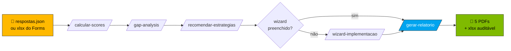

<!-- paulasilva-ms identity -->
<!--
  Paula Silva, Software Global Black Belt
  Building the future of software development with AI and Agentic DevOps
  Contact: paulasilva@microsoft.com
  Branding: paulasilva-ms Design System v1.7.0
  See referencia/branding/ for tokens, identity, and voice rules
-->

# Kit AI Maturity Assessment — Auto-serviço com GitHub Copilot

**`🏠 ÍNDICE`** · 📖 Você está aqui · [» Guia passo-a-passo](GUIA-PASSO-A-PASSO.md) · [» Coleta via Forms](coleta/INSTRUCOES-FORMS.md) · [» Wizard](wizard/README.md)

> [!TIP]
> **Primeira vez aqui?** Vá direto para o [GUIA-PASSO-A-PASSO.md](GUIA-PASSO-A-PASSO.md) ou abra o Copilot Chat e digite `@ai-maturity-assistant` — ele guia você da instalação ao PDF final.

🌐 **Mini-site público:** [paulanunes85.github.io/ai-maturity-client-kit](https://paulanunes85.github.io/ai-maturity-client-kit/) — apresentação visual + botão de download (ative GitHub Pages em Settings → Pages → Source: GitHub Actions)

🌍 **Language kits:** PT-BR está neste README. English: [kit-en/README.md](kit-en/README.md) · Español: [kit-es/README.md](kit-es/README.md). Os ZIPs EN/ES incluem documentação traduzida e bancos canônicos de perguntas em PT-BR para preservar IDs de parsing.

> **Para o cliente:** este pacote contém tudo que você precisa para conduzir o **AI Maturity Assessment** sem depender da plataforma web. Você responde um JSON, abre o GitHub Copilot Chat no VS Code, digita um comando, e recebe **planilha, scores, gap analysis, recomendações de estratégia e relatório executivo** em PT-BR.

## 🔄 Pipeline visual



---

## 🎯 Quando usar cada survey (e ROI esperado)

O kit tem **3 surveys complementares** — escolha 1, 2 ou os 3 baseado no seu objetivo:

| Survey | Objetivo | Audiência | Tempo | ROI |
|---|---|---|---|---|
| **🅰️ Assessment principal** | Baseline organizacional formal + 5 PDFs executivos para liderança | Liderança / Tech Leads (1-3 pessoas) | 60-90 min coletar + 5 min gerar | Documento canônico para board, comparável trimestralmente |
| **🅱️ Developer Survey** | Validar maturidade real anônima + identificar dissonância vs assessment | Devs individuais ANÔNIMOS (≥5, ideal 15+) | 22-28 min/dev + 3 min insights | Descobre gaps invisíveis para liderança; rubrica L0-L4 determinística em 7 dimensões |
| **🅲 Learning & Growth Survey** | Roadmap de capacitação personalizado com Champions + cohorts + workshops | Devs IDENTIFICADOS (nome+email) | 5-8 min/dev + 3 min plano | Lista concreta de inscritos por workshop; alimenta wizard Mode D auto-fill |
| **🅳 Os três (recomendado para consultoria)** | Visão 360° + cross-validation + plano de ação | Devs (anônimos + identificados) + liderança | ~6 semanas (incl. coleta) | PDFs executivos com **dissonâncias detectadas** + plano de capacitação com inscritos |

### Quando rodar 1 vs. 2 vs. 3

- **Só assessment:** liderança já tem boa visibilidade (org pequena) ou precisa de entregável formal rápido
- **Só survey-devs:** quer pulse anônimo da equipe sem comprometer com framework formal
- **Só learning:** time já maduro em IA, foco é agora capacitação avançada
- **Os 3:** consultoria séria, decisão de investimento, baseline antes/depois de transformação

> 📘 **Detalhamento completo de cada fluxo (incluindo combinação dos 3):** [GUIA-PASSO-A-PASSO.md](GUIA-PASSO-A-PASSO.md) Partes 1-11.

---

## ⚡ TL;DR — 3 passos

1. **Abra esta pasta no VS Code** (`code .` ou File → Open Folder).
2. **Preencha [`respostas.json`](respostas.json)** — para cada questão, marque um `level` de 0 a 4 e um texto de evidência.
3. **No Copilot Chat (modo Agent), digite `@ai-maturity-assistant`** (concierge guiado) ou `/pipeline-completo` (rodar tudo direto).

Pronto. O agente concierge ou o prompt orquestrador conduz as 7 skills em sequência e gera tudo em [`saida/`](saida/) — incluindo os **5 PDFs production-quality**.

> 🤖 **Primeira vez? Use o agente concierge.** Digite `@ai-maturity-assistant` no Copilot Chat e ele te guia desde "como preencho?" até "abrir os PDFs" — sem precisar lembrar nenhum comando.

> 📘 **Primeira vez usando?** Siga o **[GUIA-PASSO-A-PASSO.md](GUIA-PASSO-A-PASSO.md)** — instruções detalhadas com setup por OS, screenshots verbais, checkpoints e troubleshooting expandido.
>
> 🧪 **Quer testar antes de preencher tudo?** O kit vem com **[respostas.json.example](respostas.json.example)** — 46 respostas mockadas de uma "Cliente Exemplo S.A.". Renomeie para `respostas.json` e rode `/pipeline-completo` para ver o output completo em ~3 minutos.
>
> 📋 **Tem equipe e quer coletar via Microsoft Forms?** Veja **[coleta/INSTRUCOES-FORMS.md](coleta/INSTRUCOES-FORMS.md)** — 3 caminhos (Forms manual, Forms enxuto, Excel/SharePoint direto). A skill `/importar-respostas-excel` agrega múltiplos respondentes automaticamente.
>
> 🧙 **Quer personalizar a Parte 4 do PDF (Implementation Guide)?** Use o **[wizard/](wizard/)**: HTML standalone (`implementation-guide-wizard.html`), JSON template editável, ou skill `/wizard-implementacao` que conduz pelo chat. 9 inputs estruturados (Steering Committee, RACI, ADKAR, Quick Wins…) populam o `roadmap_part4.pdf`.
>
> 📄 **Quer ver o output final antes de rodar?** Os 5 PDFs reais estão em **[referencia/exemplo-saida/](referencia/exemplo-saida/)** — gerados a partir do `respostas.json.example` (Cliente Exemplo S.A.) com o pipeline real.
>
> 👥 **Quer ouvir os devs (anônimo, comportamental)?** Veja **[survey-devs/](survey-devs/)** — Developer Survey de 75 perguntas em 9 seções (GitHub Copilot + modos Ask/Edit/Agent + Coding Agent + Spaces + agentes IA + Foundry + segurança). Skills: `/importar-survey-devs` + `/insights-developer-survey`. Anônimo, individual, comportamental. Inclui rubrica determinística L0-L4 em 7 dimensões.
>
> 🎓 **Quer construir o roadmap de capacitação (identificado)?** Veja **[survey-learning/](survey-learning/)** — Learning & Growth Survey de 32 perguntas curtas (5-8 min, IDENTIFICADO com nome+email) que vira plano de workshops + cohorts + Champions Network + mentoria. Skills: `/importar-survey-learning` + `/plano-capacitacao`.

---

## 📋 Pré-requisitos

- [ ] **VS Code** com extensão **GitHub Copilot Chat** instalada e ativa
- [ ] Plano **Copilot Pro / Business / Enterprise** (Free pode funcionar para skills — confirmar com sua org)
- [ ] **Python 3.10+** com `openpyxl` (`pip install openpyxl`) — para preencher a planilha
- [ ] Modo **Agent** habilitado no Copilot Chat (necessário para invocar skills custom)

> [!IMPORTANT]
> Sem o modo **Agent** habilitado, os comandos `/calcular-scores`, `/gap-analysis` etc. não aparecem. Veja [GUIA-PASSO-A-PASSO.md](GUIA-PASSO-A-PASSO.md#parte-1) para o how-to por sistema operacional.
### Smoke test rápido (opcional, para contribuidores)

Valide que o pipeline está íntegro sem precisar do WeasyPrint:

```bash
make smoke          # rapid e2e — copia respostas.json.example e valida payload
make smoke-cross    # mesmo + cross-survey (developer + learning)
```

Ambos restauram o workspace ao final. Útil após editar `relatorios/scripts/build_payload_and_render.py` ou qualquer SKILL.md no pipeline.
---

## 🗂 Estrutura do kit

```
kit-cliente/
├── README.md                          ← você está aqui
├── GUIA-PASSO-A-PASSO.md              ← guia detalhado para iniciantes
├── respostas.json                     ← INPUT principal (preenchido manualmente)
├── respostas.json.example             ← 46 respostas mockadas para teste
├── framework.json                     ← Imutável — pesos, capabilities, S1-S7
│
├── formularios/                       ← HTMLs visuais (referência)
│   ├── P1-produtividade-do-desenvolvedor.html
│   ├── P2-ciclo-de-vida-devops.html
│   └── P3-plataforma-de-aplicações.html
│
├── coleta/                            ← Coleta multi-respondente do ASSESSMENT principal (Forms/Excel)
│   ├── INSTRUCOES-FORMS.md            ← 3 caminhos de coleta + tradeoffs
│   ├── perguntas-para-forms.md        ← 158 perguntas para copy/paste no Forms
│   └── template-export-forms.xlsx     ← Excel template (formato Forms export)
│
├── survey-devs/                       ← Developer Survey (anônimo, comportamental, 75 q)
│   ├── README.md
│   ├── INSTRUCOES-FORMS-DEVS.md       ← Como criar Forms anônimo
│   ├── perguntas-para-forms-devs.md   ← 75 perguntas formatadas para Forms (9 seções)
│   ├── template-export-forms-devs.xlsx ← Excel template + 5 respondentes mockados
│   ├── respostas-mock-devs.json       ← JSON estruturado de exemplo
│   ├── RUBRICA-MATURIDADE.md          ← Modelo de scoring determinístico L0-L4 (7 dimensões)
│   └── scripts/                       ← rubric.py + calcular_maturidade.py
│
├── survey-learning/                   ← ★ Learning & Growth Survey (identificado, capacitação, 32 q)
│   ├── README.md
│   ├── INSTRUCOES-FORMS-LEARNING.md   ← Como criar Forms IDENTIFICADO
│   ├── perguntas-para-forms-learning.md  ← 32 perguntas formatadas (7 seções)
│   ├── template-export-forms-learning.xlsx  ← Excel + 5 respondentes mockados
│   └── respostas-mock-learning.json   ← JSON estruturado de exemplo
│
├── wizard/                            ← ★ Wizard Implementation Guide (9 steps)
│   ├── implementation-guide-wizard.html       ← Wizard visual standalone
│   └── implementation-guide-inputs.template.json ← Alternativa para edição direta
│
├── relatorios/                        ← Templates Jinja2 + renderer (PDFs finais)
│   ├── templates/                     ← 4 .html.j2 oficiais + _print.css
│   │   ├── _components.html.j2
│   │   ├── _print.css
│   │   ├── score_justification.html.j2
│   │   ├── roadmap_part_pillar.html.j2  (renderizado 3x: P1, P2, P3)
│   │   └── roadmap_part4.html.j2
│   ├── i18n/                          ← Strings EN / ES / PT-BR
│   ├── scripts/
│   │   ├── render_reports.py          ← Renderer Jinja2 → WeasyPrint → PDF
│   │   └── build_payload_and_render.py ← Merge sample + dados cliente + render
│   └── sample_payload.json            ← Schema reference + sample data
│
├── referencia/                        ← Documentação técnica
│   ├── pontuacao-e-calculo.md         ← Algoritmo oficial
│   ├── pontuacao-e-calculo.xlsx       ← Template auditável
│   ├── calculadora-pontuacao.html     ← Demo interativa (com branding paulasilva-ms)
│   ├── P1/P2/P3-...md                 ← Documentação das 158 questões
│   ├── branding/                      ← ★ Identidade paulasilva-ms (Microsoft)
│   │   ├── tokens-paulasilva-ms.css   ← Design tokens (4 cores MS + neutros + dark mode)
│   │   ├── IDENTITY.md                ← Strings canônicas, logo SVG, chrome bar
│   │   └── VOICE.md                   ← Voz, vocabulário banido, regras de pontuação
│   └── exemplo-saida/                 ← ★ 5 PDFs reais + JSONs de exemplo
│       ├── README.md
│       ├── score_justification.pdf
│       ├── roadmap_part_pillar_p1.pdf  (P2, P3)
│       ├── roadmap_part4.pdf
│       ├── pt-br/                     ← Mesmos 5 PDFs em PT-BR
│       ├── scores.json · gaps.json · recomendacoes.json  (JSONs intermediários)
│       └── pontuacao-preenchida-2026-05-08.xlsx
│
├── saida/                             ← OUTPUT — tudo que o Copilot gera
│
└── .github/
    ├── copilot-instructions.md        ← Carregado automaticamente em todo prompt (EN)
    ├── agents/
    │   └── ai-maturity-assistant.agent.md       ← @ai-maturity-assistant (concierge guiado)
    ├── prompts/
    │   └── pipeline-completo.prompt.md          ← /pipeline-completo
    └── skills/  (12 skills custom — 1 orchestrator + 6 assessment + 1 wizard + 2 survey-devs + 2 survey-learning)
        ├── importar-respostas-excel/SKILL.md    ← /importar-respostas-excel       (assessment)
        ├── preencher-planilha/SKILL.md          ← /preencher-planilha             (assessment)
        ├── calcular-scores/SKILL.md             ← /calcular-scores                (assessment)
        ├── gap-analysis/SKILL.md                ← /gap-analysis                   (assessment)
        ├── recomendar-estrategias/SKILL.md      ← /recomendar-estrategias         (assessment)
        ├── wizard-implementacao/SKILL.md        ← /wizard-implementacao           (assessment)
        ├── gerar-relatorio/SKILL.md             ← /gerar-relatorio  (5 PDFs)      (assessment)
        ├── importar-survey-devs/SKILL.md        ← /importar-survey-devs           (survey-devs)
        ├── insights-developer-survey/SKILL.md   ← /insights-developer-survey      (survey-devs)
        ├── importar-survey-learning/SKILL.md    ← /importar-survey-learning       (survey-learning)
        └── plano-capacitacao/SKILL.md           ← /plano-capacitacao              (survey-learning)
```

---

## 🎯 Comandos disponíveis no Copilot Chat

Abra o Copilot Chat (`Ctrl+Shift+I` / `Cmd+Shift+I`) **em modo Agent** e digite `/`:

### Assessment de Maturidade IA (fluxo principal)

| Comando | O que faz | Pré-requisito |
|---|---|---|
| `@ai-maturity-assistant` | **Concierge guiado** — descobre o estado, pergunta o que falta, invoca skills, conduz até os 5 PDFs (recomendado para 1ª vez) | nenhum |
| `/pipeline-completo` | **Tudo de uma vez**: 6 skills em ordem (auto-detecta Excel + wizard) | `respostas.json` ou `respostas-forms.xlsx` |
| `/importar-respostas-excel` | Converte Excel do Microsoft Forms → `respostas.json` (agrega multi-respondente) | `respostas-forms.xlsx` |
| `/preencher-planilha` | Copia template xlsx e preenche níveis | `respostas.json` |
| `/calcular-scores` | Aplica SUMPRODUCT, gera `saida/scores.json` | `respostas.json` |
| `/gap-analysis` | Calcula gaps + prioridade P0–P3 | `saida/scores.json` |
| `/recomendar-estrategias` | Mapeia gaps → S1–S7 + tecnologias | `saida/gaps.json` |
| `/wizard-implementacao` | **Wizard de 9 steps** para personalizar Parte 4 do PDF (steering committee, RACI, ADKAR, quick wins…) | nenhum (independente) |
| `/gerar-relatorio` | **5 PDFs production-quality** via Jinja2 + WeasyPrint (idênticos à plataforma) | os 3 acima + opcional wizard |

### Developer Survey (anônimo, comportamental)

| Comando | O que faz | Pré-requisito |
|---|---|---|
| `/importar-survey-devs` | Converte `respostas-survey-devs.xlsx` (Forms anônimo) → `survey-devs/respostas-devs.json` (75 q × N respondentes) | `respostas-survey-devs.xlsx` |
| `/insights-developer-survey` | **Relatório agregado** + maturidade calculada (rubrica determinística L0-L4 nas 7 dimensões D2-D8) + gaps + recomendações ligadas às capabilities | `survey-devs/respostas-devs.json` |

### Learning & Growth Survey (identificado, capacitação)

| Comando | O que faz | Pré-requisito |
|---|---|---|
| `/importar-survey-learning` | Converte `respostas-survey-learning.xlsx` (Forms identificado) → `survey-learning/respostas-learning.json` (32 q × N respondentes com nome+email) | `respostas-survey-learning.xlsx` |
| `/plano-capacitacao` | **Plano de capacitação personalizado**: top 10 tópicos com inscritos pré-validados, cohorts por dimensão D2-D8, Champions Network (3 tiers), mentor↔mentee pairs, calendário 90 dias, barreiras priorizadas | `survey-learning/respostas-learning.json` |

---

## 📝 Como preencher `respostas.json`

```jsonc
{
  "metadata": {
    "respondent_name": "João Silva",
    "respondent_email": "joao@empresa.com",
    "respondent_role": "Engineering Manager",
    "audience": ["developer", "manager"],
    "organization": "Empresa Acme",
    "assessment_date": "2026-05-08",
    "language": "pt-BR"
  },
  "target_overrides": {
    // Opcional — se quiser target diferente do default 3.0 para alguma capability:
    "P3-C5": 4.0,   // ambicionar L4 em Aplicações Agênticas
    "P2-C4": 3.5    // ambicionar L3+ em DevSecOps
  },
  "responses": {
    "P1-C1-Q1": {
      "level": 3,                                        // 0=L0 ... 4=L4 ... null=não respondida
      "evidence": "Copilot Enterprise para 80% dos devs, métricas DORA mostram +18% velocidade.",
      "text_pt_br": "Em que medida sua organização utiliza..."  // só leitura
    },
    // ... (mais 157 questões — formato idêntico)
  }
}
```

### Dicas de preenchimento

- **Não tem certeza?** Deixe `level: null` — o sistema ignora (sem penalização).
- **Quanto mais evidência, melhor.** Texto com ferramenta + métrica + período = "exemplary".
- **Threshold mínimo: 25 questões respondidas** para sair de BLOCKED. Ideal ≥ 40 (OK).
- **Multi-respondente:** prefira `respostas-forms.xlsx` ou o template Excel em `coleta/`; a skill `/importar-respostas-excel` agrega automaticamente por média simples por questão.

### Alternativa visual: usar os HTMLs em `formularios/`
Os HTMLs em [`formularios/`](formularios/) reproduzem o visual da plataforma. Você pode abrir no browser, ler o contexto rico de cada questão (KPI, what/why, exemplos por nível) e depois preencher o JSON. Hoje **não há export automático** dos HTMLs para JSON — preencha o JSON manualmente.

---

## 🔢 Algoritmo de scoring (resumo de 5 linhas)

```
capability_score = Σ(nível × peso_questão) / Σ(peso_questão)         # apenas respondidas
pillar_score     = Σ(cap_score × peso_cap) / Σ(peso_cap)             # caps do pillar
overall_score    = Σ(cap_score × peso_cap) / Σ(peso_cap)             # TODAS as caps (não pillars)
gap_size         = max(0, target − current);  priority = peso × gap
threshold        = ≥40 OK · 25–39 WARNING · <25 BLOCKED
```

Ver `referencia/pontuacao-e-calculo.md` para fórmulas completas, edge cases e 3 exemplos end-to-end.

---

## 🎨 As 7 estratégias (S1–S7)

| ID | Nome | Quando aparece em recomendações |
|---|---|---|
| S1 | GitHub Migration | Gaps em capabilities relacionadas a SCM/colaboração |
| S2 | Foundry + SRE | Gaps em observabilidade, SLO, plataforma |
| S3 | App Modernization | Gaps em IaC, containers, cloud-native |
| S4 | AI Applications | Gaps em features IA / Azure OpenAI |
| S5 | GitHub Copilot Acceleration | Gaps em produtividade do dev |
| S6 | Agentic Activation | Gaps em workflows agênticos |
| S7 | Security & Governance | Gaps em DevSecOps, supply chain |

A skill `/recomendar-estrategias` calcula `cumulative_priority` por estratégia (soma dos `priority_score` dos gaps que ela endereça) e devolve as estratégias rankeadas com tecnologias específicas e ações iniciais.

---

## ❓ Troubleshooting

| Sintoma | Causa provável | Ação |
|---|---|---|
| Copilot Chat não mostra `/pipeline-completo` no menu | Modo Agent desativado | Trocar para "Agent" no dropdown do chat |
| Skills custom não aparecem | Pasta `.github/skills/` não detectada | Reabrir o workspace ou rodar **Developer: Reload Window** |
| `respostas.json: Unexpected token` | JSON inválido (vírgula a mais, aspas faltando) | Validar em jsonlint.com ou rodar `python -m json.tool respostas.json` |
| Planilha não recalcula no Excel | Excel em modo "manual calculation" | Excel → Fórmulas → Calcular agora (F9) |
| `openpyxl` não instalado | Falta dependência Python | `pip install openpyxl` |
| Threshold sempre BLOCKED | < 25 questões respondidas | Preencha mais 25+ — distribua entre P1, P2, P3 |

---

## 🔁 Migração para a plataforma web (futuro)

Quando o app web ficar pronto, a migração é direta:

1. O `respostas.json` deste kit segue **o mesmo schema** que a API da plataforma aceita (`POST /api/responses/bulk`).
2. As 5 skills viram operações nativas do app (botões em vez de comandos `/`).
3. Os relatórios em `saida/` ficam como arquivo histórico — o app passa a ser a fonte de verdade.

Você não perde dados — basta upload do JSON quando o app estiver disponível.

---

## 📞 Suporte

- **Dúvidas técnicas sobre o algoritmo:** ver `referencia/pontuacao-e-calculo.md`
- **Dúvidas sobre uma questão específica:** ver `referencia/P1-…md`, `P2-…md` ou `P3-…md`
- **Bugs no kit:** abrir issue no repo principal ou contatar Microsoft GBB

---

**Versão do framework:** 1.0.0 · **Data do kit:** 2026-05-08 · **Idioma:** PT-BR

---

## Travou em algum desses passos?

<details>
<summary><strong>FAQ — dúvidas comuns no primeiro contato com o kit</strong></summary>

| Sintoma | Causa provável | Como resolver |
|---|---|---|
| Não sei qual survey rodar primeiro | Você ainda não decidiu o escopo da consultoria | Use o agente: `@ai-maturity-assistant` apresenta os 4 caminhos (A/B/C/D) e te ajuda a escolher |
| `@ai-maturity-assistant` não aparece no chat | Copilot Chat não está em **modo Agent** | Clique no dropdown ao lado do ícone do Copilot → escolha **Agent** |
| `respostas.json.example` funciona como teste real? | Sim — é a Cliente Exemplo S.A. com 46 respostas mockadas | `cp respostas.json.example respostas.json` e rode `/pipeline-completo` |
| Copilot Free funciona? | Funciona para skills, mas com limites de mensagens | Recomendado **Pro/Business/Enterprise** para fluxo completo |
| Posso rodar sem WeasyPrint? | Sim, mas não vai gerar PDFs | `make smoke` valida tudo até o `payload.json` sem precisar de WeasyPrint |

</details>

---

## Continuar a leitura

| ← ANTERIOR | PRÓXIMO → |
|:---|---:|
| _(você está no hub)_ | **[Guia passo-a-passo](GUIA-PASSO-A-PASSO.md)** |
| Você já está no índice principal do kit. | Instalação, preenchimento e execução detalhados, do zero ao PDF executivo em 60–90 min. |

---

<sub>**Paula Silva** | Software Global Black Belt · paulasilva@microsoft.com</sub>
<sub>Building the future of software development with AI and Agentic DevOps</sub>
<sub>Identidade visual: [paulasilva-ms Design System v1.7.0](referencia/branding/) · Paleta Microsoft 4 cores aplicada nos HTMLs interativos e nos 5 PDFs production-quality</sub>
