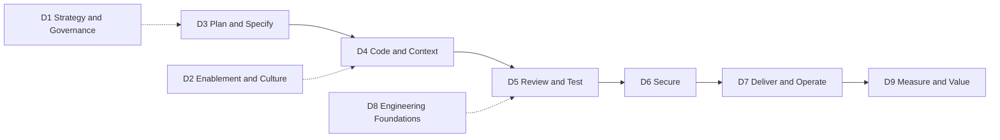

# AI-Assisted SDLC Maturity Assessment — Question Bank v2.0.0

> Microsoft Forms question bank to assess how mature an organization is at using AI, and AI agents, across the software development lifecycle (SDLC).
> This version replaces [AI-Maturity-Form-Questions.md](AI-Maturity-Form-Questions.md) (v1, 158 questions). The v1 file stays unchanged for historical comparison.

| Field | Value |
| --- | --- |
| Version | 2.0.0 |
| Date | 2026-09-25 |
| Status | Draft for review |
| Supersedes | `AI-Maturity-Form-Questions.md` (v1, 3 pillars, 28 capabilities, 158 questions) |
| Scope | AI-assisted and agentic software engineering: plan, code, review, test, secure, deliver, operate, measure |
| Structure | 1 respondent profile section (5 unscored questions) + 9 scored dimensions (61 questions) |
| Answer scale | `L0`–`L4` + `NA` (same prefixes as v1, redefined anchors, no coverage gaps) |
| Evidence base | Microsoft, GitHub, Anthropic, Gartner, DORA, OWASP, NIST, and peer-reviewed or pre-print research including 14 pre-print studies from 2026 and the 2026 peer-reviewed publication of Cui et al. (see [References](#references)) |

## Contents

- [1. What changed from v1](#1-what-changed-from-v1)
- [2. Research basis](#2-research-basis)
  - [2.1 2026 research update](#21-2026-research-update)
- [3. Model design](#3-model-design)
- [4. Answer scale](#4-answer-scale)
- [5. How to build the form](#5-how-to-build-the-form)
- [6. Section 0 — Respondent profile](#6-section-0--respondent-profile)
- [7. Scored question bank](#7-scored-question-bank)
- [8. Scoring and reporting](#8-scoring-and-reporting)
- [9. Traceability from v1 to v2](#9-traceability-from-v1-to-v2)
- [10. Import and tooling compatibility](#10-import-and-tooling-compatibility)
- [11. Assumptions and limitations](#11-assumptions-and-limitations)
- [References](#references)

---

## 1. What changed from v1

| # | v1 issue | v2 change |
| --- | --- | --- |
| 1 | Only about 23 of 158 questions were AI-specific; the rest measured generic DevOps adoption. | Every scored question now asks about AI use, AI governance, or a foundation that research shows amplifies AI outcomes (DORA AI Capabilities Model [1]). |
| 2 | Scale gap: L2 = 25–50% and L3 = >75%, so 51–75% had no answer. | Contiguous coverage bands: ≤25%, 26–50%, 51–90%, >90% (see [section 4](#4-answer-scale)). |
| 3 | Each option mixed coverage with "has metrics", so answers were ambiguous. | Each level has one generic descriptor, and each question has its own L3/L4 calibration anchors. |
| 4 | Duplicates (for example AI code review in P1-C1-Q2 and P1-C4-Q1; devcontainers in P1-C2-Q2, P1-C5-Q1 and P1-C9-Q1; SLSA in P2-C8-Q3 and P2-C10-Q3). | Consolidated into single questions; see [section 9](#9-traceability-from-v1-to-v2). |
| 5 | Metrics phrased as practices ("deployment frequency been adopted"). | Metrics moved to D9 and phrased as "is it measured and used". |
| 6 | No agentic SDLC coverage (coding agents, agent review, MCP, custom instructions, agent identity). | New dimensions D4 (code and context engineering) and D6 (agent security), plus agent governance items in D1, D5 and D7. |
| 7 | No planning/specification, AI cost, or controlled-measurement questions. | New D3 (plan and specify) and D9 (measurement, value and FinOps). |
| 8 | 158 questions + 158 evidence fields caused respondent fatigue. | 61 scored questions + 5 profile questions (61 optional evidence fields). |
| 9 | No respondent segmentation. | Section 0 captures role, scope and tooling so results can be split by persona. |

---

## 2. Research basis

Each row states a published finding and the design decision it drives. Gartner items are forecasts, not measured facts.

| Source | Finding | Design implication |
| --- | --- | --- |
| DORA 2025 [3] | 90% of survey respondents report using AI at work; more than 80% believe it increased their productivity; 30% report little or no trust in AI-generated code. | Adoption alone no longer separates organizations. Questions measure depth, governance and outcomes. |
| DORA 2025 [3], [4] | AI is an "amplifier" of existing strengths and weaknesses. "Without robust control systems, like strong automated testing, mature version control practices, and fast feedback loops, an increase in change volume leads to instability." | D8 (engineering foundations) and D5 (quality gates) are scored as part of AI maturity. |
| DORA 2024 [5] | For every 25% increase in AI adoption, an estimated 1.5% decrease in delivery throughput and a 7.2% reduction in delivery stability. | D5-Q4 (small batches) and D7-Q2 (progressive delivery, rollback). |
| DORA AI Capabilities Model [1], [2] | Seven capabilities amplify AI benefits: clear and communicated AI stance, healthy data ecosystems, AI-accessible internal data, strong version control practices, working in small batches, user-centric focus, quality internal platform. | Each capability maps to at least one question (D1-Q1, D1-Q2, D3-Q5, D4-Q7, D5-Q4, D8-Q1, D8-Q3, D8-Q4). |
| GitHub Copilot usage metrics [6] | Users are grouped into adoption cohorts: Passive, Phase 1 "Code first", Phase 2 "Agent first" (one GitHub agent surface such as cloud agent, code review or CLI), Phase 3 "Multi-agent". Pull request lifecycle metrics include merge counts and median time to merge. | D4-Q1 anchors follow the cohort model; D9-Q1 and D9-Q3 use these telemetry sources. |
| GitHub cloud agent risks and mitigations [7] | Agent pushes only to its own `copilot/` branch; draft PRs "must be reviewed and merged by a human"; workflows wait for "Approve and run workflows"; the requester cannot approve the agent's PR; internet access is firewalled; hidden characters are filtered to reduce prompt injection. | D5-Q2 (human-in-the-loop) and D6-Q3/Q4 (prompt injection, least privilege) ask whether these controls are kept, not bypassed. |
| GitHub MCP governance [9], [10] | Enterprises can define an MCP server allowlist or restrict access to a custom registry. | D4-Q6 (MCP governance). |
| Peng et al. 2023 [33] | Controlled experiment: developers with GitHub Copilot completed an HTTP server task 55.8% faster than the control group. | Productivity gains are real in bounded tasks, but see the next two rows. |
| Cui et al. [34] | Across three field experiments with 4,867 developers: 26.08% (SE 10.3%) increase in completed tasks. Peer-reviewed in _Management Science_ (online 2026-02-27). | Field evidence supports measuring throughput (D9-Q3). |
| METR 2025 [35] | RCT with 16 experienced open-source developers: with AI tools they took 19% longer; they expected a 24% speedup and afterwards still believed AI had sped them up by 20%. METR later said its follow-up experiment gives an unreliable signal [36]. | Self-reported productivity is not enough. D9-Q5 asks for controlled or cohort-based measurement. |
| Stack Overflow 2025 [37] | 46% of developers distrust AI tool accuracy vs 33% who trust it; 87% are concerned about AI agent accuracy. | D5-Q6 (verification culture and calibrated trust). |
| Anthropic Economic Index [23] | 79% of Claude Code conversations were "automation" vs 49% on Claude.ai; "Feedback Loop" patterns were 35.8% on Claude Code vs 21.3% on Claude.ai. | Agentic tools shift work from writing to directing and validating: D3 (specify) and D5 (review). |
| Anthropic, Claude Code in practice [24] | "People make most of the planning decisions (what to do) and Claude makes most of the execution decisions (how to do it)." Debugging share fell by nearly half over seven months. | D3-Q2 (spec-first work) and D3-Q3 (task scoping for agents). |
| Anthropic, context engineering [25] | "Context, therefore, must be treated as a finite resource with diminishing marginal returns." | D4-Q4, D4-Q5 and D2-Q4 (curated instructions, prompt/skill libraries, skills training). |
| Gartner, Jun 2026 [32] | Predicts that by 2028 AI coding costs will overtake the average developer's salary. Recommends classifying tasks as developer-led, developer-with-agent or fully agent-led; model routing by task complexity; mandatory context engineering; token thresholds; token reviews in sprint retrospectives. | D1-Q5 (autonomy classification), D4-Q8 (model routing), D9-Q6 (AI FinOps). |
| Gartner, May 2026 [31] | Predicts that by 2027 over 65% of engineering teams using agentic coding will treat IDEs as optional, "shifting control, governance, and validation to automated platforms". | Governance must live in the platform and pipeline (D5-Q3, D8-Q3), not only in the IDE. |
| Gartner, Jul 2025 [29] | Predicts that by 2028, 90% of enterprise software engineers will use AI code assistants, up from less than 14% in early 2024. | Plan for near-universal access; maturity is about how, not whether. |
| Gartner, Oct 2024 [30] | Through 2027, GenAI will require 80% of the engineering workforce to upskill; "AI-native software engineering" means engineers "primarily focus on steering AI agents toward the most relevant context and constraints". | D2 (enablement, skills and roles). |
| Microsoft CAF, govern and secure AI agents [19] | "Every agent must be observable, governed, and secure." Maintain an agent registry; require a single identity for every agent; enforce policies consistently; observe agent activity. | D1-Q7 (registry and identity), D6-Q7 (audit trail), D7-Q4 (agent observability). |
| Microsoft Agentic DevOps [16], [17] | AI agents "work alongside your team throughout the entire software development lifecycle". | The model covers every SDLC phase, not only coding. |
| OWASP LLM Top 10 2025 [38] and Agentic Top 10 2026 [39] | Risks include LLM01 Prompt Injection, LLM03 Supply Chain, LLM06 Excessive Agency, LLM10 Unbounded Consumption, ASI01 Agent Goal Hijack. | D6 questions reference these risk IDs. |
| NIST SP 800-218A [40] | SSDF community profile that adds AI-specific secure development practices across the SDLC. | D6-Q5 and D6-Q6. |

### 2.1 2026 research update

Fourteen studies published on arXiv between January and September 2026. They are pre-prints and have not necessarily been peer-reviewed; the peer-reviewed 2026 publication of Cui et al. [34] is covered in the table above. Most mine the public AIDev dataset of agent-authored pull requests on open-source GitHub repositories, so enterprise results may differ.

| Study | Data | Finding | Design implication |
| --- | --- | --- | --- |
| Denisov-Blanch et al., RAMP [47] | 441 repositories | Proposes RAMP (Repository AI Maturity Profile), a four-level maturity model based on AI configuration committed to the repository. Agents brought 28–38% more commits at every maturity level. Among agent-first repositories, those without committed AI configuration showed about twice the increase in cognitive complexity (+53% vs +27%) and 1.7x the increase in static-analysis warnings. 73.8% of AI configuration artifacts were committed once and never modified. The authors call the results observational and hypothesis-generating. | D4-Q4 and D4-Q5 ask for instructions that are kept up to date, not set once and forgotten. RAMP can serve as an objective cross-check of D4 self-assessment (see [section 8](#8-scoring-and-reporting)). |
| Arabat and Sayagh [46] | 15,549 agentic PRs, 148 projects | Adding instruction files does not necessarily improve agent PRs: 27.7% of projects raised their merge rate by at least 20% and 26.35% saw it fall. Projects that improved had longer, well-structured instruction files. | D4-Q4 treats instruction files as engineered artifacts ("instructions as code") whose effect is measured. |
| Pinna et al. [49] | 7,156 PRs from five coding agents | Task type drives acceptance more than agent choice for most tasks: documentation 82.1% vs new features 66.1%. No single agent was best across all task types. | D1-Q5, D3-Q3 and D4-Q3 set delegation rules per task type; D1-Q3 evaluates tools per task type. |
| Takerngsaksiri et al. [50] | 6,774 merged agent PRs vs 5,044 human PRs | Merged agent PRs attracted verified follow-up fixes at 1.62 times the odds of human PRs in the same repositories; 69.6% of those fixes came from the same agent. | D9-Q3 adds post-merge fix rate for agent PRs; D5-Q3 keeps equal quality gates. |
| Sawada et al. [51] | 1,000+ files, about 3,200 changes, 100 repositories | AI-generated files were maintained less often than human code; humans did most of the maintenance that did happen. | D5-Q7 requires a named human owner and health monitoring for AI-generated code. |
| Sakib et al. [52] | 4,022 agent PRs, 16,112 file changes | 38.9% of agent PRs had at least one security smell; supply-chain integrity issues were 82.3% of smells; hard-coded credentials were 99.6% of critical smells. Humans introduced 67.6% of the genuine leaked secrets, and review failed to detect 81.1% of those credentials before integration. | D6-Q1 (push protection for every commit, human or agent), D6-Q5 (supply chain) and D5-Q6 (reviewer vigilance). |
| Siddiq et al. [57] | 33,000+ agent PRs, 1,293 security-related | About 4% of agent PRs were security-related, mostly hardening (tests, config, error handling). They had lower merge rates and longer reviews; rejection was linked more to PR complexity and verbosity than to security topics. | D5-Q4 (small, focused PRs) and D6-Q2 (reviewed AI remediation). |
| Nachuma and Zibran [53] | AIDev agent PRs, regression analysis | Reviewer engagement had the strongest correlation with merge; larger changes and force pushes lowered the likelihood of merging. | D5-Q2 (active human review) and D5-Q4 (small batches). |
| Selvanayagam and Ghaleb [54] | 248,641 AI-authored PRs with AI review | Cross-product AI-to-AI review was about 1.6% of agent PRs but grew by more than two orders of magnitude from 2025-Q1 to 2025-Q3. | D5-Q1 treats AI review as one layer and tracks where AI reviews AI without a human. |
| Stolze and Strässle [55] | Interviews with 5 practitioners | Supervision is moving from review-centric to layered: preventive guardrails (intent and conventions in machine-readable form), executable guardrails (lint, tests, CI/CD), and human oversight focused on architecture and maintainability. | D4-Q4 (preventive), D5-Q3 (executable) and D5-Q1/Q2 (human oversight) score the three layers. Small sample. |
| Shen and Tamkin (Anthropic) [48] | Randomized experiments with developers learning a new library | AI use impaired conceptual understanding, code reading and debugging, with no significant average efficiency gain. Full delegation improved speed at the cost of learning. Three of six interaction patterns preserved learning. | D2-Q1 and D2-Q6 ask for learning-preserving AI use, especially for early-career engineers. |
| Liu et al. [45] | GitHub Copilot traces, June 2026: 3.2M users, 13M sessions, 761M LLM calls, 95T tokens | Agentic sessions are sparse user turns that each unfold into autonomous loops of LLM calls and tool execution; token consumption is long-tailed. | D7-Q4 (agent observability) and D9-Q6 (cost governance for long-tail usage). |
| Farrag [58] | Multivocal review of 67 sources plus a 4-month pilot (single author) | Frames conflicting productivity evidence as a "Productivity-Reliability Paradox" and concludes "Specification discipline, not model capability, is the binding constraint on AI-assisted software dependability." | Supports D3-Q2 (specification before implementation). |
| Monperrus [56] | Position paper | Argues that coding agents make mandatory human code review unnecessary. | A contrasting view. v2 keeps human approval for agent PRs, consistent with GitHub defaults [7], but D1-Q5 and D5-Q2 allow risk-based approval levels. |

---

## 3. Model design

Nine dimensions. D3–D7 follow the SDLC flow; D1, D2 and D8 are enablers; D9 closes the loop with measurement.

| ID | Dimension | Questions | Primary basis |
| --- | --- | --- | --- |
| D1 | AI Strategy, Policy and Governance | 7 | DORA clear AI stance [1]; Microsoft CAF [18], [19], [20]; Gartner [32] |
| D2 | Enablement, Skills and Culture | 6 | DORA [2]; Gartner [30]; Anthropic [25]; Shen and Tamkin [48] |
| D3 | Plan, Specify and Design | 6 | Anthropic [24], [27]; GitHub [8]; DORA user-centric focus [1]; Pinna et al. [49]; Farrag [58] |
| D4 | Code and Context Engineering | 8 | GitHub [6], [8], [9], [11]; Anthropic [25]; Gartner [32]; RAMP [47]; Arabat and Sayagh [46] |
| D5 | Review, Quality and Testing | 7 | GitHub [7], [12]; DORA [3], [5]; Stack Overflow [37]; 2026 agent-PR studies [50], [51], [53], [54], [55] |
| D6 | Security and AI Supply Chain | 7 | OWASP [38], [39]; NIST [40]; GitHub [7], [13]; Microsoft CAF [19]; Sakib et al. [52]; Siddiq et al. [57] |
| D7 | Deliver and Operate | 6 | DORA [3]; Microsoft [19], [22]; Liu et al. [45] |
| D8 | Engineering Foundations (AI amplifiers) | 7 | DORA AI Capabilities Model [1], [2] |
| D9 | Measurement, Value and AI FinOps | 7 | GitHub [6]; DORA [2]; METR [35]; Cui et al. [34]; Gartner [28], [32]; Takerngsaksiri et al. [50] |
| | **Total scored** | **61** | |

---

## 4. Answer scale

Use these six options, in this order, for every scored question (D1–D9). Keep the `L0`…`L4`/`NA` prefix at the start of each option: the importer maps prefixes to values 0–4 or null.

- **L0 — Not started — No practice, or AI not permitted for this activity**
- **L1 — Exploring — Individual or ad hoc use, no agreed guidance (≤25% of teams)**
- **L2 — Adopting — Team-level practice with written guidance (26–50% of teams)**
- **L3 — Scaling — Organization standard, governed and measured (51–90% of teams)**
- **L4 — AI-native — Universal (>90%), continuously evaluated and improved, tied to outcomes**
- **NA — I do not know / Not applicable**

How to read the scale:

| Level | Coverage | Governance | Measurement | Typical agentic signal (GitHub cohorts [6]) |
| --- | --- | --- | --- | --- |
| L0 | None | None or prohibited | None | No AI use |
| L1 | ≤25% of teams | Informal | Anecdotal | Passive or occasional "Code first" users |
| L2 | 26–50% | Written team guidance | Activity metrics (usage) | Most users "Code first" |
| L3 | 51–90% | Organization policy, enforced by platform controls | Outcome metrics (delivery, quality) reviewed regularly | Many users "Agent first" |
| L4 | >90% | Policy as code, audited continuously | Controlled comparisons, cost and value tracked, practice tuned from data | "Multi-agent" use is normal and governed |

If coverage and governance point to different levels, pick the **lower** one. Each question adds **L3 looks like** and **L4 looks like** anchors to calibrate answers.

---

## 5. How to build the form

1. Go to <https://forms.office.com> and create a blank form.
2. Suggested title: `AI-Assisted SDLC Maturity Assessment v2 - <Organization Name>`.
3. Add **10 sections** with `+ Add new` → `Section`: Section 0 (profile) and one per dimension (D1–D9).
4. Section 0: add the five profile questions as **Choice** with the options listed in [section 6](#6-section-0--respondent-profile). They are not scored.
5. For each scored question, add two elements:
   - **Choice** (single answer) with the question text in bold below and the six options from [section 4](#4-answer-scale).
   - **Long Text** (optional) labelled `Evidence (<ID>)`, for example `Evidence (D4-Q3)`, with the placeholder `Tool, % coverage, metric, time window, link`.
6. Add the calibration anchors (**L3 looks like**, **L4 looks like**) to the question subtitle so respondents see them.
7. `Settings` → `Anyone can respond` if sharing by link, or restrict to the organization.
8. Share the link. Recommended: at least 3 respondents per persona (see profile question `R-Q1`) to reduce single-respondent bias.
9. When responses are ready: `Responses` → `Open in Excel` and download the `.xlsx`.

Element count: 5 profile + 61 scored + 61 optional evidence fields = 127 elements (v1 had about 324).

---

## 6. Section 0 — Respondent profile

Unscored. Used to segment results. Options are specific to each question (not the L0–L4 scale).

### Question `R-Q1` — Primary role

> **Which option best describes your primary role?**

- Software engineer / developer
- Engineering manager / tech lead
- Architect
- Platform / DevOps / SRE engineer
- Security / AppSec
- QA / test engineer
- Product / program manager
- Executive (CTO, VP, Director)
- Other

### Question `R-Q2` — Scope of your answers

> **Which scope are your answers based on?**

- A single team
- Several teams in one business unit
- One business unit
- The whole organization

### Question `R-Q3` — Primary AI coding tools

> **Which AI tools do you use at least weekly for software work? (multiple answers)**

_Type: Choice (multiple answers)._

- GitHub Copilot in the IDE (completions, chat, agent mode)
- GitHub Copilot cloud agent / code review / CLI
- Claude Code or Claude in other clients
- Microsoft Foundry / Azure OpenAI based internal tools
- Other commercial AI coding tools
- Internal or self-hosted models
- None

### Question `R-Q4` — Professional experience

> **How many years of professional software experience do you have?**

- Less than 2
- 2–5
- 6–10
- More than 10

### Question `R-Q5` — Hands-on time

> **In a typical week, how much of your time is hands-on building (code, configuration, tests)?**

- Less than 20%
- 20–50%
- 51–80%
- More than 80%

---

## 7. Scored question bank

Every scored question uses the six options from [section 4](#4-answer-scale) and is followed by an optional `Evidence (<ID>)` Long Text field. Bracketed numbers refer to [References](#references). **v1 lineage** lists the v1 question IDs that this question replaces or consolidates; `New` means no v1 equivalent.

### D1 — AI Strategy, Policy and Governance

_7 questions. Why it matters: DORA identifies a "clear and communicated AI stance" as an amplifier of AI benefits [1]; Microsoft CAF requires that "every agent must be observable, governed, and secure" [19]._

#### `D1-Q1` — AI strategy for software engineering

> **Is there a documented AI strategy for software engineering that is sponsored by leadership, states explicit goals, and is communicated to every engineering team?**

- **L3 looks like:** Strategy published and reviewed at least yearly; goals (for example delivery, quality, developer experience) have owners; most engineers can say where to find it.
- **L4 looks like:** Strategy is revised from measured results (D9) and linked to business OKRs; progress is reported to leadership on a fixed cadence.
- **Evidence examples:** Strategy document, leadership communication, OKR entries.
- **Basis:** [1], [2], [18]
- **v1 lineage:** New

#### `D1-Q2` — Acceptable-use policy

> **Is it clear to engineers how they are and are not allowed to use AI at work, including which data can be shared with AI tools?**

- **L3 looks like:** Written acceptable-use policy covers code, customer data, secrets and third-party IP; it is part of onboarding; exceptions have an owner.
- **L4 looks like:** Policy is enforced by technical controls (for example content exclusion, data loss prevention, allowlists) and audited; violations trigger automated alerts.
- **Evidence examples:** Policy link, onboarding checklist, control configuration.
- **Basis:** [1], [2], [20], [21]
- **v1 lineage:** P1-C1-Q5 (partial)

#### `D1-Q3` — Approved tools and models

> **Is there a maintained catalog of approved AI tools, features and models for software development, managed through enterprise or organization policies?**

- **L3 looks like:** Enterprise/organization policies enable only approved features and models; the catalog lists owner, data handling and review date for each tool.
- **L4 looks like:** New models and tools go through a defined evaluation (quality, cost, security) before enablement; retired ones are removed on schedule.
- **Evidence examples:** Copilot policy settings, tool catalog, model evaluation records.
- **Basis:** [2], [15], [32]
- **v1 lineage:** New

#### `D1-Q4` — Data protection, IP and residency

> **Are data residency, retention, intellectual property and privacy requirements defined and applied to the AI tools and agents used in the SDLC?**

- **L3 looks like:** Requirements are documented per tool; sensitive repositories or files are excluded from AI context; logs and memory retention follow policy.
- **L4 looks like:** Compliance is assessed continuously (for example with a compliance manager) and mapped to regulations such as the EU AI Act where applicable.
- **Evidence examples:** Data processing records, exclusion settings, retention policy.
- **Basis:** [19], [20]
- **v1 lineage:** P1-C1-Q5 (partial)

#### `D1-Q5` — Autonomy levels for AI work

> **Has the organization defined which tasks are developer-led, developer-with-agent, or fully agent-led, and the controls required for each level?**

- **L3 looks like:** A published matrix maps task types (for example dependency upgrades, test generation, feature work, production changes) to autonomy levels and required approvals.
- **L4 looks like:** The matrix is enforced by platform rules (for example branch protection, required reviewers per path) and updated from incident and quality data.
- **Evidence examples:** Autonomy matrix, repository rulesets, change records.
- **Basis:** [32], [7], [26]
- **v1 lineage:** New

#### `D1-Q6` — Responsible AI and risk framework

> **Is AI use in software engineering governed by a responsible AI standard and a recognized risk framework (for example Microsoft Responsible AI Standard, NIST AI RMF, ISO/IEC 42001)?**

- **L3 looks like:** A named framework is adopted; AI-related risks are in the risk register with owners and reviews.
- **L4 looks like:** Framework controls are audited internally or externally; results feed back into policy and tooling.
- **Evidence examples:** Framework mapping, risk register entries, audit reports.
- **Basis:** [20], [21], [41], [42]
- **v1 lineage:** P3-C3-Q5 (partial)

#### `D1-Q7` — Agent registry and identity

> **Is every AI agent used in the SDLC (coding agents, review agents, custom agents, pipeline agents) registered with an owner, a purpose, a distinct identity and a defined access scope?**

- **L3 looks like:** A single inventory lists all agents with owner, platform and permissions; each agent runs under its own identity, not a shared human account.
- **L4 looks like:** Unregistered ("shadow") agents are detected automatically; identity lifecycle (creation, review, removal) is automated.
- **Evidence examples:** Agent inventory, identity configuration (for example Microsoft Entra Agent ID), access reviews.
- **Basis:** [19], [39]
- **v1 lineage:** P3-C5-Q4 (partial)

### D2 — Enablement, Skills and Culture

_6 questions. Why it matters: Gartner expects GenAI to require 80% of the engineering workforce to upskill through 2027 [30]; DORA asks about training, peer learning and support for experimentation [2]._

#### `D2-Q1` — Structured AI training

> **Do engineers receive structured training on the approved AI tools and agent workflows, beyond the vendor's default onboarding?**

- **L3 looks like:** Role-based curriculum (developer, reviewer, platform, security) with completion tracked; training is required before agent features are enabled; it teaches learning-preserving patterns (ask for explanations, attempt first, then compare) and not only full delegation.
- **L4 looks like:** Curriculum is updated each quarter from usage data and failure patterns; advanced tracks exist (agent orchestration, evaluation).
- **Evidence examples:** Learning paths, completion rates, enablement gating rules.
- **Basis:** [2], [30], [48]
- **v1 lineage:** P1-C5-Q4, P1-C3-Q6 (partial)

#### `D2-Q2` — Peer learning and champions

> **Are there regular peer-learning formats (demos, brown bags, office hours) and a network of AI champions across teams?**

- **L3 looks like:** Champions exist in most teams; sessions run at least monthly; recordings and examples are shared in one place.
- **L4 looks like:** A community of practice curates reusable assets (instructions, prompt files, agents) and measures their reuse.
- **Evidence examples:** Champion list, session calendar, shared repository of examples.
- **Basis:** [2]
- **v1 lineage:** P1-C6-Q6

#### `D2-Q3` — Support for experimentation

> **Does the organization give engineers time, sandboxes and budget to experiment safely with new AI tools and agent patterns?**

- **L3 looks like:** Sandboxed environments and a lightweight request path exist; experiments are logged and their results shared.
- **L4 looks like:** Successful experiments move into the approved catalog (D1-Q3) through a defined path within weeks.
- **Evidence examples:** Sandbox subscriptions, experiment log, promotion records.
- **Basis:** [2]
- **v1 lineage:** New

#### `D2-Q4` — Context-engineering skills

> **Are engineers trained to give AI tools the right context (clear task scoping, relevant files, constraints, examples) and to keep context lean?**

- **L3 looks like:** Guidance and examples on context engineering are part of training; teams review their instructions and prompts for quality.
- **L4 looks like:** Context practices are measured (for example success rate or token use per task) and improved over time.
- **Evidence examples:** Guidance pages, review checklists, before/after metrics.
- **Basis:** [25], [30], [32]
- **v1 lineage:** New

#### `D2-Q5` — Roles and career paths

> **Have job descriptions, career frameworks and performance expectations been updated for AI-assisted and agentic engineering (for example directing agents, reviewing AI output, AI engineering)?**

- **L3 looks like:** Updated role profiles are published; performance reviews recognize effective AI use and review quality, not raw output volume.
- **L4 looks like:** Dedicated roles exist (for example AI engineer, agent platform owner) with a clear growth path.
- **Evidence examples:** Career framework, role descriptions.
- **Basis:** [30]
- **v1 lineage:** New

#### `D2-Q6` — AI-assisted onboarding

> **Do new engineers use AI tools to understand codebases and become productive, with ramp-up time measured?**

- **L3 looks like:** Onboarding includes AI-guided codebase tours and repository instructions; time to first merged PR is tracked; new engineers are checked on code reading and debugging, not only output.
- **L4 looks like:** Ramp-up and skill metrics are compared across cohorts and used to improve onboarding material and instructions.
- **Evidence examples:** Onboarding playbook, time-to-first-PR data, skill check results.
- **Basis:** [33], [6], [48]
- **v1 lineage:** P1-C5-Q2, P1-C5-Q6, P1-C5-Q7

### D3 — Plan, Specify and Design

_6 questions. Why it matters: in agentic coding, "people make most of the planning decisions (what to do) and Claude makes most of the execution decisions (how to do it)" [24]; the quality of the task definition drives the quality of agent output [8], [27]._

#### `D3-Q1` — AI in backlog refinement

> **Is AI used to draft and refine issues or user stories, including acceptance criteria, with a human owner who approves them?**

- **L3 looks like:** Most teams use AI to draft or improve work items; acceptance criteria are mandatory before work starts.
- **L4 looks like:** Work-item quality (clarity, testability) is measured and linked to rework and cycle time.
- **Evidence examples:** Issue templates, sample work items, quality checks.
- **Basis:** [16], [17]
- **v1 lineage:** New

#### `D3-Q2` — Specification before implementation

> **For non-trivial changes, is a written plan or specification produced and reviewed before an AI agent implements the change?**

- **L3 looks like:** Plans or specs are stored in the repository or linked to the issue, and are reviewed by a human before agent implementation.
- **L4 looks like:** Specs are the contract for automated verification (tests, checks) and are kept in sync with the code.
- **Evidence examples:** Spec files, plan reviews, PRs that reference specs.
- **Basis:** [24], [27], [58]
- **v1 lineage:** New

#### `D3-Q3` — Task scoping for agents

> **Are tasks given to coding agents well scoped (small, with clear acceptance criteria and pointers to relevant code) before assignment?**

- **L3 looks like:** Teams follow written guidance for agent-ready issues; oversized tasks are split before assignment.
- **L4 looks like:** Agent task success and rework rates are tracked per task type and used to refine the guidance.
- **Evidence examples:** Agent task guidelines, issue samples, success-rate data.
- **Basis:** [8], [1], [49]
- **v1 lineage:** New

#### `D3-Q4` — Architecture and design decisions

> **Is AI used to support design work (option analysis, threat and failure modes, architecture decision records) while decisions stay with accountable humans?**

- **L3 looks like:** ADRs are versioned; AI-assisted analysis is attached; a named human approves each decision.
- **L4 looks like:** Agents check new changes against recorded decisions and flag conflicts automatically.
- **Evidence examples:** ADR repository, design review records.
- **Basis:** [26]
- **v1 lineage:** P1-C3-Q5, P1-C6-Q5

#### `D3-Q5` — User-centric focus

> **Is AI-assisted work tied to clear user outcomes and informed by user feedback?**

- **L3 looks like:** Work items reference the user problem and success measure; feedback is reviewed before prioritization.
- **L4 looks like:** User-outcome metrics are part of the definition of done for AI-assisted delivery.
- **Evidence examples:** Product briefs, feedback loop records, outcome dashboards.
- **Basis:** [1], [3]
- **v1 lineage:** New

#### `D3-Q6` — AI-assisted modernization

> **Are AI tools and agents used to understand, upgrade and migrate legacy code (for example framework or runtime upgrades, cloud migration), with results verified by tests?**

- **L3 looks like:** A repeatable AI-assisted modernization process exists for common upgrade types, with test gates.
- **L4 looks like:** Modernization backlog is burned down continuously by agents under human review, with tracked success rates.
- **Evidence examples:** Upgrade runbooks, migration PRs, test results.
- **Basis:** [16], [17]
- **v1 lineage:** New

### D4 — Code and Context Engineering

_8 questions. Why it matters: GitHub measures adoption depth as a progression from "Code first" to "Agent first" to "Multi-agent" [6]; Anthropic describes context as "a finite resource with diminishing marginal returns" [25]._

#### `D4-Q1` — Depth of AI use across surfaces

> **How deeply do engineers use AI across surfaces: completions and agent edits in the IDE, GitHub agent surfaces (cloud agent, code review, CLI), and several agents together?**

- **L1–L2 look like:** Mostly completions and chat ("Code first").
- **L3 looks like:** Many engineers regularly use at least one GitHub agent surface ("Agent first"), confirmed by usage metrics.
- **L4 looks like:** Multi-agent use is normal ("Multi-agent"), with cohort distribution tracked monthly.
- **Evidence examples:** Copilot usage metrics dashboard or API: adoption cohort distribution, daily/weekly active users.
- **Basis:** [6]
- **v1 lineage:** P1-C1-Q1

#### `D4-Q2` — Agent mode for multi-file work

> **Do engineers use IDE agent mode (or equivalent) for multi-file changes, and review every change before committing?**

- **L3 looks like:** Agent mode is the default for multi-file refactors and features in most teams; changes are reviewed in the diff before commit.
- **L4 looks like:** Teams share agent-mode patterns that work and track where it fails; tool permissions are tuned per repository.
- **Evidence examples:** Usage by feature/mode, team guidelines.
- **Basis:** [6], [27]
- **v1 lineage:** P1-C1-Q1 (partial)

#### `D4-Q3` — Coding agent delegation

> **Are coding agents (for example Copilot cloud agent) assigned issues and producing pull requests that are merged after human review?**

- **L3 looks like:** Most teams delegate suitable issues to a coding agent; the share of merged PRs that are agent-authored is tracked.
- **L4 looks like:** Agent PR merge rate, rework and post-merge fix rate are tracked by task type; delegation rules (D1-Q5) are tuned from this data.
- **Evidence examples:** Agent-authored PR counts, merge rate, time to merge, follow-up fixes.
- **Basis:** [6], [7], [14], [49], [50]
- **v1 lineage:** P3-C5-Q1 (partial)

#### `D4-Q4` — Repository instructions

> **Do repositories contain versioned, reviewed custom instructions for AI tools (for example `.github/copilot-instructions.md`, `AGENTS.md`) describing build, test, conventions and constraints?**

- **L3 looks like:** Most active repositories have structured instructions (build, test, conventions, constraints) with an owner; changes go through PR review; files are updated when the codebase changes rather than committed once.
- **L4 looks like:** Instructions are generated from a shared baseline, checked for staleness, and their effect on agent merge rate and code quality is measured, since instruction files alone do not guarantee better results.
- **Evidence examples:** Instruction files, coverage across repositories, change history, before/after agent PR metrics.
- **Basis:** [8], [25], [2], [46], [47]
- **v1 lineage:** New

#### `D4-Q5` — Reusable prompts, agents and skills

> **Is there a curated, shared library of reusable prompt files, custom agents and skills, with owners and versioning?**

- **L3 looks like:** A central repository holds approved prompt files and custom agents; teams reuse them instead of copying.
- **L4 looks like:** Assets are evaluated before release (quality, cost), usage is tracked, and unused assets are retired.
- **Evidence examples:** Library repository, custom agent profiles, reuse metrics.
- **Basis:** [11], [25], [47]
- **v1 lineage:** New

#### `D4-Q6` — MCP server governance

> **Are MCP servers and other agent tools governed through an allowlist or registry, with scoped tools and named owners?**

- **L3 looks like:** An enterprise MCP allowlist or custom registry is enforced; each server has an owner, a security review and limited tools.
- **L4 looks like:** Tool calls are logged and reviewed; new servers pass automated security checks before being added.
- **Evidence examples:** Allowlist or registry policy, MCP configuration, review records.
- **Basis:** [9], [10], [38] (LLM03, LLM06)
- **v1 lineage:** P3-C5-Q4

#### `D4-Q7` — AI access to internal knowledge

> **Can AI tools and agents securely use internal sources (code, documentation, wikis, work items) as context, through approved connectors?**

- **L3 looks like:** Approved connectors give AI tools permission-aware access to the main internal sources; responses cite internal material.
- **L4 looks like:** Knowledge sources are curated for AI use (freshness, ownership) and retrieval quality is evaluated.
- **Evidence examples:** Connector configuration, retrieval evaluations.
- **Basis:** [1], [2] (AI-accessible internal data)
- **v1 lineage:** P1-C3-Q2, P1-C3-Q3

#### `D4-Q8` — Model selection and routing

> **Is model choice matched to task complexity (smaller models for routine work, frontier models for complex work), by guidance or automatic routing?**

- **L3 looks like:** Written guidance maps task types to models; default models are set by policy.
- **L4 looks like:** Automatic routing is in place and tuned from cost and quality data.
- **Evidence examples:** Model guidance, policy settings, routing configuration.
- **Basis:** [32]
- **v1 lineage:** New

### D5 — Review, Quality and Testing

_7 questions. Why it matters: DORA links AI-driven change volume to instability unless strong control systems exist [3]; GitHub requires human review before agent PRs merge [7]; 46% of developers distrust AI output accuracy [37]._

#### `D5-Q1` — AI-assisted code review

> **Is AI code review (for example Copilot code review) applied to pull requests, with a human reviewer still accountable for approval?**

- **L3 looks like:** AI review runs automatically on most PRs; teams track useful vs dismissed suggestions.
- **L4 looks like:** Review rules are tuned per repository from suggestion outcomes; review time and escaped defects are tracked; PRs where only AI reviewed AI-authored code are visible and governed.
- **Evidence examples:** Repository rulesets, code review adoption metrics, suggestion outcomes.
- **Basis:** [6], [12], [54], [55]
- **v1 lineage:** P1-C1-Q2, P1-C4-Q1

#### `D5-Q2` — Human-in-the-loop for agent changes

> **Do agent-authored pull requests require independent human approval (not the requester), with workflow runs approved before they execute?**

- **L3 looks like:** Default protections are kept: agent PRs need an independent approver; "Approve and run workflows" is not disabled without a documented risk decision.
- **L4 looks like:** Approval requirements scale with risk (D1-Q5) and are audited; exceptions expire automatically.
- **Evidence examples:** Rulesets, branch protection, agent settings.
- **Basis:** [7], [14], [38] (LLM06), [53], [55], [56]
- **v1 lineage:** P3-C5-Q5

#### `D5-Q3` — Same quality gates for AI and human code

> **Do AI-generated and agent-authored changes pass the same required checks (build, tests, linting, security scans, coverage) as human changes?**

- **L3 looks like:** Required checks are enforced by rulesets on all protected branches, with no bypass for agent identities.
- **L4 looks like:** Gates are policy as code, applied across all repositories and reviewed after incidents.
- **Evidence examples:** Rulesets, required checks, bypass lists.
- **Basis:** [3], [7], [31], [50], [55]
- **v1 lineage:** P1-C4-Q2, P1-C4-Q4

#### `D5-Q4` — Small batches

> **Are changes kept small (limits on PR size, one concern per PR), including changes produced by agents?**

- **L3 looks like:** PR size guidance is enforced or monitored; oversized agent PRs are split before review.
- **L4 looks like:** Batch size is tracked against change failure rate and review time and used to adjust limits.
- **Evidence examples:** PR size distribution, bot or ruleset configuration.
- **Basis:** [1], [2], [5], [53], [57]
- **v1 lineage:** P1-C4-Q6

#### `D5-Q5` — AI-assisted testing

> **Is AI used to generate and maintain tests, with test quality checked (for example coverage of changed code, mutation testing) rather than only test count?**

- **L3 looks like:** Most teams use AI to write tests; coverage of changed lines is a required check.
- **L4 looks like:** Test effectiveness (mutation score, escaped defects) is tracked; flaky tests are detected and quarantined automatically.
- **Evidence examples:** Coverage reports, mutation-testing results, flaky-test dashboard.
- **Basis:** [3]
- **v1 lineage:** P1-C1-Q4, P2-C6-Q1, P2-C6-Q5, P2-C6-Q6, P2-C6-Q7

#### `D5-Q6` — Verification culture and calibrated trust

> **Do engineers systematically verify AI output (run it, test it, read it) and is trust in AI output measured over time?**

- **L3 looks like:** Review guidelines explain what to check in AI output; trust in AI output is part of the developer survey.
- **L4 looks like:** Trust and accuracy are compared with real defect data, and guidance is updated where they diverge.
- **Evidence examples:** Review guidelines, survey results, defect analysis.
- **Basis:** [3], [37], [35], [48], [52]
- **v1 lineage:** New

#### `D5-Q7` — Code health of AI-generated code

> **Is the long-term health of AI-generated code monitored (duplication, churn, complexity, maintainability)?**

- **L3 looks like:** Code-health metrics are collected for most repositories and reviewed in team retrospectives; AI-generated code has a named human owner.
- **L4 looks like:** Health trends (for example cognitive complexity, static-analysis warnings) are compared between AI-heavy and other code, with corrective actions tracked.
- **Evidence examples:** Static analysis dashboards, churn reports, ownership files.
- **Basis:** [2] (code quality outcome), [5], [47], [51]
- **v1 lineage:** New

### D6 — Security and AI Supply Chain

_7 questions. Why it matters: OWASP lists prompt injection (LLM01), supply chain (LLM03) and excessive agency (LLM06) among the top risks [38], and agent goal hijack (ASI01) first for agentic applications [39]; NIST SP 800-218A adds AI-specific practices to the SSDF [40]._

#### `D6-Q1` — Baseline scanning on every repository

> **Are code scanning (SAST), secret scanning with push protection, and dependency review applied to all repositories, including agent branches?**

- **L3 looks like:** Enabled by default for all new and most existing repositories; push protection applies to every commit, human or agent; alerts have owners and service-level targets.
- **L4 looks like:** Coverage is near complete and verified automatically; mean time to remediate is tracked.
- **Evidence examples:** Security coverage dashboard, remediation time.
- **Basis:** [13], [40], [52]
- **v1 lineage:** P1-C4-Q3, P2-C4-Q1, P2-C4-Q2, P2-C4-Q3, P2-C4-Q4, P2-C10-Q1

#### `D6-Q2` — AI-assisted remediation

> **Is AI-assisted remediation (for example autofix for code scanning) used to fix vulnerabilities, with fixes reviewed and tested before merge?**

- **L3 looks like:** Autofix suggestions are enabled for most repositories; acceptance and reopen rates are tracked.
- **L4 looks like:** Security campaigns use AI remediation at scale, and remediation time is reported to leadership.
- **Evidence examples:** Autofix settings, remediation metrics.
- **Basis:** [13], [57]
- **v1 lineage:** New

#### `D6-Q3` — Prompt injection defenses for agents

> **Are agents protected against prompt injection and goal hijack (untrusted content treated as data, hidden instructions filtered, network egress restricted)?**

- **L3 looks like:** Agent firewalls and egress restrictions are kept on; guidance tells teams which content sources are untrusted.
- **L4 looks like:** Agents are red-teamed regularly against OWASP LLM01 and ASI01 scenarios; findings are tracked to closure.
- **Evidence examples:** Firewall configuration, red-team reports.
- **Basis:** [7], [38] (LLM01), [39] (ASI01)
- **v1 lineage:** New

#### `D6-Q4` — Least privilege for agents

> **Do agents run with least privilege (scoped tokens, no production secrets, restricted branches, sandboxed environments)?**

- **L3 looks like:** Agent permissions are documented and reviewed; agents cannot reach production credentials or push to protected branches.
- **L4 looks like:** Permissions are just-in-time and time-bound; access is reviewed automatically.
- **Evidence examples:** Agent environment configuration, token scopes, access reviews.
- **Basis:** [7], [19], [38] (LLM06), [39]
- **v1 lineage:** P3-C6-Q2, P3-C6-Q3 (partial)

#### `D6-Q5` — AI supply chain

> **Are models, MCP servers, IDE extensions and agent tools vetted before use, with provenance and SBOMs for what you build and ship?**

- **L3 looks like:** A review process covers AI components; SBOMs and build provenance are produced for most builds.
- **L4 looks like:** Provenance is verified at deployment (for example SLSA level targets); unvetted components are blocked automatically.
- **Evidence examples:** Component review records, SBOM and attestation samples.
- **Basis:** [38] (LLM03), [40], [43], [52]
- **v1 lineage:** P2-C8-Q2, P2-C8-Q3, P2-C10-Q2, P2-C10-Q3, P2-C10-Q5

#### `D6-Q6` — Threat modeling for AI features and agents

> **Are AI features and agentic workflows threat-modeled with AI-specific risks (OWASP LLM and Agentic Top 10, NIST SP 800-218A)?**

- **L3 looks like:** Threat models are required for new AI features and agent workflows and reviewed by security.
- **L4 looks like:** Threat models are updated after incidents and red-team exercises; controls are verified by automated tests.
- **Evidence examples:** Threat model documents, security review records.
- **Basis:** [38], [39], [40]
- **v1 lineage:** P2-C4-Q6 (partial), P3-C3-Q5, P3-C5-Q3

#### `D6-Q7` — Audit trail for agent actions

> **Are agent sessions and actions (prompts, tool calls, commits, approvals) logged, attributable to an identity, and retained according to policy?**

- **L3 looks like:** Agent activity is logged centrally and linked to the requesting user and the agent identity.
- **L4 looks like:** Logs feed anomaly detection; audits can reconstruct any agent change end to end.
- **Evidence examples:** Audit log configuration, sample investigation.
- **Basis:** [19], [7]
- **v1 lineage:** P3-C6-Q5 (partial)

### D7 — Deliver and Operate

_6 questions. Why it matters: more AI-generated change needs strong delivery safety nets [3], [5]; Microsoft recommends continuous observation of agent activity [19] and is extending agents to cloud operations [22]._

#### `D7-Q1` — AI in CI/CD pipelines

> **Is AI used to author, maintain and troubleshoot CI/CD pipelines (for example explaining failed runs, proposing fixes), on top of pipeline-as-code?**

- **L3 looks like:** Pipelines are code in most repositories; AI-assisted failure analysis is available to all teams.
- **L4 looks like:** Agents propose pipeline fixes and optimizations automatically, under review, with build time and failure rate tracked.
- **Evidence examples:** Pipeline repositories, failure-analysis usage, build metrics.
- **Basis:** [16], [17]
- **v1 lineage:** P2-C1-Q1, P2-C1-Q2, P2-C1-Q3

#### `D7-Q2` — Progressive delivery and rollback

> **Can teams release AI-assisted changes safely through progressive delivery (feature flags, canary or blue/green) and automated rollback?**

- **L3 looks like:** Most services use feature flags or staged rollout; rollback is automated for critical services.
- **L4 looks like:** Rollout decisions are driven by health signals automatically; change failure rate and recovery time are tracked per service.
- **Evidence examples:** Feature flag platform, rollout configuration, rollback records.
- **Basis:** [3], [5]
- **v1 lineage:** P2-C1-Q6, P2-C5-Q1, P2-C5-Q2, P2-C5-Q3, P2-C5-Q5

#### `D7-Q3` — AI-assisted incident response

> **Is AI used in incident response (alert correlation, summarization, root-cause hypotheses, post-incident review drafts) with humans in command?**

- **L3 looks like:** On-call engineers in most teams use AI for triage and summaries; post-incident reviews record whether AI helped.
- **L4 looks like:** Operations agents run approved diagnostics automatically; time to restore is compared before and after adoption.
- **Evidence examples:** Incident tooling configuration, incident timelines, time-to-restore data.
- **Basis:** [22]
- **v1 lineage:** P2-C3-Q6, P2-C7-Q2, P2-C7-Q5

#### `D7-Q4` — Observability of agents

> **Are AI agents in the SDLC observable (traces of runs and tool calls, latency, failures, cost), for example through OpenTelemetry?**

- **L3 looks like:** Agent runs emit telemetry to the central observability stack; dashboards show failures and cost per agent.
- **L4 looks like:** Alerts fire on agent drift, error spikes or cost anomalies; findings feed governance (D1).
- **Evidence examples:** Telemetry dashboards, alert rules.
- **Basis:** [19], [32], [45]
- **v1 lineage:** P2-C3-Q3, P3-C5-Q6

#### `D7-Q5` — Infrastructure as code with guardrails

> **Is AI used to write and review infrastructure as code, with policy-as-code guardrails that block non-compliant changes?**

- **L3 looks like:** Most infrastructure is code; AI-generated IaC passes the same policy checks and plan reviews.
- **L4 looks like:** Drift is detected and corrected through GitOps; policy violations by AI-generated IaC are tracked and trending down.
- **Evidence examples:** IaC repositories, policy-as-code rules, drift reports.
- **Basis:** [40], [3]
- **v1 lineage:** P2-C2-Q1, P2-C2-Q2, P2-C2-Q4, P2-C2-Q5, P2-C9-Q1

#### `D7-Q6` — Agent-driven operational automation

> **Are operational tasks (runbooks, remediation, dependency and patch updates) automated by agents under defined approval rules?**

- **L3 looks like:** Common runbooks and dependency updates are automated; approvals follow the autonomy matrix (D1-Q5).
- **L4 looks like:** Most routine operations run automatically with audited approvals; human effort shifts to exceptions.
- **Evidence examples:** Automation catalog, approval logs.
- **Basis:** [19], [22]
- **v1 lineage:** P2-C7-Q7, P2-C10-Q4

### D8 — Engineering Foundations (AI amplifiers)

_7 questions. Why it matters: DORA finds that these capabilities amplify the benefits of AI adoption, and that a high-quality internal platform correlates with the ability to unlock AI value [1], [3]._

#### `D8-Q1` — Version control for everything

> **Are application code, configuration, build automation, system configuration and AI prompts/instructions all stored in version control?**

- **L3 looks like:** All five asset types are versioned for most services.
- **L4 looks like:** Nothing reaches production without a versioned source; checks confirm this automatically.
- **Evidence examples:** Repository inventory, configuration sources.
- **Basis:** [1], [2]
- **v1 lineage:** P1-C7-Q1 (partial)

#### `D8-Q2` — Commit frequency and fast rollback

> **Do engineers commit small changes frequently and rely on fast undo/revert when experimenting with AI output?**

- **L3 looks like:** Most engineers commit at least daily; reverting a change is routine and fast.
- **L4 looks like:** Trunk-based development with short-lived branches is the norm; revert time is measured.
- **Evidence examples:** Commit frequency data, branch age.
- **Basis:** [2]
- **v1 lineage:** P2-C1-Q4

#### `D8-Q3` — Quality internal platform

> **Is there an internal developer platform that is easy to use, abstracts infrastructure, and makes the secure and compliant path the default for humans and agents?**

- **L3 looks like:** A dedicated platform team offers self-service golden paths used by most teams; the team acts on feedback.
- **L4 looks like:** Agents use the same platform APIs and guardrails as humans; platform satisfaction is measured and improving.
- **Evidence examples:** Platform catalog, golden paths, satisfaction survey.
- **Basis:** [1], [2], [3], [31]
- **v1 lineage:** P1-C2-Q1, P1-C2-Q3, P1-C2-Q4, P1-C2-Q5, P1-C2-Q6

#### `D8-Q4` — Healthy data ecosystem

> **Can engineers and AI tools find and use reliable internal data (not siloed, good quality, answerable quickly)?**

- **L3 looks like:** Key data is cataloged with owners and quality indicators; most questions can be answered within an hour.
- **L4 looks like:** Data quality is monitored automatically; lineage and contracts are in place for critical data.
- **Evidence examples:** Data catalog, quality dashboards.
- **Basis:** [1], [2]
- **v1 lineage:** P3-C4-Q1, P3-C4-Q2, P3-C4-Q3

#### `D8-Q5` — Reproducible environments for humans and agents

> **Are development environments reproducible (devcontainers, cloud workspaces, pinned toolchains) so that humans and agents build and test the same way?**

- **L3 looks like:** Most repositories define a reproducible environment; agents use the same definition.
- **L4 looks like:** Environments start in minutes for any repository; drift from the definition is detected.
- **Evidence examples:** Devcontainer files, environment start-up times.
- **Basis:** [8]
- **v1 lineage:** P1-C2-Q2, P1-C5-Q1, P1-C9-Q1, P1-C9-Q2, P1-C9-Q3

#### `D8-Q6` — Documentation as AI-ready context

> **Is documentation kept as code, current and owned, so it can serve as reliable context for AI tools?**

- **L3 looks like:** Docs live next to code with owners; stale docs are flagged in reviews.
- **L4 looks like:** Freshness is checked automatically; AI-generated doc changes are reviewed like code.
- **Evidence examples:** Docs repositories, freshness checks.
- **Basis:** [25], [2]
- **v1 lineage:** P1-C3-Q1, P1-C3-Q4, P1-C7-Q1, P1-C7-Q2, P1-C7-Q3, P1-C7-Q4

#### `D8-Q7` — Automated testing as a control system

> **Is automated testing deep and fast enough to catch regressions from high volumes of AI-generated change (unit, integration, end-to-end, contract)?**

- **L3 looks like:** Most services have layered automated tests that run on every PR within agreed time budgets.
- **L4 looks like:** Test suites are tuned from escaped-defect data; feedback time is tracked and improving.
- **Evidence examples:** Test suite inventory, pipeline durations, escaped-defect data.
- **Basis:** [3]
- **v1 lineage:** P2-C6-Q2, P2-C6-Q3, P2-C6-Q4, P1-C8-Q3

### D9 — Measurement, Value and AI FinOps

_7 questions. Why it matters: controlled studies range from 55.8% faster [33] and 26.08% more completed tasks [34] to 19% slower with a strong perception gap [35], so organizations need their own objective measurement; Gartner predicts AI coding costs will overtake the average developer's salary by 2028 [32]._

#### `D9-Q1` — Adoption depth metrics

> **Is AI adoption tracked with telemetry beyond seat counts (active users, engagement by feature, adoption cohorts)?**

- **L3 looks like:** Usage metrics (for example the Copilot usage metrics API or dashboard) are reviewed monthly by engineering leadership.
- **L4 looks like:** Cohort movement is a managed target; enablement actions are evaluated by their effect on cohorts.
- **Evidence examples:** Usage dashboards, cohort trend reports.
- **Basis:** [6]
- **v1 lineage:** P1-C1-Q3

#### `D9-Q2` — Delivery outcome metrics

> **Are software delivery metrics (lead time, deployment frequency, change failure rate, time to restore) tracked and compared before and after AI adoption?**

- **L3 looks like:** DORA metrics are collected automatically for most services and reviewed with AI adoption data.
- **L4 looks like:** Delivery metrics are part of AI investment decisions; regressions trigger corrective action.
- **Evidence examples:** DORA dashboards, baseline vs current comparison.
- **Basis:** [2], [3], [5]
- **v1 lineage:** P1-C8-Q1, P2-C1-Q5, P2-C5-Q6

#### `D9-Q3` — Pull request flow metrics

> **Are PR throughput, time to merge and the share and merge rate of AI- or agent-authored PRs tracked?**

- **L3 looks like:** PR lifecycle metrics are reported per organization; agent-authored PRs are identified separately, including their post-merge fix rate.
- **L4 looks like:** Flow metrics are tied to quality metrics (D5) so that faster flow is not bought with instability.
- **Evidence examples:** PR lifecycle metrics, agent PR reports, follow-up fix analysis.
- **Basis:** [6], [34], [50]
- **v1 lineage:** P1-C4-Q5, P1-C8-Q5

#### `D9-Q4` — Developer experience and friction

> **Is developer experience measured regularly (perceived productivity, friction, trust in AI, satisfaction), using a recognized framework such as SPACE or the DORA outcome questions?**

- **L3 looks like:** A survey runs at least twice a year with good participation; results are shared and acted on.
- **L4 looks like:** Survey results are combined with telemetry (D9-Q1–Q3) to find and remove friction.
- **Evidence examples:** Survey instrument, participation rate, action log.
- **Basis:** [2], [44]
- **v1 lineage:** P1-C8-Q2, P1-C8-Q4

#### `D9-Q5` — Controlled measurement of impact

> **Is AI impact estimated with controlled or cohort-based comparisons (for example pilot vs control, adoption cohorts, before/after with a baseline) rather than only self-reported estimates?**

- **L3 looks like:** At least one controlled or cohort comparison has been run and documented, with its limitations.
- **L4 looks like:** Comparisons run continuously for major tools and practices; decisions cite them.
- **Evidence examples:** Study design, results, decision records.
- **Basis:** [35], [34], [6]
- **v1 lineage:** New

#### `D9-Q6` — AI cost governance (AI FinOps)

> **Are AI costs (seats, premium requests, tokens, agent runs) budgeted, monitored per team and use case, with thresholds and regular reviews?**

- **L3 looks like:** Budgets and alert thresholds exist per organization or team; high-consumption workflows are reviewed in retrospectives.
- **L4 looks like:** Cost per outcome (for example per merged PR) is tracked; routing and context practices are tuned to reduce waste.
- **Evidence examples:** Cost dashboards, budget alerts, retrospective notes.
- **Basis:** [32], [38] (LLM10), [45]
- **v1 lineage:** P3-C9-Q1 (partial)

#### `D9-Q7` — Business value linkage

> **Are AI engineering outcomes connected to business value (business case, ROI assumptions, OKRs) and reviewed with finance or business stakeholders?**

- **L3 looks like:** A business case with explicit assumptions exists and is reviewed at least yearly.
- **L4 looks like:** Value is reported on a fixed cadence with measured inputs from D9-Q1–Q6; investment is adjusted from results.
- **Evidence examples:** Business case, value reports.
- **Basis:** [28], [32]
- **v1 lineage:** P1-C8-Q6, P3-C9-Q5

---

## 8. Scoring and reporting

The rules below are a proposed method. Thresholds and weights are design choices for this kit, not an industry standard; adjust them per engagement and record the change.

| Step | Rule |
| --- | --- |
| Answer value | `L0`=0, `L1`=1, `L2`=2, `L3`=3, `L4`=4, `NA`=null (excluded). |
| Question score | Mean of respondent values, overall and per persona (`R-Q1`). |
| Dimension score | Mean of its question scores. Flag **low confidence** if more than 30% of answers in the dimension are `NA`. |
| Overall score | Mean of the nine dimension scores (equal weights). |
| Level band | 0.00–0.79 = L0 · 0.80–1.59 = L1 · 1.60–2.39 = L2 · 2.40–3.19 = L3 · 3.20–4.00 = L4. |
| Amplification risk flag | Flag when D5, D6 or D8 scores at least one full band below the overall score. DORA finds AI amplifies existing weaknesses [3], so weak foundations limit the value of higher adoption. |
| Perception gap flag | Flag when executives (`R-Q1`) score a dimension at least one band above hands-on engineers. Self-reported impact can differ strongly from measured impact [35]. |

Recommended outputs:

- Heatmap of dimensions (rows) by persona (columns).
- Top 5 lowest-scoring questions with their L3 anchors as the starting backlog.
- Evidence coverage: share of answers with a filled `Evidence (<ID>)` field. Treat L3/L4 answers without evidence as unverified until confirmed.
- Repository cross-check for D4: scan repositories for committed AI configuration (instruction files, custom agents, orchestration) using the RAMP levels [47], and compare with the D4-Q4 and D4-Q5 answers.
- Where available, compare D4 and D9 answers with telemetry (Copilot usage metrics [6], DORA metrics) before presenting results.

---

## 9. Traceability from v1 to v2

v1 had 158 questions. In v2, 97 of them are consolidated into the 61 scored questions (several v1 questions often map to one v2 question), and 61 are retired from the core assessment because they measure general DevOps or application-platform practices rather than AI use in the SDLC. Retired items can still run as an optional baseline module by reusing the v1 file.

| v1 capability | Consolidated into (v2) | Retired from core (v1 IDs) |
| --- | --- | --- |
| P1-C1 AI Coding Assistants | D4-Q1, D4-Q2, D5-Q1, D9-Q1, D5-Q5, D1-Q2, D1-Q4 | — |
| P1-C2 Developer Experience Platform | D8-Q3, D8-Q5 | — |
| P1-C3 Knowledge Management | D8-Q6, D4-Q7, D3-Q4, D2-Q1 | — |
| P1-C4 Code Review Automation | D5-Q1, D5-Q3, D6-Q1, D9-Q3, D5-Q4 | Q7 (reviewer load balancing) |
| P1-C5 Developer Onboarding and Training | D8-Q5, D2-Q6, D2-Q1 | Q3 (mentor pairing), Q5 (shadow on-call) |
| P1-C6 Inner Source and Collaboration | D3-Q4, D2-Q2 | Q1, Q2, Q3, Q4 (generic inner-source practices) |
| P1-C7 Documentation Automation | D8-Q6, D8-Q1 | Q5 (docs analytics) |
| P1-C8 Developer Productivity Measurement | D9-Q2, D9-Q4, D8-Q7, D9-Q3, D9-Q7 | — |
| P1-C9 Environment and Workspace Automation | D8-Q5 | Q4 (on-demand test data), Q5 (workspace telemetry) |
| P2-C1 CI/CD Pipeline Intelligence | D7-Q1, D8-Q2, D9-Q2, D7-Q2 | — |
| P2-C2 Infrastructure as Code | D7-Q5 | Q3 (module library; see D8-Q3 golden paths), Q6 (ephemeral environments) |
| P2-C3 Observability and Monitoring | D7-Q4, D7-Q3 | Q1, Q2, Q4, Q5 (general observability) |
| P2-C4 Security Integration (DevSecOps) | D6-Q1, D6-Q6 | Q5 (DAST) |
| P2-C5 Release and Deployment Strategies | D7-Q2, D9-Q2 | Q4 (ChatOps) |
| P2-C6 Test Automation | D5-Q5, D8-Q7 | — |
| P2-C7 Incident Management and SRE | D7-Q3, D7-Q6 | Q1, Q3, Q4, Q6 (general SRE practices) |
| P2-C8 Artifact and Package Management | D6-Q5 | Q1, Q4, Q5 (general artifact management) |
| P2-C9 Change Management and GitOps | D7-Q5 | Q2, Q3, Q4, Q5 (general change management; agent approvals now in D5-Q2) |
| P2-C10 Dependency and Supply Chain Security | D6-Q1, D6-Q5, D7-Q6 | — |
| P3-C1 Cloud-Native Architecture | — | Q1–Q5 (application platform, not AI in SDLC) |
| P3-C2 API Management | — | Q1–Q5 |
| P3-C3 AI Application Development | D1-Q6, D6-Q6 | Q1–Q4 (building AI products; recommend a separate AI application/agent platform assessment) |
| P3-C4 Data Platform and Lakehouse | D8-Q4 | Q4, Q5 |
| P3-C5 Agentic Applications | D4-Q3, D4-Q6, D1-Q7, D5-Q2, D6-Q6, D7-Q4 | Q2 (orchestration framework choice) |
| P3-C6 Identity and Access Management | D6-Q4, D6-Q7 | Q1 (SSO), Q4 (conditional access) |
| P3-C7 Multi-Cloud and Portability | — | Q1–Q5 |
| P3-C8 Performance and Scalability | — | Q1–Q5 |
| P3-C9 FinOps and Cost Optimization | D9-Q6, D9-Q7 | Q2, Q3, Q4 (general cloud FinOps) |

The per-question lineage is in the **v1 lineage** line of each v2 question.

---

## 10. Import and tooling compatibility

| Item | v1 | v2 | Action needed |
| --- | --- | --- | --- |
| Option prefixes | `L0`–`L4`, `NA` | Unchanged | None. |
| Question ID pattern | `P#-C#-Q#` | `D#-Q#` (scored), `R-Q#` (profile) | If `/importar-respostas-excel` matches the v1 pattern, extend it to accept `D#-Q#` and `R-Q#`. |
| Evidence field label | `Evidence (<ID>)` | Unchanged pattern | None. |
| Profile questions | None | `R-Q1`–`R-Q5`, not scored, `R-Q3` is multiple choice | Importer must store them as segment attributes and exclude them from scoring. |
| Grouping | Pillar → capability | Dimension | Update `respostas.json` aggregation and downstream reports (`/pipeline-completo`) to group by `D1`–`D9`. |
| Historical comparison | — | Section 9 table | Use the lineage lines to compare a v1 result with a v2 result per capability. |

---

## 11. Assumptions and limitations

- **Self-assessment bias.** Answers are perceptions. METR found experienced developers believed AI sped them up by 20% while they were 19% slower in that study [35]. Triangulate D4, D5 and D9 answers with telemetry and evidence.
- **Study context.** The productivity studies cited differ in setting: a bounded lab task [33], large field experiments [34], and a 16-developer RCT on mature open-source repositories [35]. None should be used alone as a benchmark for a specific client.
- **Forecasts are not facts.** Gartner items in this document are predictions [28]–[32].
- **Design choices.** Coverage bands, level bands, equal weights and flags in sections 4 and 8 are proposals for this kit, not published standards.
- **Product change rate.** Product names and features (for example Copilot cloud agent, code review, MCP policies) change often. Review product-specific wording and links every quarter.
- **Scope.** v2 measures AI in the software development lifecycle. Maturity at building AI products and agent platforms (v1 P3-C3, most of P3-C5) needs a separate assessment.
- **Pre-prints and open-source bias.** Most 2026 studies in [section 2.1](#21-2026-research-update) are arXiv pre-prints based on open-source repositories (AIDev dataset). Use them as directional evidence and re-check when peer-reviewed versions appear.
- **Contested practices.** Research disagrees on the future of mandatory human code review [55], [56]. v2 scores human approval for agent PRs as the current default and lets organizations move to risk-based approval (D1-Q5) when evidence supports it.

---

## References

1. DORA. _DORA AI Capabilities Model_. Google Cloud, 2025. <https://dora.dev/ai/capabilities-model/>
2. DORA. _DORA AI Capabilities Model — Survey Questions_. Google Cloud, 2025. <https://dora.dev/ai/capabilities-model/questions/>
3. Google Cloud. _Announcing the 2025 DORA Report: State of AI-Assisted Software Development_. 2025. <https://cloud.google.com/blog/products/ai-machine-learning/announcing-the-2025-dora-report>
4. DORA. _State of AI-assisted Software Development 2025_. <https://dora.dev/research/2025/dora-report/>
5. Google Cloud. _Announcing the 2024 DORA report_. 2024. <https://cloud.google.com/blog/products/devops-sre/announcing-the-2024-dora-report>
6. GitHub Docs. _GitHub Copilot usage metrics_. <https://docs.github.com/en/copilot/concepts/copilot-metrics>
7. GitHub Docs. _Risks and mitigations for GitHub Copilot cloud agent_. <https://docs.github.com/en/enterprise-cloud@latest/copilot/concepts/agents/cloud-agent/risks-and-mitigations>
8. GitHub Docs. _Best practices for using GitHub Copilot to work on tasks_. <https://docs.github.com/enterprise-cloud@latest/copilot/tutorials/cloud-agent/get-the-best-results>
9. GitHub Docs. _Configuring an MCP server allowlist for your enterprise_. <https://docs.github.com/en/copilot/how-tos/administer-copilot/manage-mcp-usage/configure-enterprise-allowlist>
10. GitHub Docs. _Restrict MCP server access to a custom registry_. <https://docs.github.com/en/copilot/how-tos/administer-copilot/manage-mcp-usage/restrict-based-on-registry>
11. GitHub Docs. _Custom agents configuration_. <https://docs.github.com/en/copilot/reference/custom-agents-configuration>
12. GitHub Docs. _About GitHub Copilot code review_. <https://docs.github.com/copilot/concepts/agents/code-review>
13. GitHub Docs. _About autofix for code scanning_. <https://docs.github.com/en/code-security/concepts/code-scanning/autofix-for-code-scanning>
14. GitHub Docs. _Application card: GitHub Copilot Agents_. <https://docs.github.com/en/copilot/responsible-use/agents>
15. GitHub Docs. _Managing policies and features for GitHub Copilot in your organization_. <https://docs.github.com/copilot/managing-github-copilot-in-your-organization/managing-policies-and-features-for-copilot-in-your-organization>
16. Microsoft Azure Blog. _Agentic DevOps: Evolving software development with GitHub Copilot and Microsoft Azure_. 2025. <https://azure.microsoft.com/en-us/blog/agentic-devops-evolving-software-development-with-github-copilot-and-microsoft-azure/>
17. Microsoft for Developers. _Agentic DevOps in action: Reimagining every phase of the developer lifecycle_. 2025. <https://developer.microsoft.com/blog/reimagining-every-phase-of-the-developer-lifecycle/>
18. Microsoft Learn. _AI strategy — Cloud Adoption Framework_. <https://learn.microsoft.com/en-us/azure/cloud-adoption-framework/ai/strategy>
19. Microsoft Learn. _Govern and secure AI agents — Cloud Adoption Framework_. <https://learn.microsoft.com/en-us/azure/cloud-adoption-framework/ai-agents/governance-security-across-organization>
20. Microsoft Learn. _Responsible AI policies — Cloud Adoption Framework_. <https://learn.microsoft.com/en-us/azure/cloud-adoption-framework/ai/responsible-ai-policies>
21. Microsoft. _Responsible AI: Principles and approach (Microsoft Responsible AI Standard)_. <https://www.microsoft.com/en-us/ai/principles-and-approach>
22. Microsoft Azure Blog. _Announcing Azure Copilot agents and AI infrastructure innovations_. 2025. <https://azure.microsoft.com/en-us/blog/announcing-azure-copilot-agents-and-ai-infrastructure-innovations/>
23. Anthropic. _Anthropic Economic Index: AI's impact on software development_. 2025-04-28. <https://www.anthropic.com/research/impact-software-development>
24. Anthropic. _How Claude Code is used in practice_. <https://www.anthropic.com/research/claude-code-expertise>
25. Anthropic. _Effective context engineering for AI agents_. <https://www.anthropic.com/engineering/effective-context-engineering-for-ai-agents>
26. Anthropic. _Building effective agents_. <https://www.anthropic.com/engineering/building-effective-agents>
27. Anthropic. _Best practices for Claude Code_. <https://www.anthropic.com/engineering/claude-code-best-practices>
28. Gartner. _Gartner Says 75% of Enterprise Software Engineers Will Use AI Code Assistants by 2028_. 2024-04-11. <https://www.gartner.com/en/newsroom/press-releases/2024-04-11-gartner-says-75-percent-of-enterprise-software-engineers-will-use-ai-code-assistants-by-2028>
29. Gartner. _Gartner Identifies the Top Strategic Trends in Software Engineering for 2025 and Beyond_. 2025-07-01. <https://www.gartner.com/en/newsroom/press-releases/2025-07-01-gartner-identifies-the-top-strategic-trends-in-software-engineering-for-2025-and-beyond>
30. Gartner. _Gartner Says Generative AI will Require 80% of Engineering Workforce to Upskill Through 2027_. 2024-10-03. <https://www.gartner.com/en/newsroom/press-releases/2024-10-03-gartner-says-generative-ai-will-require-80-percent-of-engineering-workforce-to-upskill-through-2027>
31. Gartner. _Gartner Says the Market for Enterprise AI Coding Agents Is Entering a New Phase of Expansion and Competitive Realignment_. 2026-05-20. <https://www.gartner.com/en/newsroom/press-releases/2026-05-20-gartner-says-the-market-for-enterprise-ai-coding-agents-is-entering-a-new-phase-of-expansion-and-competitive-realignment>
32. Gartner. _Gartner Predicts AI Coding Costs Will Surpass Average Developer's Salary by 2028 as Token Consumption Surges_. 2026-06-24. <https://www.gartner.com/en/newsroom/press-releases/2026-06-24-gartner-predicts-ai-coding-costs-will-surpass-average-developer-salary-by-2028-as-token-consumption-surges>
33. Peng, S., Kalliamvakou, E., Cihon, P., Demirer, M. _The Impact of AI on Developer Productivity: Evidence from GitHub Copilot_. arXiv:2302.06590, 2023. <https://arxiv.org/abs/2302.06590>
34. Cui, Z. K., Demirer, M., Jaffe, S., Musolff, L., Peng, S., Salz, T. _The Effects of Generative AI on High-Skilled Work: Evidence from Three Field Experiments with Software Developers_. Management Science, published online 2026-02-27. <https://doi.org/10.1287/mnsc.2025.00535> (pre-print: <https://papers.ssrn.com/sol3/papers.cfm?abstract_id=4945566>)
35. METR. _Measuring the Impact of Early-2025 AI on Experienced Open-Source Developer Productivity_. 2025-07-10. <https://metr.org/blog/2025-07-10-early-2025-ai-experienced-os-dev-study/> (paper: <https://arxiv.org/abs/2507.09089>)
36. METR. _We are Changing our Developer Productivity Experiment Design_. 2026-02-24. <https://metr.org/blog/2026-02-24-uplift-update/>
37. Stack Overflow. _2025 Developer Survey — AI_. <https://survey.stackoverflow.co/2025/ai>
38. OWASP GenAI Security Project. _OWASP Top 10 for LLM Applications 2025_. <https://genai.owasp.org/llm-top-10/>
39. OWASP GenAI Security Project. _OWASP Top 10 for Agentic Applications for 2026_. <https://genai.owasp.org/resource/owasp-top-10-for-agentic-applications-for-2026/>
40. NIST. _SP 800-218A: Secure Software Development Practices for Generative AI and Dual-Use Foundation Models — An SSDF Community Profile_. 2024-07. <https://csrc.nist.gov/pubs/sp/800/218/a/final>
41. NIST. _AI Risk Management Framework_. <https://www.nist.gov/itl/ai-risk-management-framework>
42. ISO. _ISO/IEC 42001:2023 — Artificial intelligence — Management system_. <https://www.iso.org/standard/81230.html>
43. OpenSSF. _SLSA — Supply-chain Levels for Software Artifacts_. <https://slsa.dev/>
44. Forsgren, N., Storey, M.-A., Maddila, C., Zimmermann, T., Houck, B., Butler, J. _The SPACE of Developer Productivity_. ACM Queue, 2021. <https://queue.acm.org/detail.cfm?id=3454124>
45. Liu, B., Qiu, H., Goiri, Í., Fonseca, R., Bianchini, R., Choukse, E. _Agentic Coding in the Wild: Characterizing GitHub Copilot Traces at Production Scale_. arXiv:2608.00101, 2026-07-30. <https://arxiv.org/abs/2608.00101>
46. Arabat, A., Sayagh, M. _Toward Instructions-as-Code: Understanding the Impact of Instruction Files on Agentic Pull Requests_. arXiv:2606.13449, 2026-06-11. <https://arxiv.org/abs/2606.13449>
47. Denisov-Blanch, Y., Agarwal, S., Azaletskiy, P., He, H., Schaeffer, R., Miranda, B., Vasilescu, B., Koyejo, S. _A Few Pages of Markdown: Committed AI Configuration and Lower Quality Cost after Coding-Agent Adoption_. arXiv:2608.25241, 2026-08-26. <https://arxiv.org/abs/2608.25241>
48. Shen, J. H., Tamkin, A. _How AI Impacts Skill Formation_. arXiv:2601.20245, 2026-01-28. <https://arxiv.org/abs/2601.20245> (Anthropic summary: <https://www.anthropic.com/research/AI-assistance-coding-skills>)
49. Pinna, G., Gong, J., Williams, D., Sarro, F. _Comparing AI Coding Agents: A Task-Stratified Analysis of Pull Request Acceptance_. arXiv:2602.08915, 2026-02-09. <https://arxiv.org/abs/2602.08915>
50. Takerngsaksiri, W., Duong, N., Barnett, S. _Who Finishes the Job? A Study of Follow-Up Fixes and Commit Authorship on AI Coding Agent Pull Requests_. arXiv:2609.26847, 2026-09-22. <https://arxiv.org/abs/2609.26847>
51. Sawada, S., Shirai, T., Kashiwa, Y., Yamaguchi, K., Iwata, H., Iida, H. _To What Extent Does Agent-generated Code Require Maintenance? An Empirical Study_. arXiv:2605.06464, 2026-05-07. <https://arxiv.org/abs/2605.06464>
52. Sakib, A. H. M. N., Banik, D., Jadliwala, M. _Trust but Verify? Uncovering the Security Debt of Autonomous Coding Agents_. arXiv:2607.12428, 2026-07-14. <https://arxiv.org/abs/2607.12428>
53. Nachuma, C., Zibran, M. _When AI Teammates Meet Code Review: Collaboration Signals Shaping the Integration of Agent-Authored Pull Requests_. arXiv:2602.19441, 2026-02-23. <https://arxiv.org/abs/2602.19441>
54. Selvanayagam, N., Ghaleb, T. A. _AI-to-AI Code Reviews of GitHub Pull Requests_. arXiv:2608.21311, 2026-08-21. <https://arxiv.org/abs/2608.21311>
55. Stolze, M., Strässle, M. _When Review Alone No Longer Scales: Layered Supervision in AI-Assisted Software Engineering_. arXiv:2608.26316, 2026-08-26. <https://arxiv.org/abs/2608.26316>
56. Monperrus, M. _The End of Code Review: Coding Agents Supersede Human Inspection_. arXiv:2606.13175, 2026-06-11. <https://arxiv.org/abs/2606.13175>
57. Siddiq, M. L., Zhao, X., Lopes, V. C., Casey, B., Santos, J. C. S. _Security in the Age of AI Teammates: An Empirical Study of Agentic Pull Requests on GitHub_. arXiv:2601.00477, 2026-01-01. <https://arxiv.org/abs/2601.00477>
58. Farrag, S. E. _The Productivity-Reliability Paradox: Specification-Driven Governance for AI-Augmented Software Development_. arXiv:2605.01160, 2026-05-01. <https://arxiv.org/abs/2605.01160>
