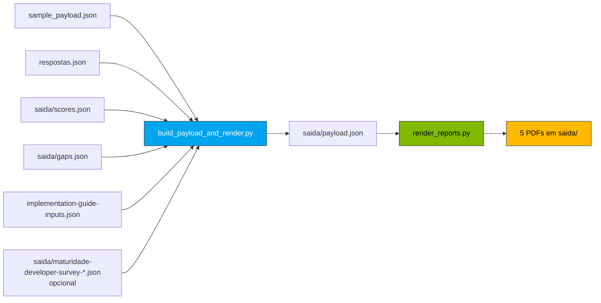

# `relatorios/scripts/`

📖 **Navegação:** [🏠 Índice](../../README.md) · [« Relatórios](../README.md)

Scripts Python que renderizam os 5 PDFs production-quality usando Jinja2 + WeasyPrint, com branding paulasilva-ms aplicado.

## Conteúdo

| Arquivo | Propósito |
| --- | --- |
| [`build_payload_and_render.py`](build_payload_and_render.py) | **Entry point principal.** Mescla `sample_payload.json` (estrutura rica) com dados do cliente (scores, gaps, recomendações, wizard) e invoca o renderer. Detecta cross-survey artifacts (maturidade-devs, insights-devs, plano-capacitacao), anexa em `payload.cross_survey_data`, e o `score_justification.pdf` renderiza esses sinais quando disponíveis. |
| [`render_reports.py`](render_reports.py) | Renderer Jinja2 → WeasyPrint. Recebe `payload.json` + templates `.html.j2`, produz os 5 PDFs em `saida/`. |
| [`branding.py`](branding.py) | Constantes da identidade paulasilva-ms: cores MS 4 (`#00A4EF`, `#7FBA00`, `#FFB900`, `#F25022`), assinatura, tagline, design system. Injeta tudo no `payload.branding`. |
| [`render_smoke.py`](render_smoke.py) | Smoke rápido que renderiza só 1 PDF para sanity check do template. |

## Pipeline visual



## Uso

```bash
# Pipeline completo (com PDFs)
python3 relatorios/scripts/build_payload_and_render.py

# Só montar o payload (sem render)
python3 relatorios/scripts/build_payload_and_render.py --no-render

# Re-renderizar depois de editar payload.json manualmente
python3 relatorios/scripts/render_reports.py --payload saida/payload.json --out saida/
```

## Dependências

```bash
pip install jinja2 weasyprint openpyxl
# ou
make install-deps
```

> [!NOTE]
> WeasyPrint requer libs do sistema (Cairo, Pango). No macOS: `brew install pango`. No Linux/WSL: pacote `libpango-1.0-0`.
