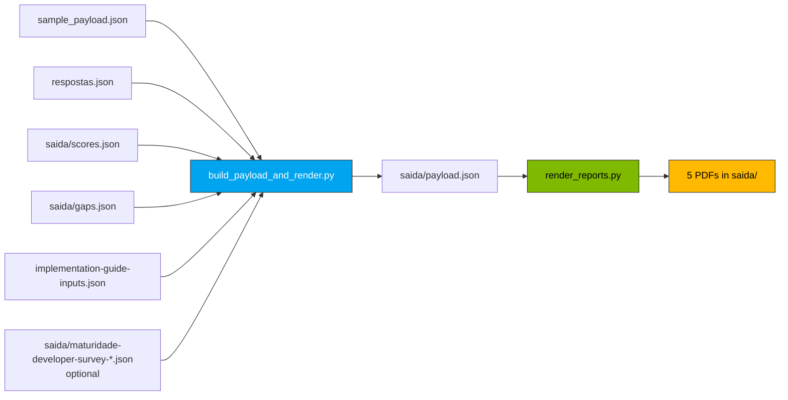

# `relatorios/scripts/`

🌐 English · [Português (Brasil)](README.pt-br.md)

📖 **Navigation:** [🏠 Index](../../README.md) · [« Reports](../README.md)

Python scripts that render the 5 production-quality PDFs with Jinja2 + WeasyPrint, with paulasilva-ms branding applied.

## Contents

| File | Purpose |
| --- | --- |
| [`build_payload_and_render.py`](build_payload_and_render.py) | **Main entry point.** Merges `sample_payload.json` (rich structure) with client data (scores, gaps, recommendations, wizard) and invokes the renderer. Detects cross-survey artifacts (devs maturity, devs insights, capacitation plan), attaches them to `payload.cross_survey_data`, and `score_justification.pdf` renders those signals when available. Locale comes from `respostas.json::metadata.language` (default `en`). |
| [`render_reports.py`](render_reports.py) | Jinja2 → WeasyPrint renderer. Takes `payload.json` + the `.html.j2` templates and produces the 5 PDFs in `saida/`. |
| [`branding.py`](branding.py) | paulasilva-ms identity constants: MS 4 colors (`#00A4EF`, `#7FBA00`, `#FFB900`, `#F25022`), signature, tagline, design system. Injects everything into `payload.branding`. |
| [`render_smoke.py`](render_smoke.py) | Quick smoke that renders only 1 PDF to sanity check the template. |

## Visual pipeline


```mermaid
flowchart LR
    A[sample_payload.json] --> M[build_payload_and_render.py]
    B[respostas.json] --> M
    C[saida/scores.json] --> M
    D[saida/gaps.json] --> M
    E[implementation-guide-inputs.json] --> M
    F[saida/maturidade-developer-survey-*.json<br/>optional] --> M
    M --> P[saida/payload.json]
    P --> R[render_reports.py]
    R --> O[5 PDFs in saida/]
    style M fill:#00A4EF,stroke:#333,color:#fff
    style R fill:#7FBA00,stroke:#333,color:#000
    style O fill:#FFB900,stroke:#333,color:#000
```

## Usage

```bash
# Full pipeline (with PDFs)
python3 relatorios/scripts/build_payload_and_render.py

# Build the payload only (no render)
python3 relatorios/scripts/build_payload_and_render.py --no-render

# Re-render after editing payload.json by hand
python3 relatorios/scripts/render_reports.py --payload saida/payload.json --out saida/
```

## Dependencies

```bash
pip install jinja2 weasyprint openpyxl
# or
make install-deps
```

> [!NOTE]
> WeasyPrint needs system libraries (Cairo, Pango). On macOS: `brew install pango`. On Linux/WSL: the `libpango-1.0-0` package.
